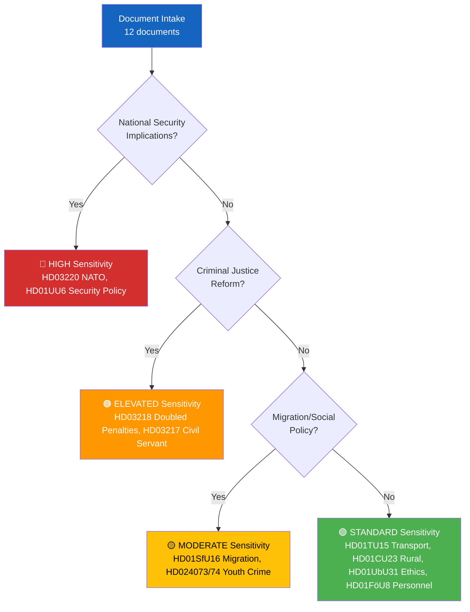

# 🏷️ Classification Results — 2026-04-09

**CLS-ID:** CLS-2026-04-09-EVE | **Date:** 2026-04-09 | **Riksmöte:** 2025/26
**Analyst:** news-evening-analysis | **Confidence:** HIGH

---

## 🌳 Sensitivity Decision Tree

## 📊 Per-Document Classification

| dok_id | Title | Sensitivity | Domain | Urgency | Significance (0-10) |
|--------|-------|-------------|--------|---------|:---:|
| HD03220 | Swedish NATO Contribution to Finland | 🔴 HIGH | Defense/Security | IMMEDIATE | **9** |
| HD03218 | Double Penalties Criminal Networks | 🟠 ELEVATED | Criminal Justice | HIGH | **8** |
| HD03217 | Expanded Civil Servant Accountability | 🟠 ELEVATED | Governance/Accountability | HIGH | **8** |
| HD01UU6 | Security Policy | 🔴 HIGH | Foreign Affairs/Security | HIGH | **7** |
| HD01SfU16 | Migration Issues | 🟡 MODERATE | Migration/Social | MEDIUM | **7** |
| HD024073 | V Motion Youth Crime | 🟡 MODERATE | Criminal Justice | MEDIUM | **6** |
| HD024074 | MP Motion Youth Crime | 🟡 MODERATE | Criminal Justice | MEDIUM | **6** |
| HD01TU15 | Railway & Public Transport | 🟢 STANDARD | Infrastructure | LOW | **5** |
| HD01FöU8 | Defense Personnel | 🟢 STANDARD | Defense | MEDIUM | **5** |
| HD01CU23 | Rural Employment & Housing | 🟢 STANDARD | Social/Regional | LOW | **4** |
| HD01UbU31 | Research Ethics Exemptions | 🟢 STANDARD | Education/Science | LOW | **4** |
| HD11695 | Written Question | 🟢 STANDARD | Parliamentary | LOW | **2** |
