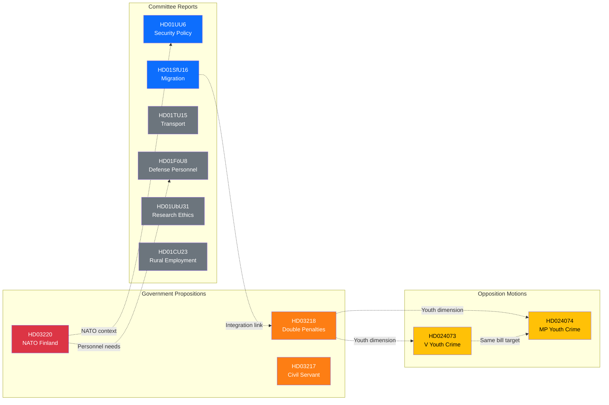

# 🔗 Cross-Reference Map — 2026-04-09

**XRF-ID:** XRF-2026-04-09-EVE | **Date:** 2026-04-09 | **Riksmöte:** 2025/26

---

## 🕸️ Document Cross-Reference Network

## 📊 Reference Links

| Source | Target | Relationship | Strength |
|--------|--------|-------------|----------|
| HD03220 (NATO) | HD01UU6 (Security Policy) | NATO forward presence complements security policy committee review | Strong |
| HD03220 (NATO) | HD01FöU8 (Defense Personnel) | Deployment requires defense personnel framework | Medium |
| HD03218 (Double Penalties) | HD024073 (V motion) | V motion opposes underlying youth crime bill related to double penalties | Strong |
| HD03218 (Double Penalties) | HD024074 (MP motion) | MP motion also opposes same underlying bill | Strong |
| HD024073 (V motion) | HD024074 (MP motion) | Both target Prop 2025/26:227 but filed separately — uncoordinated | Strong |
| HD01SfU16 (Migration) | HD03218 (Double Penalties) | Migration policy intersects with criminal network targeting | Weak |
