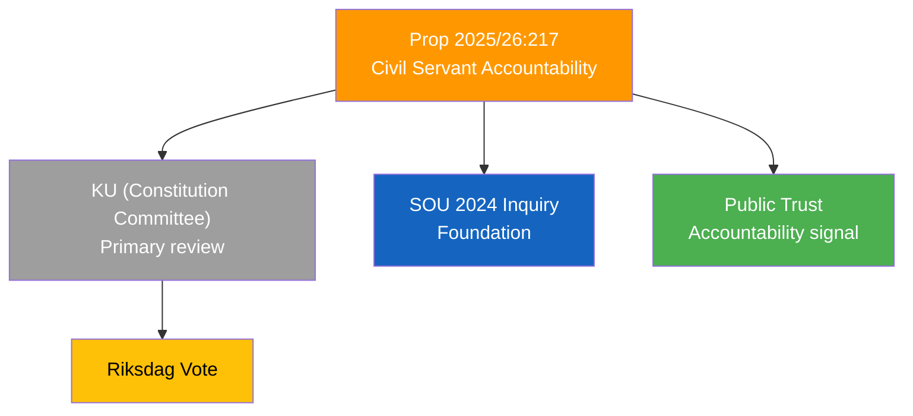

# Document Analysis: Utvidgat straffansvar för tjänstefel

**Generated**: 2026-04-09 18:22 UTC | **AI-Enriched**: 2026-04-09
**dok_id**: HD03217
**Document Type**: Proposition
**Committee**: Justitiedepartementet
**Date**: 2026-04-09
**Author**: Gunnar Strömmer (Justice Minister)
**Party**: M (Government)
**Riksmöte**: 2025/26
**Significance**: 🟠 Elevated (8/10)
**Confidence**: HIGH (80%)

---

## Executive Summary

Proposition to expand criminal liability for public officials who commit malfeasance ("tjänstefel"). This reverses decades of gradual decriminalization of public service errors and responds to long-standing public demand for greater accountability of state officials. Cross-party support is likely as accountability reform has been discussed since the SOU 2024 inquiry.

## SWOT Analysis

| Quadrant | Finding | Evidence | Confidence |
|----------|---------|----------|------------|
| **Strength** | Broad cross-party appeal — accountability reform has multi-party support | Long SOU inquiry process with broad participation | **[HIGH]** |
| **Strength** | Addresses documented public trust deficit in government institutions | Post-pandemic governance criticism | **[HIGH]** |
| **Weakness** | Risk of chilling effect on public servants — officials may avoid decisions | Expanded criminal scope for discretionary decisions | **[MEDIUM]** |
| **Opportunity** | Could restore institutional trust ahead of 2028 election | Bipartisan accountability narrative | **[HIGH]** |
| **Threat** | Implementation complexity — defining "tjänstefel" boundaries | Historical difficulty in prosecuting tjänstefel cases | **[MEDIUM]** |

## Significance Assessment

**Overall Score**: 8/10 — 🟠 Elevated

Reverses decades of decriminalization trend in public service liability. Likely to receive broad Riksdag support. Governance reform with lasting institutional impact.
