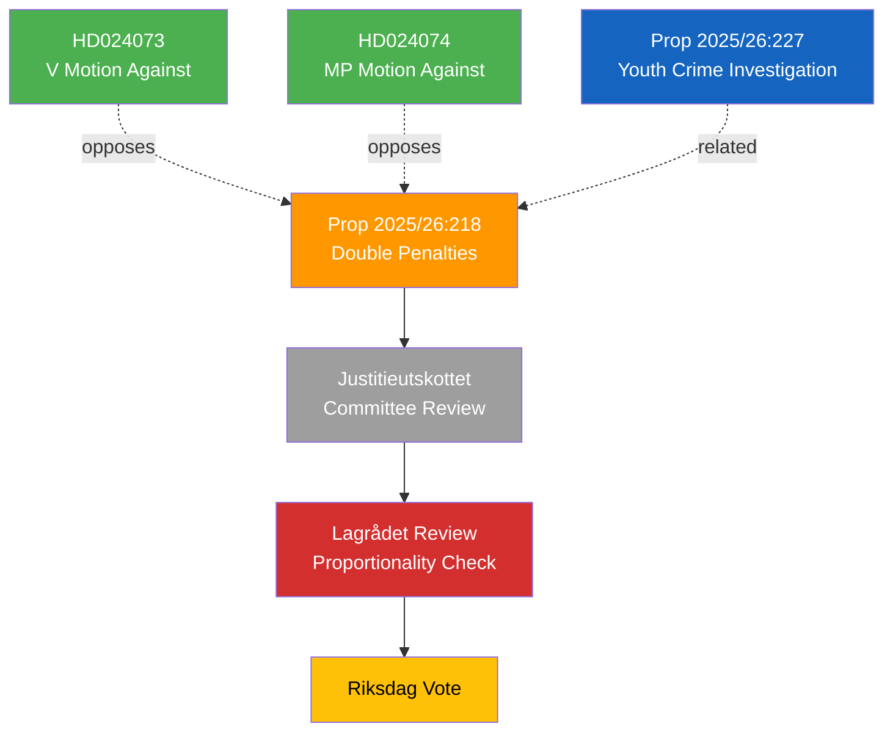

# Document Analysis: Dubbla straff för brott i kriminella nätverk

**Generated**: 2026-04-09 18:22 UTC | **AI-Enriched**: 2026-04-09
**dok_id**: HD03218
**Document Type**: Proposition
**Committee**: Justitiedepartementet
**Date**: 2026-04-09
**Author**: Gunnar Strömmer (Justice Minister)
**Party**: M (Government)
**Riksmöte**: 2025/26
**Significance**: 🟠 Elevated (8/10)
**Confidence**: HIGH (80%)

---

## Executive Summary

The government proposes automatic doubling of criminal penalties when offenses are committed within criminal networks. This is unprecedented in Swedish legal tradition and raises significant proportionality concerns under ECHR Article 7 and Regeringsformen 2:12. Two opposition parties (V, MP) have already filed counter-motions targeting the underlying youth crime bill.

## SWOT Analysis

| Quadrant | Finding | Evidence | Confidence |
|----------|---------|----------|------------|
| **Strength** | Addresses public demand for tougher criminal network penalties | Aligns with government's anti-gang crime platform since 2022 | **[HIGH]** |
| **Weakness** | No Swedish precedent for automatic penalty multiplier | Departs from individual sentencing principle in BrB | **[HIGH]** |
| **Weakness** | Proportionality likely challenged at Lagrådet and ECHR | Automatic doubling vs. case-by-case assessment | **[HIGH]** |
| **Opportunity** | Could significantly deter network recruitment | Economic deterrence model if penalties exceed expected criminal profit | **[MEDIUM]** |
| **Threat** | Constitutional challenge risk at highest court level | RF 2:12 proportionality requirement | **[HIGH]** |

## Stakeholder Perspective Analysis

| Stakeholder | Position | Impact |
|-------------|----------|--------|
| Government (M+KD+L) | Flagship criminal justice reform | HIGH |
| SD (confidence partner) | Strong support — core law-and-order agenda | HIGH |
| V (opposition) | Filed motion HD024073 opposing youth crime dimension | HIGH |
| MP (opposition) | Filed motion HD024074 opposing same | HIGH |
| Judiciary/Lagrådet | Expected proportionality scrutiny | HIGH |
| Civil liberties organizations | Expected strong opposition | HIGH |

## Significance Assessment

**Overall Score**: 8/10 — 🟠 Elevated

Historically unprecedented automatic penalty multiplier in Swedish criminal law. Already generating organized opposition (2 motions filed same day). Constitutional review at Lagrådet will be critical test.
