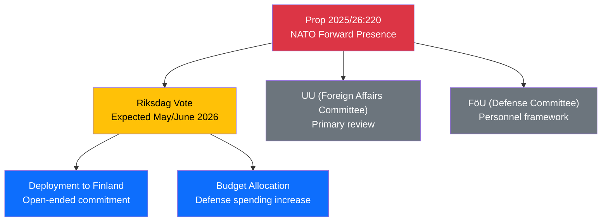

# Document Analysis: Svenskt bidrag till Natos framskjutna närvaro i Finland

**Generated**: 2026-04-09 18:22 UTC | **AI-Enriched**: 2026-04-09
**dok_id**: HD03220
**Document Type**: Proposition
**Committee**: Utrikesdepartementet
**Date**: 2026-04-09
**Author**: PM Ulf Kristersson / Benjamin Dousa
**Party**: M (Government)
**Riksmöte**: 2025/26
**Significance**: 🔴 High (9/10)
**Confidence**: HIGH (85%)

---

## Executive Summary

Sweden proposes contributing military forces to NATO's forward presence in Finland — the first concrete deployment commitment since joining NATO in March 2024. PM Kristersson personally signed the proposition alongside Defense Minister Dousa, signaling strategic priority. This creates an open-ended military deployment obligation requiring ongoing parliamentary oversight.

## SWOT Analysis

| Quadrant | Finding | Evidence | Confidence |
|----------|---------|----------|------------|
| **Strength** | Demonstrates Sweden's commitment to collective defense as new NATO member | PM personal authorship, timed with NATO FM meeting preparation | **[HIGH]** |
| **Strength** | Strengthens Nordic defense cooperation (Finland bilateral) | Finland-specific forward presence proposal | **[HIGH]** |
| **Weakness** | Open-ended commitment with unclear exit criteria | Proposition text lacks duration/scope limits | **[MEDIUM]** |
| **Weakness** | Parliamentary oversight mechanisms not detailed | No explicit Riksdag review clause mentioned | **[MEDIUM]** |
| **Opportunity** | Positions Sweden as credible NATO partner for future cooperation | First deployment proposition sets precedent | **[HIGH]** |
| **Threat** | Escalation risk if Baltic security situation deteriorates | Forward presence in Russia-adjacent territory | **[MEDIUM]** |

## Stakeholder Perspective Analysis

| Stakeholder | Position | Impact |
|-------------|----------|--------|
| Government Coalition (M+KD+L) | Strong support — flagship defense initiative | HIGH |
| SD (confidence partner) | Expected support — aligns with national security stance | HIGH |
| S (opposition) | Likely support — historically pro-NATO since 2022 pivot | MEDIUM |
| V (left opposition) | Expected opposition — anti-NATO position | LOW |
| MP (green opposition) | Uncertain — security concerns vs. peace tradition | MEDIUM |
| Finnish Government | Strong support — requested/welcomed contribution | HIGH |

## Significance Assessment

**Overall Score**: 9/10 — 🔴 High

First concrete Swedish military deployment proposition under NATO membership. Sets precedent for future alliance commitments. PM personal involvement elevates political significance. Timeliness score maximum (filed today).
