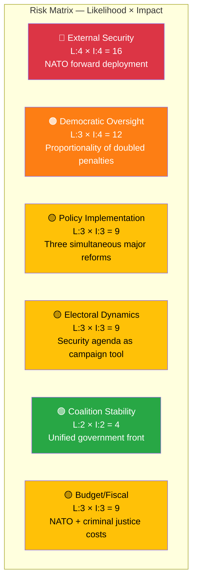

# ⚠️ Risk Assessment — 2026-04-09

**RSK-ID:** RSK-2026-04-09-EVE | **Date:** 2026-04-09 | **Riksmöte:** 2025/26
**Analyst:** news-evening-analysis | **Confidence:** HIGH

---

## 🗺️ Risk Heat Map

## 📊 Detailed Risk Register

| Risk ID | Category | Description | Likelihood (1-5) | Impact (1-5) | L×I Score | Trend | Evidence |
|---------|----------|-------------|:-:|:-:|:-:|-------|----------|
| RSK-01 | External Security | NATO forward presence in Finland positions Swedish forces near Russian border — escalation and force protection risk | 4 | 4 | **16** | ↑ | HD03220 — first deployment proposition since NATO accession |
| RSK-02 | Democratic Oversight | Doubled criminal penalties (HD03218) may violate proportionality principle — Lagrådet and ECHR scrutiny expected | 3 | 4 | **12** | → | HD03218 — no precedent for automatic 2× penalty multiplier in Swedish law |
| RSK-03 | Policy Implementation | Three major reforms launched simultaneously strain government implementation capacity | 3 | 3 | **9** | ↑ | HD03220 + HD03218 + HD03217 — all require regulatory apparatus |
| RSK-04 | Electoral | Coordinated security proposition timing reads as election-year positioning, inviting legitimacy criticism | 3 | 3 | **9** | → | Three security/justice bills on one day, 18 months before election |
| RSK-05 | Coalition Stability | Government presents unified front with PM and Justice Minister co-authoring, SD implicit support | 2 | 2 | **4** | ↓ | All props signed by Kristersson — no visible coalition friction |
| RSK-06 | Budget/Fiscal | NATO deployment + criminal justice expansion + expanded accountability create cumulative fiscal pressure | 3 | 3 | **9** | ↑ | Spring budget timing — allocation not yet specified |

## 🔮 Risk Mitigation Watch Items

| Risk | Mitigation Signal | Timeline | Confidence |
|------|-------------------|----------|------------|
| RSK-01 | FöU/UU joint committee review of deployment scope and rules of engagement | 2-4 weeks | **[HIGH]** |
| RSK-02 | Lagrådet opinion on proportionality of doubled penalties | 3-6 weeks | **[HIGH]** |
| RSK-03 | Government action plan with implementation timeline for all three reforms | 1-3 months | **[MEDIUM]** |
| RSK-04 | Opposition joint statement on government's legislative pace | 1-2 weeks | **[MEDIUM]** |
