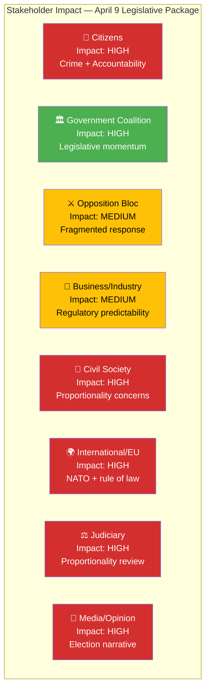

# 👥 Stakeholder Impact Analysis — 2026-04-09

**STA-ID:** STA-2026-04-09-EVE | **Date:** 2026-04-09 | **Riksmöte:** 2025/26
**Analyst:** news-evening-analysis | **Confidence:** HIGH

---

## 🎯 Impact Radar

## 📊 Impact Summary Matrix

| Stakeholder Group | Impact Level | Key Concern | Primary Documents | Confidence |
|-------------------|-------------|-------------|-------------------|------------|
| **Citizens** | HIGH | Doubled criminal penalties promise safer streets but raise civil liberties questions; civil servant accountability increases trust in government | HD03218, HD03217 | **[HIGH]** |
| **Government Coalition (M+KD+L+SD)** | HIGH | Three-proposition launch demonstrates unified legislative capacity; PM personal authorship signals coalition cohesion ahead of 2028 election | HD03220, HD03218, HD03217 | **[HIGH]** |
| **Opposition Bloc (S+V+MP+C)** | MEDIUM | Fragmented response — V and MP file separate motions (HD024073/HD024074); S notably silent on all three propositions | HD024073, HD024074 | **[HIGH]** |
| **Business/Industry** | MEDIUM | Civil servant accountability reform (HD03217) improves regulatory predictability; NATO costs may affect business taxation priorities | HD03217, HD03220 | **[MEDIUM]** |
| **Civil Society** | HIGH | Human rights organizations expected to challenge proportionality of doubled penalties; research ethics exemption (HD01UbU31) affects academic freedom | HD03218, HD01UbU31 | **[HIGH]** |
| **International/EU** | HIGH | NATO deployment proposition strengthens Swedish alliance credibility; criminal justice reform under EU rule-of-law monitoring | HD03220, HD03218 | **[HIGH]** |
| **Judiciary/Constitutional** | HIGH | Lagrådet expected to review proportionality of automatic penalty doubling; civil servant accountability expands criminal liability scope | HD03218, HD03217 | **[HIGH]** |
| **Media/Public Opinion** | HIGH | Election-year security narrative dominates; risk of "tough on crime" framing vs. nuanced proportionality debate | All 3 propositions | **[HIGH]** |
