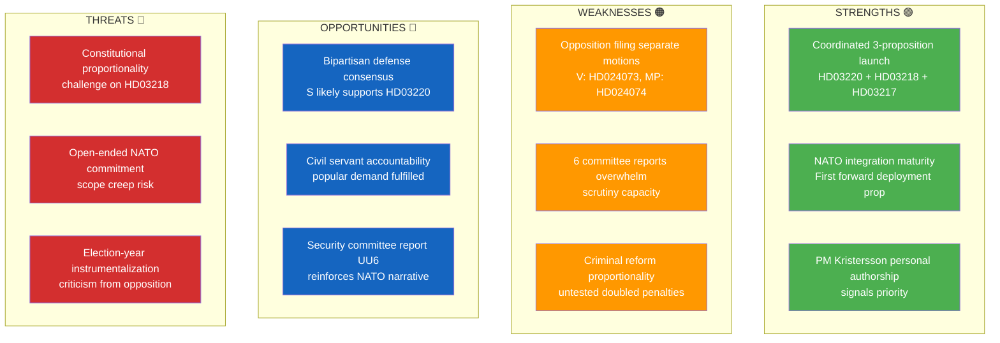

# 🔍 SWOT Analysis — 2026-04-09

**SWT-ID:** SWT-2026-04-09-EVE | **Date:** 2026-04-09 | **Riksmöte:** 2025/26
**Analyst:** news-evening-analysis | **Confidence:** HIGH

---

## 📊 SWOT Quadrant Mapping

## 📋 Evidence-Based SWOT Analysis

### Strengths

| # | Finding | Evidence | dok_id | Confidence |
|---|---------|----------|--------|------------|
| S1 | Government demonstrates coordinated legislative capacity by launching 3 major propositions on same day | PM Kristersson signs all three; Strömmer leads two justice bills | HD03220, HD03218, HD03217 | **[HIGH]** |
| S2 | NATO forward deployment proposition shows Sweden's alliance integration maturity, less than 2 years after accession | First Swedish NATO deployment proposition to riksdagen | HD03220 | **[HIGH]** |
| S3 | Security policy committee report reinforces defense narrative | UU6 published same day as NATO proposition — strategic timing | HD01UU6 | **[MEDIUM]** |

### Weaknesses

| # | Finding | Evidence | dok_id | Confidence |
|---|---------|----------|--------|------------|
| W1 | Opposition parties file uncoordinated separate motions on same bill, showing fragmentation | V (Gudrun Nordborg) and MP (Ulrika Westerlund) file individual motions on Prop. 2025/26:227 | HD024073, HD024074 | **[HIGH]** |
| W2 | 6 simultaneous committee reports create scrutiny capacity strain for opposition | UbU31, FöU8, TU15, SfU16, UU6, CU23 all published April 9 | All bet docs | **[MEDIUM]** |
| W3 | Doubled criminal penalties represent untested legal territory with proportionality risks | No comparable Swedish precedent for automatic sentence doubling | HD03218 | **[MEDIUM]** |

### Opportunities

| # | Finding | Evidence | dok_id | Confidence |
|---|---------|----------|--------|------------|
| O1 | NATO deployment likely attracts bipartisan support — Socialdemokraterna traditionally supports defense consensus | Historical pattern: S supported NATO accession, defense spending increases | HD03220 | **[HIGH]** |
| O2 | Civil servant accountability reform fulfills long-standing public demand, could boost government approval | Popular issue since Transportstyrelsen scandal (2017); PM Kristersson personal priority | HD03217 | **[HIGH]** |
| O3 | Migration committee report (SfU16) gives government platform to highlight immigration policy results | Published alongside security propositions — reinforces "order and security" theme | HD01SfU16 | **[MEDIUM]** |

### Threats

| # | Finding | Evidence | dok_id | Confidence |
|---|---------|----------|--------|------------|
| T1 | Doubled penalties for criminal networks may face constitutional proportionality challenges | Lagrådet (Council on Legislation) historically scrutinizes automatic penalty multipliers | HD03218 | **[MEDIUM]** |
| T2 | NATO forward presence in Finland creates open-ended military commitment with escalation risk | Proposition scope includes "framskjuten närvaro" — forward positioning near Russian border | HD03220 | **[MEDIUM]** |
| T3 | Coordinated election-year security push invites opposition criticism of political instrumentalization | Three security/justice propositions on one day = optics of choreographed campaign launch | HD03218, HD03217, HD03220 | **[HIGH]** |

### Stakeholder SWOT Summary

| Stakeholder Group | Impact Assessment | Key Concern |
|-------------------|-------------------|-------------|
| **Citizens** | NET POSITIVE — accountability reform + crime reduction promise | Proportionality of doubled penalties affecting civil liberties |
| **Government Coalition** | STRONG POSITIVE — demonstrates legislative momentum | Implementation capacity for 3 major reforms simultaneously |
| **Opposition Bloc** | MIXED — fragmented response weakens counter-narrative | V and MP filing separate motions instead of united front |
| **Business/Industry** | NEUTRAL-POSITIVE — civil servant accountability improves regulatory predictability | NATO commitment cost allocation may affect budget priorities |
| **Civil Society** | CAUTIOUS — criminal justice proportionality concerns | Human rights organizations likely to challenge HD03218 |
| **International/EU** | POSITIVE — NATO deployment strengthens alliance credibility | EU monitoring of rule-of-law implications of criminal reform |
| **Judiciary/Constitutional** | WATCHFUL — proportionality review expected | Lagrådet assessment of doubled penalties precedent |
| **Media/Public Opinion** | HIGH ATTENTION — election-year security narrative dominates | Risk of oversimplified "tough on crime" vs nuanced analysis |
