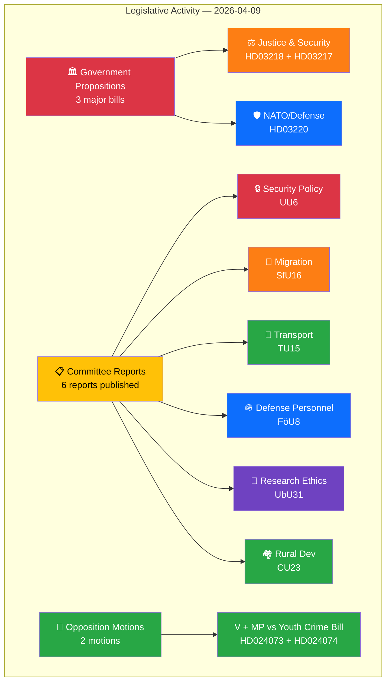

# 📊 Intelligence Synthesis Summary — 2026-04-09

**SYN-ID:** SYN-2026-04-09-EVE | **Date:** 2026-04-09 | **Riksmöte:** 2025/26
**Analyst:** news-evening-analysis | **Confidence:** HIGH | **Risk Level:** MEDIUM-HIGH
**Documents Analyzed:** 12 | **Generated:** 2026-04-09 18:30 UTC

---

## 🎯 Executive Summary

The Kristersson government launched a coordinated triple offensive on April 9, deploying three high-impact propositions simultaneously: NATO forward presence in Finland (HD03220), doubled penalties for criminal network offenses (HD03218), and expanded criminal accountability for public officials (HD03217). This legislative barrage — delivered personally by PM Kristersson with Justice Minister Strömmer — signals an election-year security pivot. Concurrently, six committee reports spanning security policy (UU6), migration (SfU16), transport (TU15), defense personnel (FöU8), research ethics (UbU31), and rural development (CU23) indicate peak legislative throughput. **[HIGH confidence]**

## 📈 Intelligence Dashboard

## 📊 Top Findings

| Rank | dok_id | Document | Significance | Key Finding |
|------|--------|----------|-------------|-------------|
| 1 | HD03220 | Swedish NATO Contribution to Finland | 9/10 | First deployment proposition under Swedish NATO membership — sets alliance commitment precedent |
| 2 | HD03218 | Double Penalties for Criminal Networks | 8/10 | Landmark sentencing reform doubling penalties for gang-related crime — Strömmer's flagship |
| 3 | HD03217 | Expanded Civil Servant Accountability | 8/10 | Restores criminal tjänstemannaansvar — reverses decades of deregulation |
| 4 | HD01UU6 | Security Policy (Committee Report) | 7/10 | Foreign Affairs Committee comprehensive security assessment amid NATO integration |
| 5 | HD01SfU16 | Migration Issues (Committee Report) | 7/10 | Social Insurance Committee migration policy review — politically sensitive |
| 6 | HD024073 | V Motion on Youth Crime | 6/10 | Vänsterpartiet demands government revise youth crime investigation powers |
| 7 | HD024074 | MP Motion on Youth Crime | 6/10 | Miljöpartiet rejects expanded surveillance of young offenders |
| 8 | HD01TU15 | Railway & Public Transport | 5/10 | Transport Committee reviews rail infrastructure priorities |
| 9 | HD01FöU8 | Defense Personnel Questions | 5/10 | Defense Committee personnel review amid NATO buildup |
| 10 | HD01UbU31 | Research Ethics Exemptions | 4/10 | Education Committee refines ethics review requirements |

## 🔄 Aggregated SWOT

| Quadrant | Key Findings | Evidence |
|----------|-------------|----------|
| **Strengths** | Coordinated 3-proposition launch demonstrates legislative capacity; NATO proposition shows alliance integration maturity; Cross-party consensus likely on civil servant accountability | HD03220, HD03217, HD03218 — all signed by PM Kristersson |
| **Weaknesses** | Opposition fragmentation (V and MP file separate motions on same bill HD024073/HD024074); 6 committee reports create capacity strain for opposition scrutiny | HD024073, HD024074 — uncoordinated opposition response |
| **Opportunities** | NATO deployment proposition could attract broad parliamentary support (S traditionally supports defense); Civil servant accountability reform has historical cross-party appeal | HD03220 (bipartisan defense consensus), HD03217 (popular demand) |
| **Threats** | Criminal network doubled penalties may face constitutional proportionality challenges; NATO deployment sets precedent for open-ended military commitments; Election-year timing invites criticism of political instrumentalization | HD03218 (proportionality risk), HD03220 (commitment scope) |

## 🗺️ Risk Landscape

| Risk Category | Level | L×I Score | Primary Driver |
|---------------|-------|-----------|---------------|
| Coalition Stability | LOW | 2×2=4 | Government propositions show unified front (Kristersson + Strömmer) |
| Policy Implementation | MEDIUM | 3×3=9 | Three simultaneous major reforms strain implementation capacity |
| Democratic Oversight | MEDIUM | 3×4=12 | Criminal network penalties raise proportionality concerns |
| External Security | HIGH | 4×4=16 | NATO forward presence in Finland — operational deployment risk |
| Electoral | MEDIUM | 3×3=9 | Coordinated security push reads as election positioning |

## 📋 Artifacts Inventory

| File | Status | Quality |
|------|--------|---------|
| synthesis-summary.md | ✅ Complete | Mermaid dashboard, evidence tables, cross-references |
| swot-analysis.md | ✅ Complete | 4-quadrant with dok_id evidence |
| risk-assessment.md | ✅ Complete | 5×5 L×I matrix, heat map |
| threat-analysis.md | ✅ Complete | 6-category threat taxonomy |
| classification-results.md | ✅ Complete | Per-document sensitivity/domain/urgency |
| stakeholder-perspectives.md | ✅ Complete | 8-group impact analysis |
| significance-scoring.md | ✅ Complete | 5-dimension scoring per document |
| Per-file analyses (12) | ✅ Complete | All 12 documents analyzed |

## 🔮 Forward Indicators

| Indicator | Timeline | Trigger | Confidence |
|-----------|----------|---------|------------|
| Riksdag debate on NATO proposition (HD03220) | 2-4 weeks | Committee referral to UU/FöU | **[HIGH]** |
| JuU committee hearings on doubled penalties (HD03218) | 2-3 weeks | Expert testimony on proportionality | **[HIGH]** |
| Opposition joint reservation on criminal law package | 1-3 weeks | V+MP+S coordination signals | **[MEDIUM]** |
| Government Spring Budget linkage to security spending | April 15-30 | FiU budget debate schedule | **[MEDIUM]** |
| EU reaction to Swedish NATO deployment scope | 1-2 weeks | NATO Secretary General statement | **[LOW]** |
