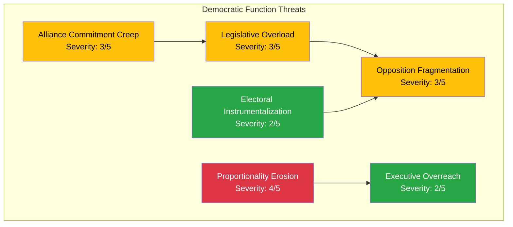

# 🛡️ Threat Analysis — 2026-04-09

**THR-ID:** THR-2026-04-09-EVE | **Date:** 2026-04-09 | **Riksmöte:** 2025/26
**Analyst:** news-evening-analysis | **Confidence:** HIGH

---

## 🕸️ Threat Taxonomy Network

## 📊 Threat Category Assessment

| Category | Severity (1-5) | Evidence | dok_id | Confidence |
|----------|:-:|----------|--------|------------|
| **Legislative Quality** | 3 | Six committee reports + 3 propositions on one day risks insufficient deliberation time | HD01UU6, HD01SfU16, HD01TU15, HD01FöU8, HD01UbU31, HD01CU23 | **[MEDIUM]** |
| **Proportionality** | 4 | Doubled penalties for criminal network offenses — no Swedish precedent for automatic multiplier; ECHR Art. 7 and RF 2:12 implications | HD03218 | **[HIGH]** |
| **Executive Power** | 2 | Government propositions follow normal legislative process; PM personal authorship is unusual but constitutional | HD03220, HD03218, HD03217 | **[LOW]** |
| **Alliance Commitment** | 3 | NATO forward presence creates open-ended deployment obligation; Parliament must retain oversight of scope/duration | HD03220 | **[MEDIUM]** |
| **Opposition Effectiveness** | 3 | V and MP file separate uncoordinated motions on same bill; S silent on today's propositions so far | HD024073, HD024074 | **[HIGH]** |
| **Electoral Integrity** | 2 | Security proposition timing coincides with pre-election period but falls within normal legislative calendar | All 3 propositions | **[LOW]** |

## 🎯 Escalation Decision

**Overall Threat Level: MEDIUM** — The doubled penalties proposition (HD03218) is the primary concern, with proportionality severity at 4/5. All other threats remain within normal democratic parameters. Monitor Lagrådet response and opposition coordination efforts.
