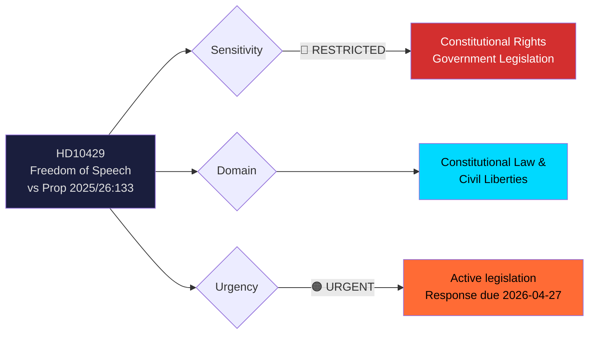

# 🔍 Per-File Political Intelligence Analysis — HD10429

| Field | Value |
|-------|-------|
| **Document ID** | HD10429 |
| **Document Type** | Interpellation |
| **Title** | Skyddet för yttrandefriheten i förhållande till proposition 2025/26:133 |
| **Date** | 2026-04-07 |
| **Riksmöte** | 2025/26 |
| **Source MCP Tool** | get_interpellationer |
| **Analysis Timestamp** | 2026-04-09 07:00 UTC |
| **Analyst** | news-interpellations workflow |
| **Filed By** | Rashid Farivar (SD) |
| **Addressed To** | Justice Minister Gunnar Strömmer (M) |
| **Interpellation Number** | frs 2025/26:429 |

## 🎯 Executive Summary

SD's Rashid Farivar challenges coalition leader M's Justice Minister Strömmer on whether proposition 2025/26:133 (enhanced security at public gatherings) could enable police to effectively ban Quran burnings or other controversial demonstrations. The interpellation raises the constitutional principle of "våldsverkarnas veto" (the violent's veto) — whether threat of violence should determine which demonstrations occur. This represents a remarkable dynamic: a coalition support party challenging the governing party on fundamental rights, specifically arguing that the government's own proposition may undermine Sweden's 1766 press freedom tradition. **[HIGH]**

## 📊 Political Classification

| Dimension | Assessment | Evidence |
|-----------|-----------|----------|
| Sensitivity | 🔴 RESTRICTED | Constitutional rights challenge to active government legislation |
| Domain | Constitutional Law / Civil Liberties | Proposition 2025/26:133 on public gatherings security |
| Urgency | 🟠 URGENT | Active legislative process; response due April 24-27 |
| Significance | 8/10 | Constitutional challenge from coalition partner; Quran burning precedent; international dimension |

## 🔄 SWOT Analysis

### Government Coalition Perspective

| # | Type | Statement | Evidence | Confidence | Impact |
|---|------|-----------|----------|------------|--------|
| 1 | Strength | Proposition addresses genuine security concerns post-2023 Quran burning riots | International reactions and diplomatic costs were real and documented | **[HIGH]** | High |
| 2 | Weakness | Coalition support party (SD) publicly questions government's own legislation | Farivar (SD) explicitly challenges Strömmer (M) on prop 2025/26:133 | **[HIGH]** | Very High |
| 3 | Weakness | Previous written answer (March 4) deemed "not satisfactory" by SD | Farivar states response was "i stora delar en upprepning av propositionens innehåll" | **[HIGH]** | High |
| 4 | Threat | If SD votes against or abstains on prop 133, legislative defeat possible | SD support essential for Tidö Agreement majority | **[HIGH]** | Very High |

### Opposition Perspective

| # | Type | Statement | Evidence | Confidence | Impact |
|---|------|-----------|----------|------------|--------|
| 1 | Opportunity | Coalition fracture — SD and M disagreeing on fundamental rights legislation | S/V can highlight government instability | **[MEDIUM]** | High |
| 2 | Opportunity | Frame proposition as authoritarian overreach if even SD opposes it | Cross-political consensus concern strengthens criticism | **[MEDIUM]** | High |
| 3 | Threat | Being forced to take position on Quran burnings — politically toxic either way | V/MP support free speech but oppose Islamophobia framing | **[HIGH]** | Medium |

## ⚠️ Risk Assessment

| Risk | Likelihood (1-5) | Impact (1-5) | L×I Score | Mitigation |
|------|-------------------|--------------|-----------|------------|
| SD defection on proposition 133 vote | 3 | 5 | **15** | Strömmer negotiates amendments with SD |
| Constitutional challenge to enacted law | 2 | 5 | **10** | Lagrådet review ensures constitutional compliance |
| International exploitation of Swedish freedom debate | 4 | 3 | **12** | MFA coordinates messaging on Swedish values |
| "Violent's veto" becomes normalized precedent | 3 | 4 | **12** | Explicit legislative safeguards for demonstration rights |

## 👥 Stakeholder Impact (8 Groups)

| Stakeholder Group | Impact | Assessment | Confidence |
|-------------------|--------|------------|------------|
| **Citizens** | Very High | Fundamental rights to demonstrate and protest directly at stake | **[HIGH]** |
| **Government Coalition** | Very High | SD challenges M on their own legislation — coalition stress test | **[HIGH]** |
| **Opposition Bloc** | High | Can exploit coalition division; but must navigate Quran burning politics | **[MEDIUM]** |
| **Business/Industry** | Low | Indirect through political stability and international reputation | **[LOW]** |
| **Civil Society** | Very High | Freedom of expression organizations, religious communities, human rights groups | **[HIGH]** |
| **International/EU** | High | Sweden's international reputation on free speech; EU fundamental rights | **[HIGH]** |
| **Judiciary/Constitutional** | Very High | Constitutional law implications; Lagrådet role; police discretion boundaries | **[HIGH]** |
| **Media/Public Opinion** | High | Quran burning debate highly salient; press freedom tradition | **[HIGH]** |

## 🔮 Forward Indicators

| Indicator | Trigger | Timeline | Confidence |
|-----------|---------|----------|------------|
| Minister Strömmer response | Formal answer to interpellation | By 2026-04-24 to 2026-04-27 | **[HIGH]** |
| SD position on proposition 133 | Party group decision on voting | Before committee vote | **[HIGH]** |
| Constitutional committee review | KU assessment of rights implications | If referred | **[MEDIUM]** |
| International media coverage | Major outlets covering Sweden's freedom of speech debate | 1-4 weeks | **[MEDIUM]** |
| Lagrådet opinion | Constitutional review of proposition | If requested by committee | **[LOW]** |
