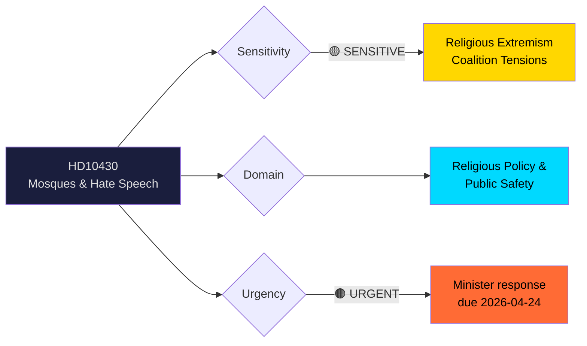

# 🔍 Per-File Political Intelligence Analysis — HD10430

| Field | Value |
|-------|-------|
| **Document ID** | HD10430 |
| **Document Type** | Interpellation |
| **Title** | Moskéer som sprider hat och hot (Mosques Spreading Hate and Threats) |
| **Date** | 2026-04-07 |
| **Riksmöte** | 2025/26 |
| **Source MCP Tool** | get_interpellationer |
| **Analysis Timestamp** | 2026-04-09 07:00 UTC |
| **Analyst** | news-interpellations workflow |
| **Filed By** | Richard Jomshof (SD) |
| **Addressed To** | Social Minister Jakob Forssmed (KD) |
| **Interpellation Number** | frs 2025/26:430 |

## 🎯 Executive Summary

SD's Richard Jomshof challenges coalition partner KD's Social Minister Forssmed on hate preaching in Kristianstad mosques, citing Expressen investigations revealing imams promoting violence against Jews and non-Muslims. This interpellation tests the coalition's fault line on religious extremism — SD pushes for governmental action while KD must balance religious freedom with security concerns. The interpellation creates political pressure within the coalition, as SD's anti-Islam stance clashes with KD's traditionally moderate approach to religious communities. **[HIGH]**

## 📊 Political Classification

| Dimension | Assessment | Evidence |
|-----------|-----------|----------|
| Sensitivity | 🟡 SENSITIVE | Involves religious extremism, antisemitism, and intra-coalition tensions |
| Domain | Social Policy / Religious Affairs | Addressed to Social Minister; relates to mosque oversight |
| Urgency | 🟠 URGENT | Media-driven (Expressen exposé April 2); response due April 24 |
| Significance | 7/10 | Coalition stress-test; media salience; antisemitism dimension |

## 🔄 SWOT Analysis

### Government Coalition Perspective

| # | Type | Statement | Evidence | Confidence | Impact |
|---|------|-----------|----------|------------|--------|
| 1 | Strength | KD can demonstrate toughness on extremism by announcing concrete measures | Forssmed as Social Minister has policy levers (social affairs oversight) | **[MEDIUM]** | High |
| 2 | Weakness | Coalition internal pressure — SD pushes harder than KD/M on Islam issues | Jomshof (SD) targets Forssmed (KD) specifically, not Strömmer (M) | **[HIGH]** | High |
| 3 | Opportunity | Response could strengthen coalition by showing unified anti-extremism stance | Both SD and KD share concern about extremist preaching | **[MEDIUM]** | Medium |
| 4 | Threat | Non-response or weak response alienates SD, risks coalition friction | SD has 73 seats — essential for Tidö Agreement majority | **[HIGH]** | High |

### Opposition Perspective

| # | Type | Statement | Evidence | Confidence | Impact |
|---|------|-----------|----------|------------|--------|
| 1 | Opportunity | Exploit coalition division if KD gives tepid response | S/V/MP can frame KD as caught between liberal values and SD pressure | **[MEDIUM]** | Medium |
| 2 | Threat | Being seen as soft on antisemitism if opposing SD's framing | Expressen evidence of imam antisemitism is concrete and documented | **[HIGH]** | High |

## ⚠️ Risk Assessment

| Risk | Likelihood (1-5) | Impact (1-5) | L×I Score | Mitigation |
|------|-------------------|--------------|-----------|------------|
| Coalition friction over response tone | 4 | 3 | **12** | Forssmed coordinates with SD before formal response |
| Media escalation (more mosque investigations) | 3 | 4 | **12** | Proactive government review of all reported cases |
| International attention (antisemitism focus) | 3 | 3 | **9** | Coordinate with Foreign Ministry messaging |
| Religious community backlash | 2 | 3 | **6** | Distinguish extremist individuals from communities |

## 👥 Stakeholder Impact (8 Groups)

| Stakeholder Group | Impact | Assessment | Confidence |
|-------------------|--------|------------|------------|
| **Citizens** | High | Public safety concerns; Muslim-Jewish community tensions in Kristianstad | **[HIGH]** |
| **Government Coalition** | High | Tests KD-SD-M unity on religious extremism policy | **[HIGH]** |
| **Opposition Bloc** | Medium | Must navigate carefully — opposing SD's framing risks appearing soft on antisemitism | **[MEDIUM]** |
| **Business/Industry** | Low | Indirect impact through social cohesion and community stability | **[LOW]** |
| **Civil Society** | High | Religious freedom organizations, Jewish community, Muslim community all directly affected | **[HIGH]** |
| **International/EU** | Medium | Antisemitism monitoring; EU Fundamental Rights Agency tracking | **[MEDIUM]** |
| **Judiciary/Constitutional** | Medium | Freedom of religion vs hate speech law boundaries | **[MEDIUM]** |
| **Media/Public Opinion** | High | Expressen drove this story; high salience topic | **[HIGH]** |

## 🔮 Forward Indicators

| Indicator | Trigger | Timeline | Confidence |
|-----------|---------|----------|------------|
| Minister Forssmed response | Formal answer to interpellation | By 2026-04-24 (statutory deadline) | **[HIGH]** |
| Interpellation debate scheduling | Announcement in Riksdag | Week of 2026-04-13 | **[HIGH]** |
| Follow-up Expressen reporting | Additional mosque investigations | 1-4 weeks | **[MEDIUM]** |
| SD follow-up motion | If response deemed inadequate | 2-6 weeks post-response | **[MEDIUM]** |
