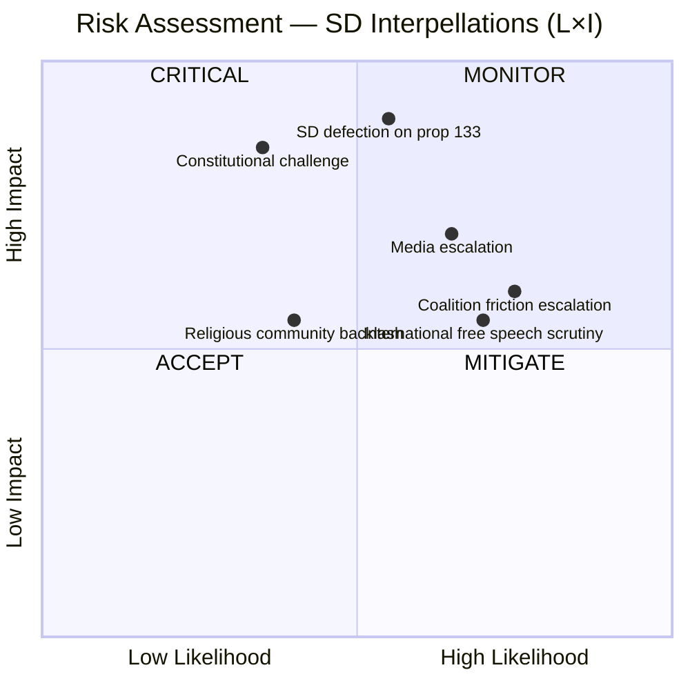

# Political Risk Assessment — 2026-04-09

**Generated**: 2026-04-09 07:00 UTC
**Data Sources**: get_interpellationer, get_dokument_innehall
**Documents Analyzed**: 2 (frs 2025/26:429, frs 2025/26:430)
**Confidence**: HIGH
**Produced By**: AI-enriched analysis (news-interpellations workflow)

## Summary

Risk assessment of two SD interpellations targeting coalition partner ministers on religious freedom and hate speech. Primary risks center on coalition stability and constitutional implications.

## Risk Matrix

## Detailed Risk Register

| # | Risk | Description | L (1-5) | I (1-5) | L×I | Category | Evidence |
|---|------|-------------|---------|---------|-----|----------|----------|
| 1 | SD defection on proposition 133 | SD votes against or abstains on government legislation on public gatherings | 3 | 5 | **15** | Coalition Stability | frs 2025/26:429 — Farivar signals constitutional objections |
| 2 | Coalition friction escalation | SD-M/KD tensions deepen over response adequacy | 4 | 3 | **12** | Coalition Stability | Both frs 429 and 430 target coalition partners directly |
| 3 | International free speech scrutiny | Global attention on Sweden's Quran burning legislation | 4 | 3 | **12** | Reputational | frs 2025/26:429 — references 2023 Quran burning international reactions |
| 4 | Media-driven escalation | More mosque investigations reveal additional cases | 3 | 4 | **12** | Political | frs 2025/26:430 — Expressen already has two Kristianstad investigations |
| 5 | Constitutional challenge to enacted law | Legal challenge to prop 133 on freedom of assembly grounds | 2 | 5 | **10** | Legal | frs 2025/26:429 — "våldsverkarnas veto" argument has constitutional weight |
| 6 | Religious community backlash | Muslim community response to increased mosque scrutiny | 2 | 3 | **6** | Social Cohesion | frs 2025/26:430 — broad mosque framing vs individual imam actions |

## Key Findings

1. **Highest risk**: SD defection on proposition 133 (L×I = 15) — could defeat government legislation **[HIGH]**
2. **Cluster of medium-high risks** (L×I = 12): Coalition friction, international scrutiny, and media escalation all interconnected **[HIGH]**
3. **Constitutional risk** (L×I = 10): Low likelihood but very high impact — Lagrådet may need to weigh in **[MEDIUM]**
4. **Response deadline pressure**: April 24-27 response window concentrates risk **[HIGH]**

## Implications

The risk landscape is dominated by coalition stability concerns. SD's strategic use of interpellations against its own coalition partners creates risks that are primarily political rather than policy-driven. Monitor minister responses and SD party group positioning ahead of proposition 133 committee vote.
