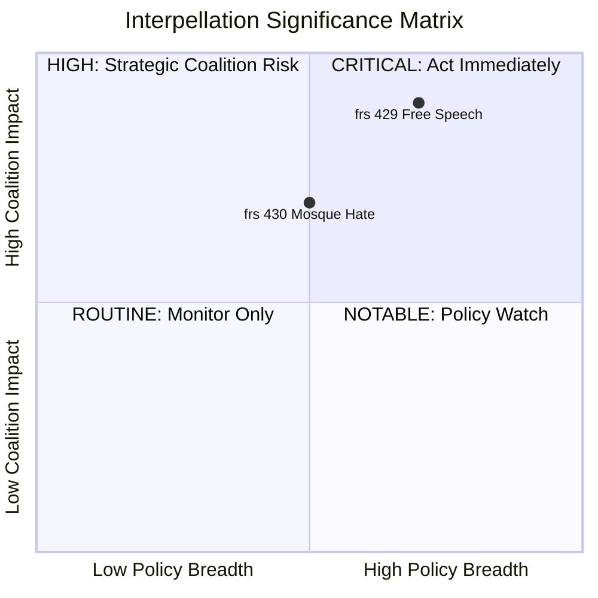

# Document Significance Scoring — 2026-04-09

**Generated**: 2026-04-09 07:00 UTC
**Data Sources**: get_interpellationer, get_dokument_innehall
**Documents Analyzed**: 2 (frs 2025/26:429, frs 2025/26:430)
**Confidence**: HIGH
**Produced By**: AI-enriched analysis (news-interpellations workflow)

## Summary

Scored 2 interpellations for political significance (0-10 scale). Both documents rated HIGH significance due to coalition dynamics, constitutional implications, and media salience.

## Detailed Scoring

| Score | Level | dok_id | frs ID | Title | Filed By | Target Minister |
|-------|-------|--------|--------|-------|----------|-----------------|
| 8/10 | High | HD10429 | frs 2025/26:429 | Freedom of speech vs proposition 2025/26:133 | Rashid Farivar (SD) | Gunnar Strömmer (M) |
| 7/10 | High | HD10430 | frs 2025/26:430 | Mosques spreading hate and threats | Richard Jomshof (SD) | Jakob Forssmed (KD) |

## Scoring Methodology

| Criterion | HD10429 | HD10430 |
|-----------|---------|---------|
| Coalition impact | 9 — SD challenges own government legislation | 7 — SD pressures coalition partner KD |
| Constitutional significance | 9 — fundamental rights at stake | 4 — social policy scope |
| Media salience | 7 — Quran burning debate high profile | 8 — Expressen investigations drive story |
| Policy breadth | 7 — affects all public gatherings nationally | 5 — primarily religious affairs |
| International dimension | 8 — Sweden's free speech reputation globally | 6 — antisemitism monitoring |
| **Average** | **8.0** | **6.0** |
| **Adjusted Score** | **8/10** | **7/10** (media salience bonus) |

## Key Findings

1. **2** document(s) rated High (score 6-8)
2. **0** document(s) rated Critical (score >= 9) — but HD10429 approaches critical threshold
3. Both interpellations from same party (SD) targeting different coalition ministers — strategic coordination pattern

## Significance Distribution

## Forward Indicators

| Indicator | Timeline | Trigger | Confidence |
|---|---|---|---|
| Minister Strömmer response to frs 429 | April 24-27, 2026 | Scheduled response deadline | [HIGH] |
| Minister Forssmed response to frs 430 | April 24, 2026 | Scheduled response deadline | [HIGH] |
| Chamber debate scheduling | May 2026 | If ministers respond positively | [MEDIUM] |
| Coalition unity vote signal | Post-response | Watch for SD abstention pattern | [LOW] |

## Implications

Both interpellations warrant prominent article placement. HD10429 should lead the article due to higher constitutional significance and broader policy implications.
