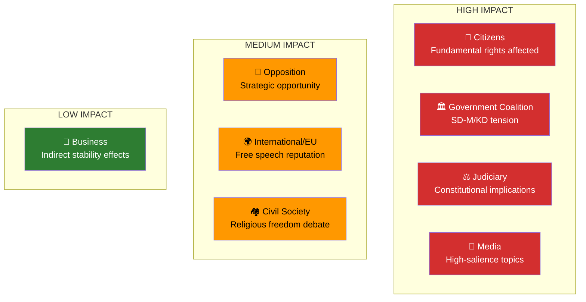

# Stakeholder Perspectives — 2026-04-09

**Generated**: 2026-04-09 07:00 UTC
**Data Sources**: get_interpellationer, get_dokument_innehall
**Documents Analyzed**: 2 (frs 2025/26:429, frs 2025/26:430)
**Confidence**: HIGH
**Produced By**: AI-enriched analysis (news-interpellations workflow)

## Summary

Multi-stakeholder impact assessment of SD interpellations on freedom of speech (frs 429) and mosque hate preaching (frs 430). Analysis covers all 8 mandatory stakeholder groups.

## Stakeholder Impact Overview

## Detailed Analysis per Stakeholder Group

### 1. Citizens — Impact: HIGH
- Demonstration and free speech rights directly at stake via proposition 2025/26:133 (frs 429)
- Jewish community protection strengthened by attention to mosque antisemitism (frs 430)
- Muslim community faces risk of stigmatization from broad mosque scrutiny
- **Net assessment**: Citizens benefit from parliamentary accountability debate but face polarization risks

### 2. Government Coalition — Impact: VERY HIGH
- SD uses interpellations to pressure coalition partners M (Strömmer) and KD (Forssmed)
- Farivar's previous question (March 4) already deemed "unsatisfactory" — escalation pattern
- Risk of SD defection on proposition 133 vote threatens legislative agenda
- **Net assessment**: Coalition faces concentrated pressure from its own support party

### 3. Opposition Bloc — Impact: MEDIUM-HIGH
- Can exploit visible coalition division on fundamental rights
- Must navigate Quran burning politics carefully (V/MP: free speech vs Islamophobia framing)
- Opportunity to frame prop 133 as authoritarian if SD also opposes
- **Net assessment**: Strategic opportunity but requires careful positioning

### 4. Business/Industry — Impact: LOW
- Indirect through political stability and international reputation effects
- Social cohesion concerns in affected communities may have local economic impact
- **Net assessment**: Minimal direct business impact

### 5. Civil Society — Impact: MEDIUM-HIGH
- Freedom of expression organizations directly engaged on prop 133 debate
- Religious communities (both Muslim and Jewish) directly affected
- Human rights organizations have concrete legislative text to analyze
- **Net assessment**: Active engagement opportunity on fundamental rights

### 6. International/EU — Impact: MEDIUM-HIGH
- Sweden's free speech reputation since 2023 Quran burnings under ongoing scrutiny
- EU Fundamental Rights Agency monitoring Swedish developments
- Antisemitism cases attract international Jewish community attention
- **Net assessment**: International attention likely if debate escalates

### 7. Judiciary/Constitutional — Impact: HIGH
- Proposition 133 raises constitutional questions about police discretion vs fundamental rights
- Farivar's three specific legal questions force rigorous constitutional analysis
- Hate speech law enforcement gaps exposed by mosque cases
- **Net assessment**: Significant constitutional law implications requiring Lagrådet attention

### 8. Media/Public Opinion — Impact: HIGH
- Expressen investigative journalism directly driving mosque accountability (frs 430)
- Quran burning and free speech debates are high-salience media topics (frs 429)
- Polarized coverage risks but also democratic engagement opportunity
- **Net assessment**: Strong media interest guaranteed; responsible coverage critical

## Key Findings

1. Government Coalition and Citizens are most directly impacted stakeholder groups **[HIGH]**
2. Constitutional and media dimensions create secondary pressure amplification **[HIGH]**
3. All 8 stakeholder groups affected — interpellations have broad political resonance **[MEDIUM]**
