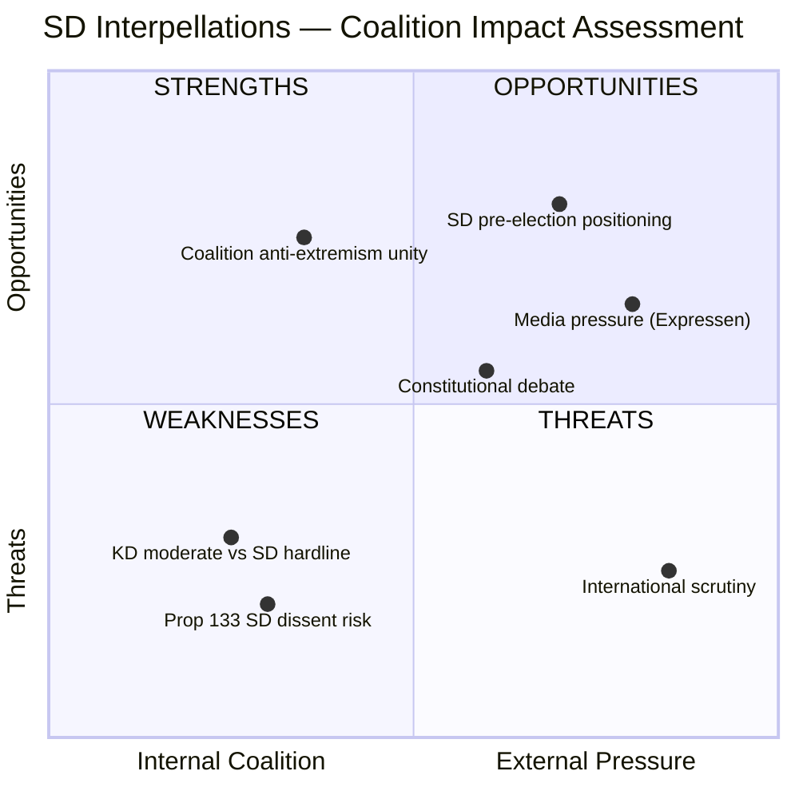

# Political SWOT Analysis — 2026-04-09

**Generated**: 2026-04-09 07:00 UTC
**Data Sources**: get_interpellationer, get_dokument_innehall
**Documents Analyzed**: 2 (frs 2025/26:429, frs 2025/26:430)
**Confidence**: HIGH
**Produced By**: AI-enriched analysis (news-interpellations workflow)

## Summary

Multi-stakeholder SWOT analysis of two SD interpellations challenging coalition partners on religious freedom and hate speech policy. Both interpellations test the Tidö Agreement coalition dynamics ahead of the 2026 election.

## SWOT Matrix

## All 8 Stakeholder Groups

### 1. Citizens

| # | Type | Statement | Evidence (frs ID/dok_id) | Confidence | Impact | Entry Date |
|---|------|-----------|--------------------------|------------|--------|------------|
| 1 | Strength | Jewish community protection strengthened by political attention | frs 2025/26:430 (HD10430) — cites imam antisemitism | **[HIGH]** | High | 2026-04-07 |
| 2 | Weakness | Muslim communities face stigmatization from broad mosque scrutiny | frs 2025/26:430 — framing of "mosques spreading hate" | **[MEDIUM]** | Medium | 2026-04-07 |
| 3 | Opportunity | Public debate may improve hate speech enforcement | Both frs 429 and 430 raise enforcement questions | **[MEDIUM]** | Medium | 2026-04-07 |
| 4 | Threat | Demonstration rights could be curtailed under prop 2025/26:133 | frs 2025/26:429 (HD10429) — "våldsverkarnas veto" argument | **[HIGH]** | High | 2026-04-07 |

### 2. Government Coalition

| # | Type | Statement | Evidence (frs ID/dok_id) | Confidence | Impact | Entry Date |
|---|------|-----------|--------------------------|------------|--------|------------|
| 1 | Strength | Can demonstrate decisive action against extremism | frs 2025/26:430 — Forssmed can announce mosque oversight measures | **[MEDIUM]** | High | 2026-04-07 |
| 2 | Weakness | SD publicly questioning own government's legislation | frs 2025/26:429 — Farivar (SD) challenges Strömmer (M) on prop 133 | **[HIGH]** | Very High | 2026-04-07 |
| 3 | Weakness | Previous response to SD deemed "unsatisfactory" | HD10429 — Farivar states March 4 answer was inadequate | **[HIGH]** | High | 2026-04-07 |
| 4 | Threat | SD could defect on prop 133 vote | frs 2025/26:429 — SD signals constitutional concerns | **[MEDIUM]** | Very High | 2026-04-07 |

### 3. Opposition Bloc

| # | Type | Statement | Evidence (frs ID/dok_id) | Confidence | Impact | Entry Date |
|---|------|-----------|--------------------------|------------|--------|------------|
| 1 | Opportunity | Coalition division on fundamental rights visible | Both frs 429 and 430 show SD-M/KD tensions | **[HIGH]** | High | 2026-04-07 |
| 2 | Weakness | Must navigate politically toxic Quran burning debate | frs 2025/26:429 — free speech vs Islamophobia framing | **[HIGH]** | Medium | 2026-04-07 |
| 3 | Opportunity | Can frame prop 133 as authoritarian if SD also opposes | Cross-party concern strengthens opposition critique | **[MEDIUM]** | High | 2026-04-07 |

### 4. Business/Industry

| # | Type | Statement | Evidence (frs ID/dok_id) | Confidence | Impact | Entry Date |
|---|------|-----------|--------------------------|------------|--------|------------|
| 1 | Threat | Social cohesion concerns affect business climate | frs 2025/26:430 — community tensions in Kristianstad | **[LOW]** | Low | 2026-04-07 |
| 2 | Opportunity | Stable democratic framework protects investment climate | frs 2025/26:429 — constitutional debate strengthens rule of law discourse | **[LOW]** | Low | 2026-04-07 |

### 5. Civil Society

| # | Type | Statement | Evidence (frs ID/dok_id) | Confidence | Impact | Entry Date |
|---|------|-----------|--------------------------|------------|--------|------------|
| 1 | Strength | Freedom of expression debate receives parliamentary attention | frs 2025/26:429 — detailed constitutional argumentation | **[HIGH]** | High | 2026-04-07 |
| 2 | Threat | Religious communities face increased scrutiny and potential profiling | frs 2025/26:430 — mosque-focused framing | **[MEDIUM]** | High | 2026-04-07 |
| 3 | Opportunity | Human rights organizations can engage on proposition 133 | frs 2025/26:429 — concrete legislative text to analyze | **[HIGH]** | Medium | 2026-04-07 |

### 6. International/EU

| # | Type | Statement | Evidence (frs ID/dok_id) | Confidence | Impact | Entry Date |
|---|------|-----------|--------------------------|------------|--------|------------|
| 1 | Weakness | Sweden's free speech reputation under pressure | frs 2025/26:429 — Farivar cites 1766 press freedom tradition at risk | **[HIGH]** | High | 2026-04-07 |
| 2 | Opportunity | Transparent parliamentary debate demonstrates democratic health | Both interpellations show functioning accountability | **[MEDIUM]** | Medium | 2026-04-07 |
| 3 | Threat | Antisemitism monitoring by EU/international bodies | frs 2025/26:430 — imam antisemitism cases | **[MEDIUM]** | Medium | 2026-04-07 |

### 7. Judiciary/Constitutional

| # | Type | Statement | Evidence (frs ID/dok_id) | Confidence | Impact | Entry Date |
|---|------|-----------|--------------------------|------------|--------|------------|
| 1 | Strength | Constitutional debate forces rigorous analysis of prop 133 | frs 2025/26:429 — Farivar's three specific legal questions | **[HIGH]** | High | 2026-04-07 |
| 2 | Threat | Police discretion under new law could face legal challenges | frs 2025/26:429 — "tungt vägande skäl" interpretation concerns | **[MEDIUM]** | High | 2026-04-07 |
| 3 | Weakness | Hate speech law enforcement gaps exposed | frs 2025/26:430 — repeated extremist preaching despite existing laws | **[HIGH]** | Medium | 2026-04-07 |

### 8. Media/Public Opinion

| # | Type | Statement | Evidence (frs ID/dok_id) | Confidence | Impact | Entry Date |
|---|------|-----------|--------------------------|------------|--------|------------|
| 1 | Strength | Investigative journalism (Expressen) driving accountability | frs 2025/26:430 — two Expressen investigations cited | **[HIGH]** | High | 2026-04-07 |
| 2 | Opportunity | High-salience topics generate public engagement | Both interpellations touch deeply divisive issues | **[HIGH]** | High | 2026-04-07 |
| 3 | Threat | Polarized media coverage risks deepening divisions | frs 2025/26:430 — mosque hate speech vs religious freedom framing | **[MEDIUM]** | Medium | 2026-04-07 |

## Key Findings

1. SD uses interpellations strategically to pressure coalition partners (M, KD) on issues where SD holds hardline positions **[HIGH]**
2. Proposition 2025/26:133 faces cross-party constitutional scrutiny — even support party SD questions its free speech implications **[HIGH]**
3. Expressen investigations provide concrete evidence driving political accountability on mosque hate preaching **[HIGH]**
4. Both ministers face April 24-27 response deadlines, creating concentrated political pressure **[HIGH]**

## Implications

SWOT analysis reveals the central dynamic: SD leveraging interpellations as pre-election positioning tools against coalition partners. The constitutional dimension of frs 429 makes it particularly significant — a coalition partner questioning the government's own legislation on fundamental rights grounds is a rare and politically consequential event.
