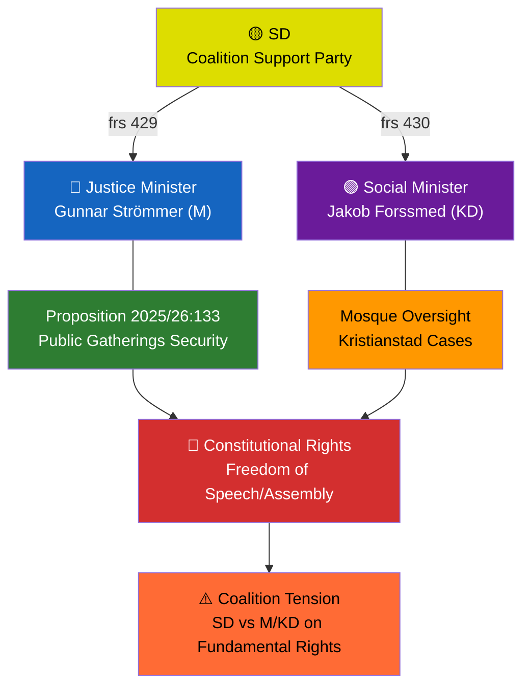

# Analysis Synthesis Summary — 2026-04-09

**Generated**: 2026-04-09 07:00 UTC
**Data Sources**: get_interpellationer, get_dokument_innehall
**Documents Analyzed**: 2
**Confidence**: HIGH
**Produced By**: AI-enriched analysis (news-interpellations workflow)

## Summary

Two interpellations filed by SD on April 7, 2026, both target coalition partner ministers and probe the coalition's internal tensions on religious freedom and security policy. HD10429 (frs 2025/26:429) challenges Justice Minister Strömmer (M) on whether proposition 2025/26:133 undermines demonstration rights — a remarkable case of a coalition support party questioning its own government's legislation on constitutional grounds. HD10430 (frs 2025/26:430) challenges Social Minister Forssmed (KD) to act on mosque hate preaching exposed by Expressen. Together, these interpellations reveal SD's strategic pressure on coalition partners ahead of the 2026 election.

## AI-Recommended Article Metadata

**Recommended Title (EN)**: SD Challenges Coalition Partners on Religious Freedom and Hate Speech
**Recommended Title (SV)**: SD utmanar koalitionspartner om religionsfrihet och hatpredikningar
**Meta Description (EN)**: Sweden Democrats file two interpellations targeting Justice Minister Strömmer and Social Minister Forssmed on mosque hate speech and demonstration rights, testing coalition unity.
**Meta Description (SV)**: Sverigedemokraterna lämnar in två interpellationer riktade mot justitieminister Strömmer och socialminister Forssmed om hatpredikningar och demonstrationsrätt.
**Key Highlights**: SD-coalition tension on proposition 2025/26:133; mosque hate preaching in Kristianstad; constitutional freedom of speech debate
**Article Decision**: PUBLISH — High political significance, coalition dynamics
**Article Priority**: HIGH

## Key Findings

1. **Coalition Stress Test**: Both interpellations target Tidö Agreement coalition partners (M and KD), not opposition — SD probes coalition unity on sensitive religious/constitutional topics **[HIGH]**
2. **Constitutional Challenge**: frs 2025/26:429 raises fundamental questions about whether government legislation creates "våldsverkarnas veto" (violent's veto) undermining Sweden's 1766 press freedom tradition **[HIGH]**
3. **Antisemitism Dimension**: frs 2025/26:430 cites Expressen investigations of imam antisemitism in Kristianstad, linking mosque oversight to hate crime prevention **[HIGH]**
4. **Response Deadlines**: Both ministers must respond by April 24-27, creating a concentrated accountability window **[HIGH]**

## Top Documents by Significance

| Score | Type | dok_id | Title | Filed By | Target Minister |
|-------|------|--------|-------|----------|-----------------|
| 8/10 | Interpellation | HD10429 | Freedom of speech vs proposition 2025/26:133 | Rashid Farivar (SD) | Gunnar Strömmer (M) |
| 7/10 | Interpellation | HD10430 | Mosques spreading hate and threats | Richard Jomshof (SD) | Jakob Forssmed (KD) |

## Cross-Document Patterns

## Implications

Both interpellations share a common thread: SD leveraging its coalition position to pressure M and KD on religious and constitutional issues where SD's hardline stance differs from its partners' moderate positions. This pattern — a support party using parliamentary accountability tools against its own government — signals pre-election positioning and potential coalition friction ahead of the September 2026 election.

## Data Quality Notes

Overall confidence: **HIGH**. Full document text analyzed via get_dokument_innehall. Minister responses not yet available (due dates April 24-27). No debate speeches found via search_anforanden — interpellations are newly filed and awaiting scheduling.
