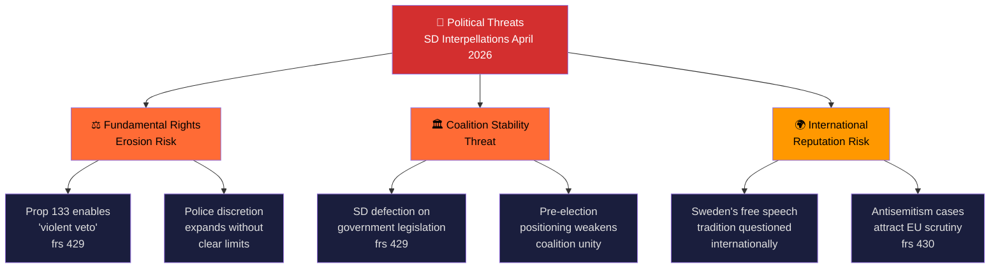

# Political Threat Analysis — 2026-04-09

**Generated**: 2026-04-09 07:00 UTC
**Data Sources**: get_interpellationer, get_dokument_innehall
**Documents Analyzed**: 2 (frs 2025/26:429, frs 2025/26:430)
**Confidence**: HIGH
**Produced By**: AI-enriched analysis (news-interpellations workflow)

## Summary

Threat analysis of SD interpellations focusing on democratic function risks. Primary threat categories: Fundamental Rights Erosion (prop 133 concerns) and Coalition Stability (SD pressure tactics).

## Threat Taxonomy

## Threat Register

| # | Threat Category | Description | Severity | Evidence | Confidence |
|---|----------------|-------------|----------|----------|------------|
| 1 | Fundamental Rights Erosion | Proposition 2025/26:133 could normalize restriction of demonstrations based on security threats | HIGH | frs 2025/26:429 — Farivar's "våldsverkarnas veto" analysis | **[HIGH]** |
| 2 | Coalition Stability | SD using interpellations to weaken coalition partners' positions pre-election | MEDIUM | Both frs 429 and 430 target M/KD ministers | **[HIGH]** |
| 3 | International Reputation | Sweden's free speech credentials questioned | MEDIUM | frs 2025/26:429 — references post-2023 Quran burning international pressure | **[MEDIUM]** |
| 4 | Social Cohesion | Religious community tensions in Kristianstad and nationally | MEDIUM | frs 2025/26:430 — Expressen mosque investigations | **[HIGH]** |
| 5 | Democratic Accountability Gap | Minister responses may be evasive (as Farivar alleges previous response was) | LOW | HD10429 — previous "unsatisfactory" written answer | **[HIGH]** |

## Key Findings

1. Primary democratic threat: proposition 2025/26:133 creating legal framework that could restrict demonstrations based on third-party threats **[HIGH]**
2. Coalition stability threat is strategic rather than existential — SD unlikely to withdraw from Tidö Agreement but may extract concessions **[MEDIUM]**
3. International reputation threat compounds with previous Quran burning incidents **[MEDIUM]**
