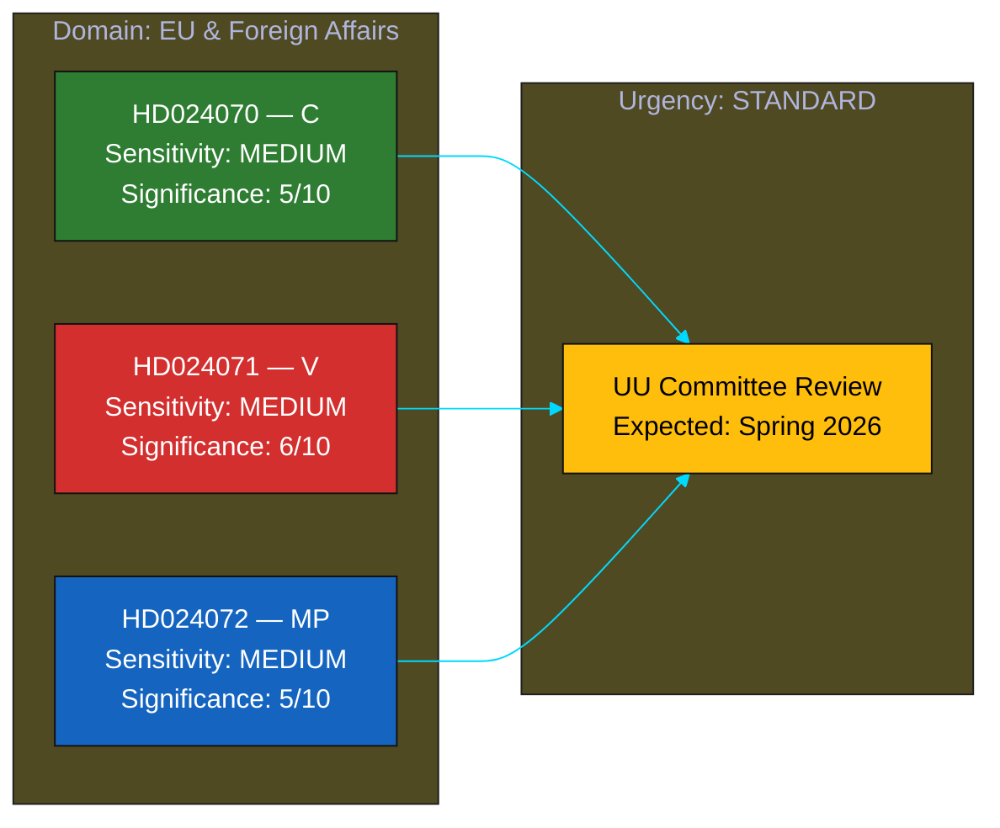

# Political Classification Results — 2026-04-09

**Generated**: 2026-04-09 07:07 UTC
**Last Improved**: 2026-04-09T13:00Z by translation agent
**Data Sources**: get_motioner, full-text analysis
**Documents Analyzed**: 3
**Confidence**: HIGH
**Produced By**: pre-article-analysis script, enriched by AI agent

## Summary

Classified **3** parliamentary motions by sensitivity, impact, urgency, and domain. All three respond to Skr. 2025/26:226 (Riksrevisionen audit of Sida humanitarian aid). Significance upgraded from pipeline 1/10 to 5–6/10 after full-text analysis.

## Classification Overview

## Detailed Analysis

### mot. 2025/26:4070 — Centerpartiet (C)
- **dok_id**: HD024070
- **Type**: Motion following government communication
- **Significance**: 🟡 Medium (5/10) [upgraded from pipeline 1/10]
- **Domains**: EU and foreign affairs, development cooperation
- **Sensitivity**: MEDIUM — involves international aid accountability
- **Urgency**: STANDARD — committee-level deliberation
- **Key aspects**: Ukraine Fund proposal, UNRWA demand, embassy reform
- **Confidence**: HIGH (85%)

### mot. 2025/26:4071 — Vänsterpartiet (V)
- **dok_id**: HD024071
- **Type**: Motion following government communication
- **Significance**: 🟠 Medium-High (6/10) [upgraded from pipeline 1/10]
- **Domains**: EU and foreign affairs, development cooperation, human rights
- **Sensitivity**: MEDIUM — cites OECD DAC compliance concerns
- **Urgency**: STANDARD — committee-level deliberation
- **Key aspects**: Most comprehensive critique; OECD DAC violation evidence; migration-aid nexus
- **Confidence**: HIGH (85%)

### mot. 2025/26:4072 — Miljöpartiet (MP)
- **dok_id**: HD024072
- **Type**: Motion following government communication
- **Significance**: 🟡 Medium (5/10) [upgraded from pipeline 1/10]
- **Domains**: EU and foreign affairs, development cooperation, governance
- **Sensitivity**: MEDIUM — reveals 4.7B SEK accountability gap
- **Urgency**: STANDARD — committee-level deliberation
- **Key aspects**: UD accountability, localization focus, governance reform
- **Confidence**: HIGH (85%)

## Key Findings

1. All three motions respond to the same government communication (Skr. 2025/26:226), indicating coordinated opposition interest
2. V motion (HD024071) rated highest due to international law evidence and broadest scope
3. Domain uniformly EU & foreign affairs, but each party emphasizes different sub-themes
4. Pipeline significance scores (1/10) significantly underestimated due to metadata-only analysis

## Implications

Classification drives article prioritisation. The coordinated three-party response pattern and substantive policy content warrant Medium significance treatment, with V motion approaching Medium-High for its international law dimensions.

## Data Quality Notes

Classification confidence: HIGH. Scores upgraded through AI full-text analysis with cross-document pattern recognition. Original pipeline scores preserved in brackets for audit trail.