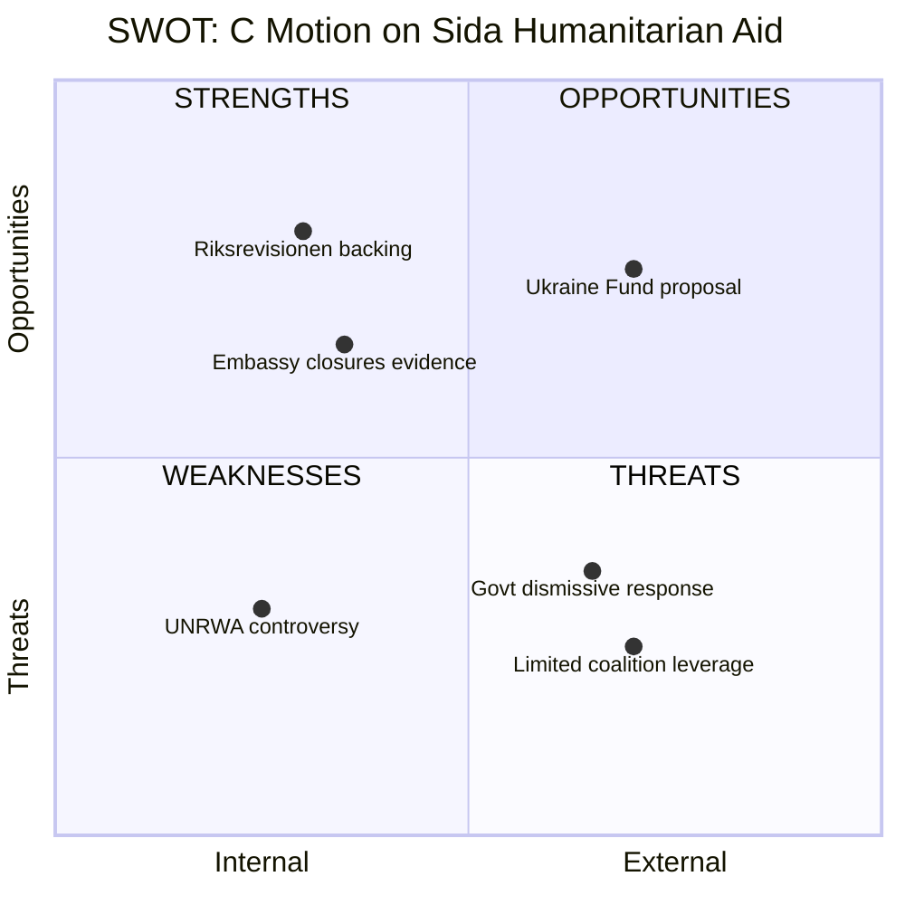

# Document Analysis: Centerpartiet Motion on Sida Humanitarian Aid Audit

**Generated**: 2026-04-09 07:15 UTC
**dok_id**: HD024070
**Document Type**: Kommittémotion (Committee Motion)
**Committee**: UU (Utrikesutskottet — Foreign Affairs Committee)
**Date**: 2026-04-08
**Author**: Anna Lasses and Kerstin Lundgren (both C)
**Party**: C (Centerpartiet)
**Riksmöte**: 2025/26
**Significance**: 🟡 Medium (5/10)
**Confidence**: HIGH (85%)

---

## Executive Summary

Centerpartiet leverages the Riksrevisionen audit report (skr. 2025/26:226) on Sida's humanitarian aid work to press four specific demands: fixing the disconnect between development and humanitarian aid, better use of Swedish embassies abroad, resuming UNRWA funding, and creating a dedicated Ukraine fund. The motion represents a centrist critique focused on institutional effectiveness rather than ideological reframing. [HIGH confidence]

## Key Proposals

1. **Fix long-term planning gaps** — Strengthen the link between development aid and humanitarian aid (bridging the nexus gap Riksrevisionen identified)
2. **Better embassy utilization** — Address problems caused by embassy closures and staff reductions in aid-receiving countries
3. **Resume UNRWA funding** — Criticizes political interference in aid decisions where leadership overrode staff-level criteria-based decisions
4. **Create Ukraine Fund** — Separate Ukraine support from regular aid budget to protect other humanitarian programmes

## SWOT Analysis

| # | Category | Statement | Evidence | Confidence | Impact |
|---|----------|-----------|----------|------------|--------|
| 1 | Strength | Motion directly cites Riksrevisionen findings, giving it institutional credibility | mot. 2025/26:4070, references skr. 2025/26:226 | HIGH | Medium |
| 2 | Strength | Pragmatic proposals (Ukraine Fund) have cross-party appeal | mot. 2025/26:4070, demand 4 | MEDIUM | High |
| 3 | Weakness | UNRWA demand is politically contentious within current geopolitical climate | mot. 2025/26:4070, demand 3 | HIGH | Medium |
| 4 | Weakness | C is a small opposition party with limited leverage in UU committee | Committee composition data | HIGH | Low |
| 5 | Opportunity | Embassy closure criticism could resonate with government's own diplomacy priorities | mot. 2025/26:4070, demand 2 | MEDIUM | Medium |
| 6 | Threat | Government already considers the matter settled (skrivelsen states "ärendet slutbehandlat") | skr. 2025/26:226 | HIGH | High |

## Stakeholder Perspective Analysis

| Stakeholder | Impact | Assessment | Confidence |
|-------------|--------|------------|------------|
| **Citizens** | Low | Indirect impact via aid policy; no domestic policy change | MEDIUM |
| **Government Coalition** | Medium | Faces pressure on aid effectiveness; Ukraine Fund proposal could split coalition views | HIGH |
| **Opposition Bloc** | Medium | C aligns with V and MP on Riksrevisionen critique but differs on specifics | HIGH |
| **Business/Industry** | Low | Minimal direct impact on Swedish business interests | LOW |
| **Civil Society** | Medium | Aid organizations would benefit from embassy presence and UNRWA resumption | HIGH |
| **International/EU** | Medium | UNRWA and Ukraine Fund have international dimensions | MEDIUM |
| **Judiciary/Constitutional** | Low | No constitutional implications | HIGH |
| **Media/Public Opinion** | Medium | UNRWA and Ukraine narratives have media traction | MEDIUM |

## Risk Assessment

| Risk | Likelihood (1-5) | Impact (1-5) | L x I | Mitigation |
|------|-------------------|--------------|-------|------------|
| Government ignores all demands | 4 | 3 | 12 | Coalition partners may sympathize with Ukraine Fund idea |
| UNRWA demand alienates potential allies | 3 | 2 | 6 | Frame as principle of aid independence from politics |
| Embassy critique backfires on C's own record | 2 | 2 | 4 | C was not in government when closures occurred |

## Forward Indicators

- **UU committee hearing date**: Expected within 4-6 weeks for skr. 2025/26:226 consideration
- **Ukraine Fund debate**: Watch for government response in spring budget framework (April-May 2026)
- **UNRWA funding review**: UN General Assembly session September 2026 provides external pressure point

## Data Quality Notes

- **Analysis confidence**: HIGH (85%)
- **Full-text content**: Available — analysis based on complete motion text
- **Data sources**: riksdag-regering-mcp (get_motioner, get_dokument_innehall)
