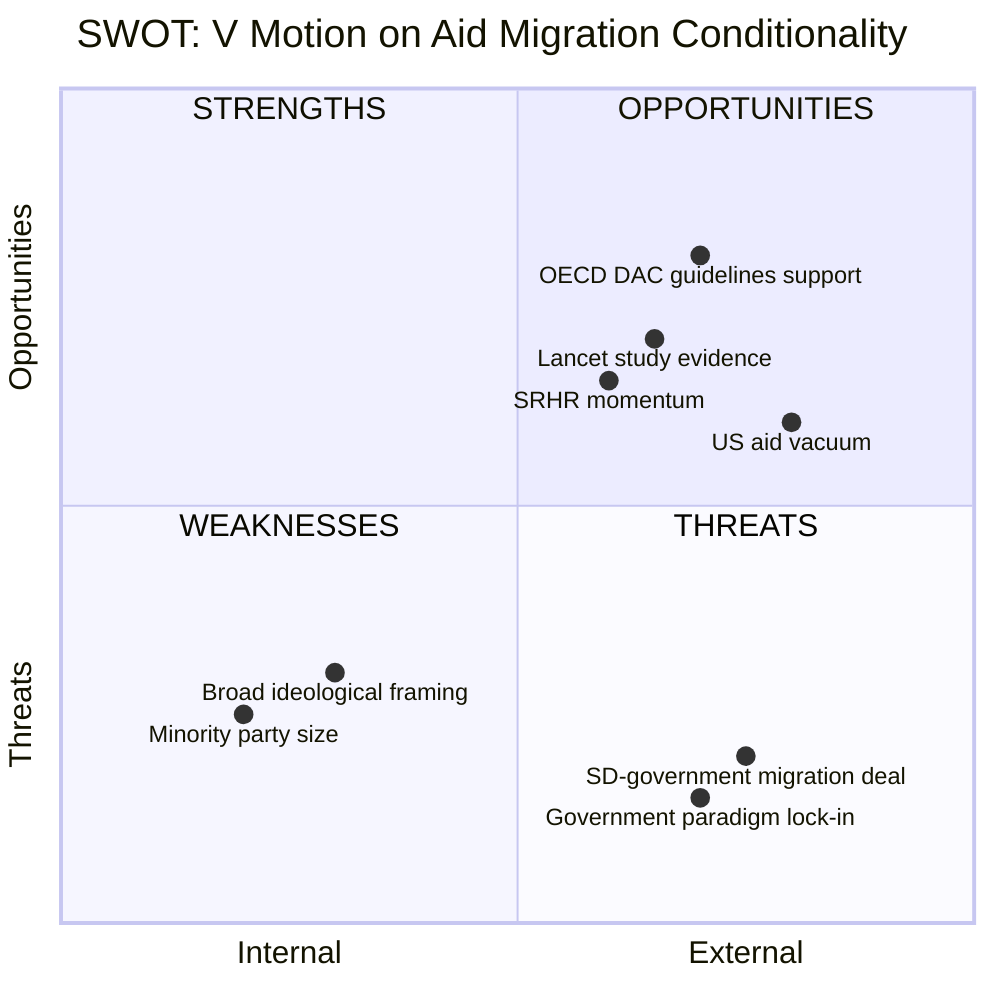

# Document Analysis: Vänsterpartiet Motion on Sida Humanitarian Aid and Migration Policy

**Generated**: 2026-04-09 07:15 UTC
**dok_id**: HD024071
**Document Type**: Kommittémotion (Committee Motion)
**Committee**: UU (Utrikesutskottet — Foreign Affairs Committee)
**Date**: 2026-04-08
**Author**: Lotta Johnsson Fornarve et al. (V)
**Party**: V (Vänsterpartiet)
**Riksmöte**: 2025/26
**Significance**: 🟠 Medium-High (6/10)
**Confidence**: HIGH (90%)

---

## Executive Summary

Vänsterpartiet files the most extensive of the three opposition motions responding to the Riksrevisionen Sida audit. The motion goes beyond audit findings to mount a comprehensive attack on the government's entire aid paradigm shift — particularly the conditioning of aid on migration policy compliance and the abandonment of the 1% GNI target. Four specific demands focus on ending migration conditions in aid, protecting refugees, increasing SRHR funding, and strengthening children's rights. The motion explicitly links Sweden's aid cuts to the broader global context of US (Trump) aid slashing, warning of catastrophic consequences. [HIGH confidence]

## Key Proposals

1. **End migration conditions on aid** — Sweden must not condition development or aid on migration cooperation
2. **No aid for refugee deterrence** — Neither Sweden nor EU should use aid to stop people fleeing
3. **Increase SRHR funding** — Boost sexual and reproductive health and rights in humanitarian aid
4. **Strengthen children's rights** — Enhance child rights perspective in humanitarian operations

## SWOT Analysis

| # | Category | Statement | Evidence | Confidence | Impact |
|---|----------|-----------|----------|------------|--------|
| 1 | Strength | Cites OECD DAC clarification showing government violates international aid rules | mot. 2025/26:4071, OECD Dec 2022 guidelines | HIGH | High |
| 2 | Strength | Uses Lancet study (14M deaths risk from US aid cuts) for urgency framing | mot. 2025/26:4071, Lancet July 2025 | HIGH | High |
| 3 | Strength | Strong SRHR/children's rights demands with concrete evidence (MSF Sudan report) | mot. 2025/26:4071, MSF 2026 report | HIGH | Medium |
| 4 | Weakness | Sweeping ideological critique may dilute specific actionable demands | mot. 2025/26:4071, overall structure | MEDIUM | Medium |
| 5 | Weakness | V's minority position limits legislative influence | Parliamentary composition | HIGH | High |
| 6 | Opportunity | US aid vacuum creates need for European leadership — Sweden could lead | mot. 2025/26:4071, Trump/USAID analysis | HIGH | High |
| 7 | Opportunity | Cross-party alignment with C and MP on Riksrevisionen critique | HD024070, HD024072 | HIGH | Medium |
| 8 | Threat | Government-SD migration deal makes migration-aid separation politically impossible | Tidöavtalet context | HIGH | High |
| 9 | Threat | Government considers aid reform agenda settled — low receptivity | skr. 2025/26:226 response | HIGH | Medium |

## Stakeholder Perspective Analysis

| Stakeholder | Impact | Assessment | Confidence |
|-------------|--------|------------|------------|
| **Citizens** | Medium | Migration-aid nexus touches domestic migration debate; SRHR has public support | HIGH |
| **Government Coalition** | High | Direct challenge to Tidöavtalet migration-aid linkage; threatens coalition consensus | HIGH |
| **Opposition Bloc** | High | V sets ideological anchor for left-wing opposition on aid policy | HIGH |
| **Business/Industry** | Low | Critique of aid-trade linkage relevant but not primary focus | MEDIUM |
| **Civil Society** | High | Aid organizations, MSF, UNRWA, women's rights groups strongly aligned | HIGH |
| **International/EU** | High | EU role in filling US vacuum; OECD DAC compliance questions | HIGH |
| **Judiciary/Constitutional** | Low | No direct constitutional implications | HIGH |
| **Media/Public Opinion** | High | Migration-aid linkage and Trump/USAID angle generate significant media interest | HIGH |

## Risk Assessment

| Risk | Likelihood (1-5) | Impact (1-5) | L x I | Mitigation |
|------|-------------------|--------------|-------|------------|
| Government rejects all demands citing Tidöavtalet | 5 | 4 | 20 | Frame as international law compliance, not ideology |
| Migration debate drowns out aid effectiveness message | 3 | 3 | 9 | Lead with Riksrevisionen findings, then policy critique |
| SRHR demands dismissed as peripheral to audit scope | 3 | 2 | 6 | Link to specific crisis evidence (Sudan, MSF report) |
| 1% GNI target seen as unrealistic in current fiscal climate | 4 | 2 | 8 | Emphasize relative cost vs humanitarian impact |

## Forward Indicators

- **UU committee deliberation**: Expected May-June 2026 for skr. 2025/26:226
- **EU aid policy review**: European Council meeting June 2026 will address US aid vacuum
- **Migration-aid policy review**: Government's 3 billion SEK migration-aid package (2024-2028) enters mid-term review
- **UN General Assembly**: September 2026 provides platform for Sweden's aid stance

## Cross-Document References

- Directly references own party motion mot. 2025/26:2818 (Swedish development policy)
- References skr. 2025/26:97 on Ukraine aid results
- Shares UU committee with HD024070 (C) and HD024072 (MP)

## Data Quality Notes

- **Analysis confidence**: HIGH (90%)
- **Full-text content**: Available — analysis based on complete motion text (most detailed of 3 motions)
- **Data sources**: riksdag-regering-mcp (get_motioner, get_dokument_innehall)
