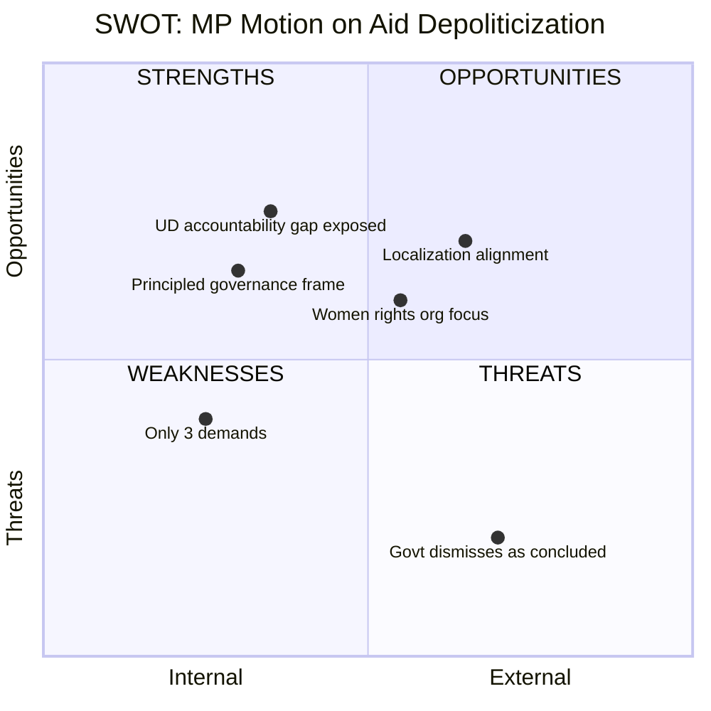

# Document Analysis: Miljöpartiet Motion on Sida Humanitarian Aid Depoliticization

**Generated**: 2026-04-09 07:15 UTC
**dok_id**: HD024072
**Document Type**: Kommittémotion (Committee Motion)
**Committee**: UU (Utrikesutskottet — Foreign Affairs Committee)
**Date**: 2026-04-08
**Author**: Janine Alm Ericson et al. (MP)
**Party**: MP (Miljöpartiet)
**Riksmöte**: 2025/26
**Significance**: 🟡 Medium (5/10)
**Confidence**: HIGH (85%)

---

## Executive Summary

Miljöpartiet's motion focuses on three demands: preventing politicization of humanitarian aid efficiency reforms, requiring comprehensive government follow-up on the Riksrevisionen audit (including UD's own operations), and strengthening local civil society organizations' access to humanitarian funding. Notably, MP reveals that 4.7 billion SEK of humanitarian aid (nearly half) is handled by the Foreign Ministry (UD), not Sida — creating an accountability gap that Riksrevisionen's audit didn't cover. The motion takes a principled governance approach emphasizing transparency and institutional integrity. [HIGH confidence]

## Key Proposals

1. **Prevent politicization** — Ensure efficiency reforms don't subordinate humanitarian principles to "Swedish interests"
2. **Comprehensive UD accountability** — Government must report on how all state humanitarian aid handling (including UD's 4.7B SEK) addresses Riksrevisionen findings
3. **Strengthen local organizations** — Ensure localization and simplification policies actually benefit local civil society, especially women's rights organizations

## SWOT Analysis

| # | Category | Statement | Evidence | Confidence | Impact |
|---|----------|-----------|----------|------------|--------|
| 1 | Strength | Reveals UD handles 4.7B SEK (half of humanitarian aid) outside Riksrevisionen audit scope | mot. 2025/26:4072, financial data | HIGH | High |
| 2 | Strength | Principled governance framing avoids ideological polarization | mot. 2025/26:4072, overall tone | HIGH | Medium |
| 3 | Strength | Focus on women's rights organizations aligns with international Grand Bargain commitments | mot. 2025/26:4072, demand 3 | HIGH | Medium |
| 4 | Weakness | Narrower scope (3 demands vs V's 4 and broader analysis) | mot. 2025/26:4072 | MEDIUM | Low |
| 5 | Opportunity | UD accountability demand could attract cross-party support for transparency | mot. 2025/26:4072, demand 2 | MEDIUM | Medium |
| 6 | Opportunity | Localization agenda aligns with international humanitarian reform trends | Grand Bargain context | HIGH | Medium |
| 7 | Threat | Government states matter is "slutbehandlat" (concluded) | skr. 2025/26:226 | HIGH | High |
| 8 | Threat | "Swedish interests" language in government strategy signals continued politicization | Humanitarian strategy text | HIGH | High |

## Stakeholder Perspective Analysis

| Stakeholder | Impact | Assessment | Confidence |
|-------------|--------|------------|------------|
| **Citizens** | Low | Governance and transparency focus has limited direct citizen impact | MEDIUM |
| **Government Coalition** | Medium | UD accountability demand challenges Foreign Ministry directly | HIGH |
| **Opposition Bloc** | Medium | MP complements C and V critiques with governance/transparency angle | HIGH |
| **Business/Industry** | Low | No significant business implications | HIGH |
| **Civil Society** | High | Local organizations, women's rights groups directly benefit from demand 3 | HIGH |
| **International/EU** | Medium | Localization aligns with Grand Bargain; principled aid has EU relevance | MEDIUM |
| **Judiciary/Constitutional** | Low | No constitutional implications | HIGH |
| **Media/Public Opinion** | Medium | UD accountability gap (4.7B SEK) is a newsworthy revelation | HIGH |

## Risk Assessment

| Risk | Likelihood (1-5) | Impact (1-5) | L x I | Mitigation |
|------|-------------------|--------------|-------|------------|
| Government ignores UD accountability demand | 4 | 3 | 12 | Use KU (Constitutional Committee) scrutiny mechanisms |
| Localization remains rhetorical | 3 | 3 | 9 | Demand concrete metrics and timelines |
| Politicization concern dismissed as hypothetical | 3 | 3 | 9 | Cite specific strategy language about "Swedish interests" |

## Forward Indicators

- **UU committee schedule**: Review of skr. 2025/26:226 expected May-June 2026
- **Grand Bargain reporting**: International localization targets reviewed mid-2026
- **UD budget transparency**: Autumn budget 2026 will reveal UD humanitarian aid allocation
- **Women's rights funding**: Track SRHR funding levels in Sida's 2026 plan

## Data Quality Notes

- **Analysis confidence**: HIGH (85%)
- **Full-text content**: Available — analysis based on complete motion text
- **Data sources**: riksdag-regering-mcp (get_motioner, get_dokument_innehall)
