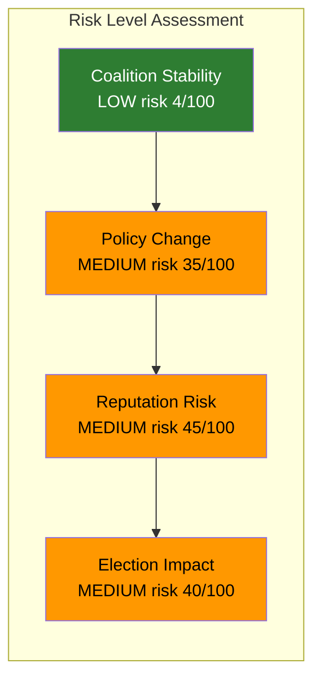

# Political Risk Assessment — 2026-04-09

**Generated**: 2026-04-09 07:18 UTC
**Analyst**: AI-driven deep analysis
**Data Sources**: riksdag-regering-mcp (get_motioner, get_dokument_innehall)
**Documents Analyzed**: 3 (mot. 2025/26:4070, 4071, 4072)
**Confidence**: MEDIUM-HIGH
**Riksmöte**: 2025/26

## Summary

Coalition risk remains LOW for immediate government stability, but the humanitarian aid policy debate introduces MEDIUM risk for the government's international reputation and diplomatic positioning. Three opposition parties challenging the migration-aid nexus creates sustained policy pressure heading into the 2026 election cycle.

## Risk Matrix

| Risk | Likelihood (1-5) | Impact (1-5) | L x I | Category | Trigger |
|------|-------------------|--------------|-------|----------|---------|
| Government rejects all 3 motions in UU | 5 | 3 | 15 | Policy | UU committee vote May-Jun 2026 |
| Migration-aid conditionality exposed at OECD review | 3 | 4 | 12 | Reputation | OECD DAC peer review cycle |
| UD accountability gap becomes KU investigation | 2 | 4 | 8 | Governance | KU session autumn 2026 |
| Aid policy becomes election wedge issue | 3 | 3 | 9 | Electoral | Campaign season Sep 2026 |
| UNRWA funding remains frozen | 4 | 3 | 12 | International | UNGA session Sep 2026 |
| US aid vacuum not filled by EU/Sweden | 3 | 4 | 12 | International | EU Council Jun 2026 |

## Anomaly Flags

1. **Three simultaneous motions on same skrivelse**: Unusual coordination — typically 1-2 parties respond. All three opposition parties filing on the same day signals pre-coordination or shared urgency. [MEDIUM confidence]
2. **S absence**: Socialdemokraterna did not file a motion on skr. 2025/26:226, despite being the largest opposition party and historically championing aid policy. This may indicate strategic restraint or that S will address this in broader budget debate. [MEDIUM confidence]

## Key Findings

1. Coalition stability not directly threatened — Tidöavtalet partners aligned on aid reform
2. International reputation risk is the primary concern (OECD DAC compliance, EU leadership vacuum)
3. UD's 4.7B SEK handling outside audit scope is a governance risk flag
4. Election cycle amplifies all risks as parties position for 2026 campaign

## Implications

- Government should expect sustained UU committee questioning
- International forums (OECD, EU, UNGA) provide opposition with amplification platforms
- S's strategic silence may indicate a larger upcoming intervention in budget debates

## Data Quality Notes

Risk assessment derived from full-text analysis of all 3 motions, coalition dynamics context, and international aid policy landscape. Confidence: MEDIUM-HIGH.
