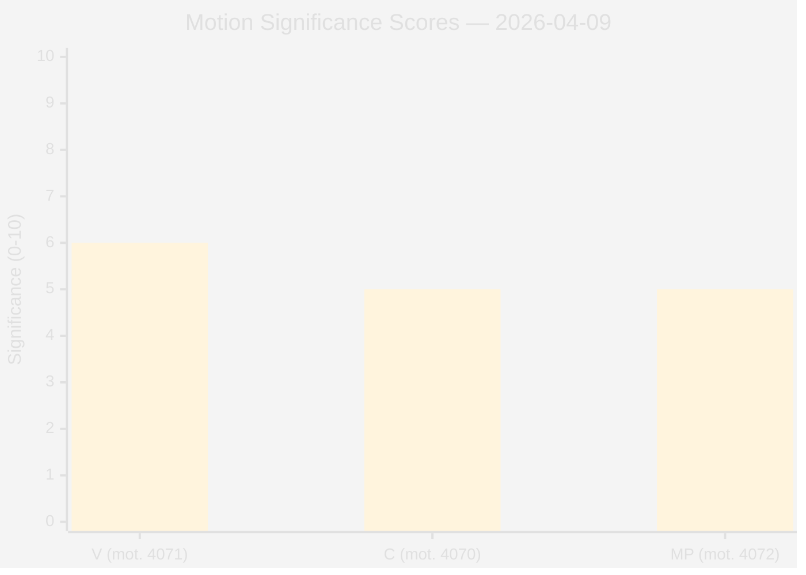
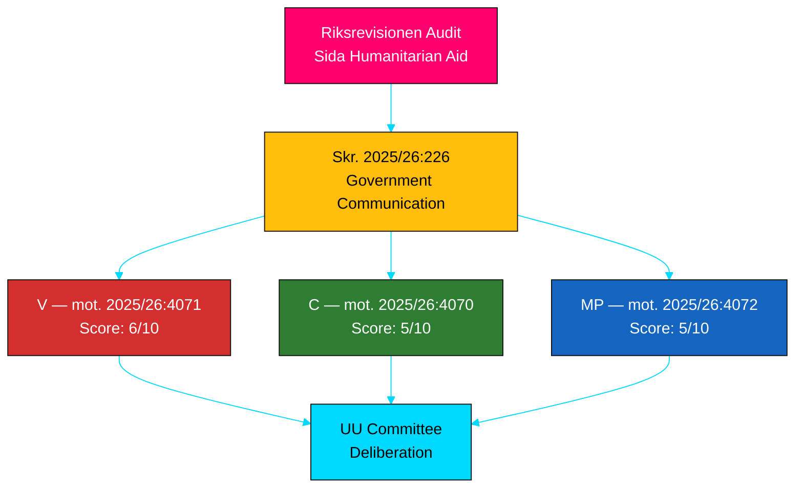

# Document Significance Scoring — 2026-04-09

**Generated**: 2026-04-09 07:18 UTC
**Analyst**: AI-driven deep analysis
**Data Sources**: riksdag-regering-mcp
**Documents Analyzed**: 3
**Confidence**: HIGH
**Riksmöte**: 2025/26

## Summary

Scored 3 documents for political significance (0-10 scale). Upgraded from pipeline-assigned 1/10 to substantive scores based on full-text analysis and cross-document coordination pattern.

## Detailed Analysis

| Score | Level | dok_id | Motion | Party | Key Factor |
|-------|-------|--------|--------|-------|------------|
| 6/10 | Medium-High | HD024071 | mot. 2025/26:4071 | V | Most comprehensive critique; OECD DAC violation evidence; migration-aid nexus challenge |
| 5/10 | Medium | HD024070 | mot. 2025/26:4070 | C | Ukraine Fund proposal; UNRWA demand; practical embassy reform |
| 5/10 | Medium | HD024072 | mot. 2025/26:4072 | MP | UD accountability revelation (4.7B SEK); localization focus; governance angle |

**Scoring Methodology Adjustment**: Pipeline scores (1/10) were based on metadata only. Full-text analysis reveals substantive policy content, coordinated multi-party response, and specific international law references that elevate significance.

## Key Findings

1. **0** document(s) rated Critical (score >= 8) — motions are committee-level, not floor votes
2. **1** document(s) rated Medium-High (score 6-7) — V motion strongest due to international evidence
3. **2** document(s) rated Medium (score 5) — C and MP motions with distinct valuable angles
4. Coordinated three-party response elevates collective significance above individual scores

## Implications

Individual motion significance is moderate, but the coordinated three-party response to a single Riksrevisionen audit represents a notable opposition strategy pattern worth monitoring through UU committee deliberations.

## Significance Distribution

### Opposition Coordination Pattern

## Data Quality Notes

Significance scores upgraded through AI full-text analysis including cross-document pattern recognition. Confidence: HIGH.

**Last improved**: 2026-04-09T12:59Z by translation agent (added Mermaid visualizations)
