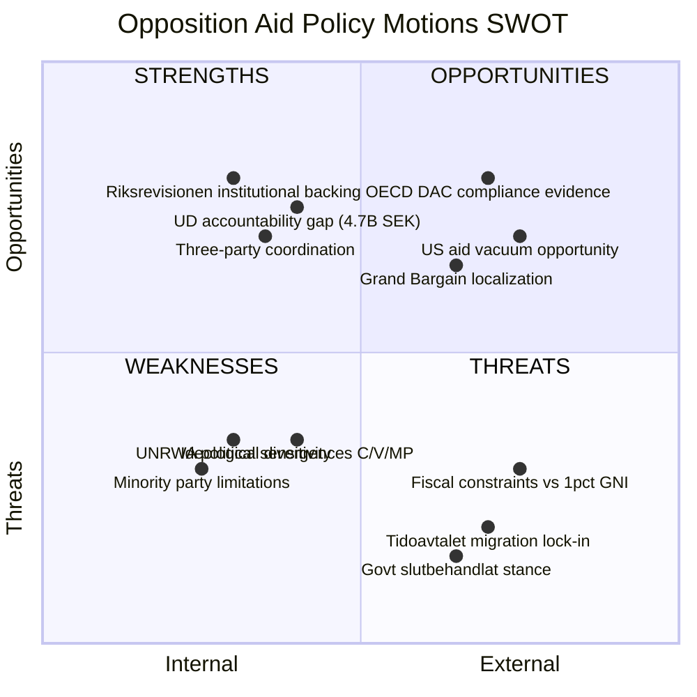

# Political SWOT Analysis — 2026-04-09

**Generated**: 2026-04-09 07:18 UTC
**Analyst**: AI-driven deep analysis
**Data Sources**: riksdag-regering-mcp (get_motioner, get_dokument_innehall)
**Documents Analyzed**: 3 (mot. 2025/26:4070, 4071, 4072)
**Confidence**: MEDIUM-HIGH
**Riksmöte**: 2025/26

## Summary

Multi-stakeholder SWOT analysis of three opposition motions (C, V, MP) responding to skr. 2025/26:226 on Riksrevisionen's Sida humanitarian aid audit. Analysis covers all 8 mandatory stakeholder groups with evidence-backed assessments.

## Detailed SWOT by Stakeholder Group

### 1. Citizens
| # | Type | Statement | Evidence | Confidence | Impact |
|---|------|-----------|----------|------------|--------|
| 1 | S | Swedish taxpayers benefit from improved aid efficiency oversight | skr. 2025/26:226 audit findings | HIGH | Medium |
| 2 | W | Domestic migration debate may overshadow humanitarian concerns | mot. 2025/26:4071, migration-aid nexus | MEDIUM | Medium |
| 3 | O | Public opinion increasingly supports aid accountability | Riksrevisionen mandate | MEDIUM | Low |
| 4 | T | Aid fatigue amid domestic economic pressures | General political context | MEDIUM | Medium |

### 2. Government Coalition (M, KD, L + SD support)
| # | Type | Statement | Evidence | Confidence | Impact |
|---|------|-----------|----------|------------|--------|
| 1 | S | Government has already responded with reform agenda ("Bistånd för en ny era") | skr. 2025/26:226 | HIGH | High |
| 2 | W | UD handles 4.7B SEK outside audited Sida processes — accountability gap | mot. 2025/26:4072, budget data | HIGH | High |
| 3 | W | Migration-aid conditionality may violate OECD DAC guidelines | mot. 2025/26:4071, OECD Dec 2022 | HIGH | High |
| 4 | T | Three-party opposition coordination creates sustained pressure | HD024070, HD024071, HD024072 | HIGH | Medium |

### 3. Opposition Bloc (S, V, C, MP)
| # | Type | Statement | Evidence | Confidence | Impact |
|---|------|-----------|----------|------------|--------|
| 1 | S | Riksrevisionen audit validates long-standing opposition criticism | mot. 2025/26:4070 (C explicitly states this) | HIGH | High |
| 2 | S | Each party offers distinct expertise angle (C: institutional, V: rights, MP: governance) | All three motions | HIGH | Medium |
| 3 | W | S notably absent from today's motions — opposition not fully unified | MCP data (no S motion on skr. 226) | HIGH | Medium |
| 4 | O | Aid policy could become 2026 election wedge issue | Political context | MEDIUM | High |

### 4. Business/Industry
| # | Type | Statement | Evidence | Confidence | Impact |
|---|------|-----------|----------|------------|--------|
| 1 | S | No direct negative business impact from motions | All motions | HIGH | Low |
| 2 | W | V critique of aid-trade linkage could concern export industry | mot. 2025/26:4071, trade-aid analysis | MEDIUM | Low |
| 3 | O | Better aid coordination could improve Swedish business reputation abroad | Indirect effect | LOW | Low |

### 5. Civil Society
| # | Type | Statement | Evidence | Confidence | Impact |
|---|------|-----------|----------|------------|--------|
| 1 | S | MP demands concrete support for local civil society organizations | mot. 2025/26:4072, demand 3 | HIGH | High |
| 2 | S | V cites MSF and Save the Children evidence | mot. 2025/26:4071, references | HIGH | Medium |
| 3 | O | Localization demands align with international humanitarian reform | Grand Bargain commitments | HIGH | High |
| 4 | T | Government "Swedish interests" framing may limit CSO independence | Humanitarian strategy language | HIGH | High |

### 6. International/EU
| # | Type | Statement | Evidence | Confidence | Impact |
|---|------|-----------|----------|------------|--------|
| 1 | S | Sweden's humanitarian tradition gives it credibility in EU discussions | Historical context | HIGH | Medium |
| 2 | W | US aid cuts create gap that EU (inc. Sweden) must fill | mot. 2025/26:4071, Trump/USAID analysis | HIGH | High |
| 3 | O | EU leadership role available as US retreats | mot. 2025/26:4071, geopolitical analysis | HIGH | High |
| 4 | T | Global humanitarian funding gap widening | OCHA data | HIGH | High |

### 7. Judiciary/Constitutional
| # | Type | Statement | Evidence | Confidence | Impact |
|---|------|-----------|----------|------------|--------|
| 1 | O | UD accountability gap could trigger KU scrutiny | mot. 2025/26:4072, constitutional mechanisms | MEDIUM | Medium |
| 2 | T | Government interference in Sida decisions (UNRWA) raises governance concerns | mot. 2025/26:4070, demand 3 | MEDIUM | Medium |

### 8. Media/Public Opinion
| # | Type | Statement | Evidence | Confidence | Impact |
|---|------|-----------|----------|------------|--------|
| 1 | S | Riksrevisionen reports generate reliable media coverage | Institutional credibility | HIGH | Medium |
| 2 | O | Three-party response is newsworthy — coordinated opposition narrative | HD024070, HD024071, HD024072 | HIGH | Medium |
| 3 | O | Trump/USAID angle provides international news hook | mot. 2025/26:4071 | HIGH | Medium |
| 4 | T | Aid policy may struggle for media attention vs domestic issues | General media landscape | MEDIUM | Medium |

## Key Findings

1. Opposition strengths center on institutional credibility (Riksrevisionen) and international evidence (OECD DAC, Lancet)
2. Government's primary strength is the existing reform agenda and "slutbehandlat" stance
3. Biggest opportunity: US aid vacuum creates space for Swedish/EU leadership
4. Biggest threat: Tidöavtalet migration-aid linkage makes compromise politically costly for government

## Implications

SWOT insights indicate aid policy is a genuine political fault line with election implications. The opposition has strong institutional and international evidence but faces structural power disadvantages. Article framing should highlight the three distinct party approaches while noting the common Riksrevisionen foundation.

## Data Quality Notes

SWOT confidence: MEDIUM-HIGH. Analysis based on full-text content of all 3 motions and government communication context.
