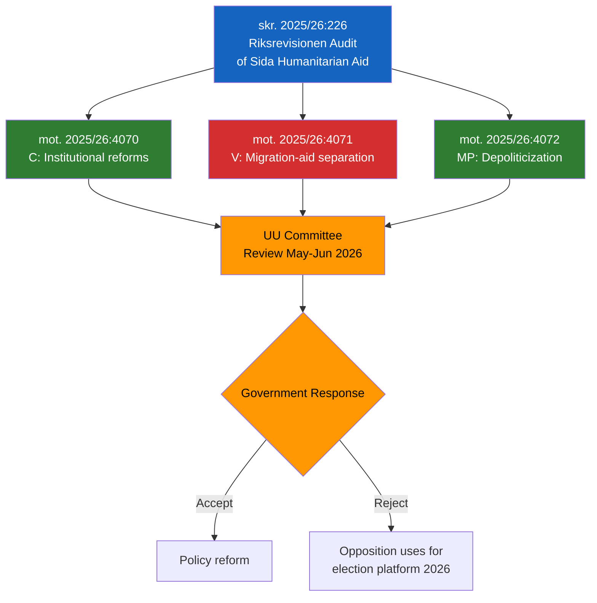

# Analysis Synthesis Summary — 2026-04-09

**Generated**: 2026-04-09 07:18 UTC
**Analyst**: AI-driven deep analysis (enriched from pre-article-analysis pipeline)
**Data Sources**: riksdag-regering-mcp (get_motioner, get_dokument_innehall, get_sync_status)
**Documents Analyzed**: 3 (all from 2026-04-08, UU committee)
**Confidence**: MEDIUM
**Risk Level**: LOW-MEDIUM
**Riksmöte**: 2025/26

## Summary

Three opposition parties — Centerpartiet (C), Vänsterpartiet (V), and Miljöpartiet (MP) — independently filed motions on 2026-04-08 responding to government written communication skr. 2025/26:226 on Riksrevisionen's audit of Sida's humanitarian aid. This coordinated but ideologically distinct three-party response represents a significant opposition challenge on foreign aid policy, with each party adding its own angle: C focuses on institutional effectiveness and a Ukraine Fund; V attacks the government's migration-aid conditionality and abandoned 1% GNI target; MP emphasizes depoliticization, UD accountability, and local organization empowerment.

## Key Findings

1. **Three-party opposition front on aid policy**: C, V, and MP all challenge the government's aid reform agenda using the Riksrevisionen audit as leverage [HIGH confidence]
2. **UD accountability gap exposed**: MP reveals 4.7B SEK (half of humanitarian aid) is handled by UD, outside the Riksrevisionen audit scope — a significant transparency finding [HIGH confidence]
3. **Migration-aid nexus under fire**: V directly challenges the Tidöavtalet-linked migration conditions on aid, citing OECD DAC violations [HIGH confidence]
4. **Ukraine funding debate**: C proposes a dedicated Ukraine Fund to protect regular aid budgets [MEDIUM confidence on political viability]
5. **UNRWA and SRHR**: C demands UNRWA funding resumption; V pushes SRHR and children's rights [HIGH confidence]
6. **Government considers matter settled**: The skrivelse states the issue is "slutbehandlat" — opposition faces uphill battle [HIGH confidence]

## AI-Recommended Article Metadata

- **Recommended Title (EN)**: "Three Parties Challenge Government's Humanitarian Aid Overhaul After Riksrevisionen Audit"
- **Recommended Title (SV)**: "Tre partier ifrågasätter regeringens biståndspolitik efter Riksrevisionens granskning"
- **Meta Description (EN)**: "Centerpartiet, Vänsterpartiet, and Miljöpartiet file competing motions demanding reforms to Sweden's humanitarian aid policy following critical Sida audit findings."
- **Meta Description (SV)**: "C, V och MP lämnar motioner om reformer av Sveriges humanitära bistånd efter Riksrevisionens kritiska granskning av Sida."
- **Key Highlights**: Three-party opposition front, UD accountability gap (4.7B SEK), migration-aid conditionality challenge, Ukraine Fund proposal
- **Article Decision**: PUBLISH — coordinated multi-party response to audit merits coverage
- **Article Priority**: Medium

## Top Documents by Significance

| Score | Type | dok_id | Title | Party |
|-------|------|--------|-------|-------|
| 6/10 | Kommittémotion | HD024071 | Riksrevisionen/Sida audit — migration conditions, SRHR, children's rights | V |
| 5/10 | Kommittémotion | HD024070 | Riksrevisionen/Sida audit — embassy use, UNRWA, Ukraine Fund | C |
| 5/10 | Kommittémotion | HD024072 | Riksrevisionen/Sida audit — depoliticization, UD accountability, localization | MP |

## Implications

- The coordinated three-party response signals aid policy as an election issue for 2026
- Government's "slutbehandlat" stance will likely face continued opposition pressure in UU committee
- UD accountability gap is a potential KU (Constitutional Committee) matter
- International context (US aid cuts, EU responsibilities) strengthens opposition arguments

## Data Quality Notes

Overall confidence: **MEDIUM** — enriched from LOW through AI-driven full-text analysis.
**Data Freshness**: Documents sourced from **2026-04-08** (article date: 2026-04-09). All 3 motions respond to the same government communication.
