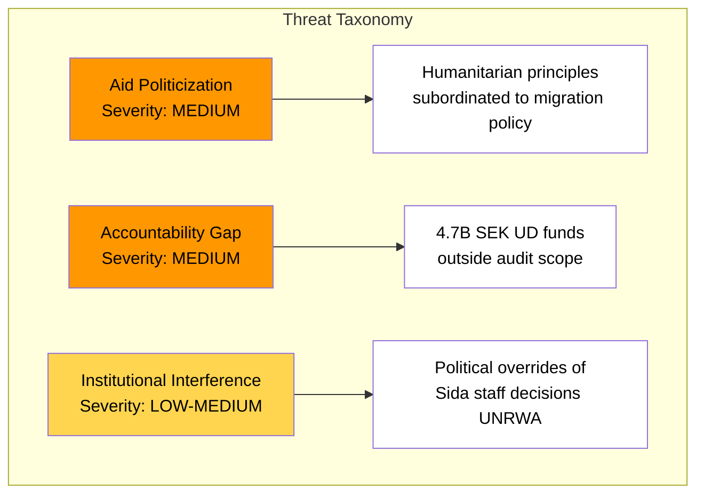

# Political Threat Analysis — 2026-04-09

**Generated**: 2026-04-09 07:18 UTC
**Analyst**: AI-driven deep analysis
**Data Sources**: riksdag-regering-mcp
**Documents Analyzed**: 3 (mot. 2025/26:4070, 4071, 4072)
**Confidence**: MEDIUM
**Riksmöte**: 2025/26

## Summary

The three opposition motions identify threats to democratic oversight of Swedish humanitarian aid, particularly around politicization of aid decisions and the accountability gap where 4.7B SEK of humanitarian funds handled by UD escape Riksrevisionen scrutiny. These are governance-level threats rather than direct democratic function threats.

## Threat Indicators

| Threat Category | Indicator | Source | Severity | Confidence |
|----------------|-----------|--------|----------|------------|
| Democratic Oversight | UD handles 4.7B SEK without Riksrevisionen audit | mot. 2025/26:4072 | MEDIUM | HIGH |
| Policy Integrity | Migration conditions attached to aid violate OECD DAC | mot. 2025/26:4071 | MEDIUM | HIGH |
| Institutional Independence | Political interference in UNRWA funding decisions | mot. 2025/26:4070 | LOW-MEDIUM | MEDIUM |
| Transparency | Multiple directive changes in short time impair Sida planning | mot. 2025/26:4070 | LOW | HIGH |
| International Standing | Sweden's humanitarian credibility at risk as 1% GNI abandoned | mot. 2025/26:4071 | MEDIUM | MEDIUM |

## Key Findings

1. Primary threat is governance-level: democratic oversight of aid spending is weakened when half the humanitarian budget bypasses the audited agency
2. Migration-aid conditionality represents policy integrity threat — OECD DAC compliance at risk
3. Institutional interference (UNRWA case) demonstrates political override of professional decisions
4. No direct threat to democratic functions (elections, constitutional order) identified

## Implications

Threats are institutional and reputational rather than existential. The appropriate response mechanism is parliamentary scrutiny (UU committee, potentially KU) rather than emergency measures.

## Data Quality Notes

Analysis confidence: MEDIUM. Based on opposition claims which require verification against government's own position. International compliance threats (OECD DAC) have higher confidence due to documented guidelines.
