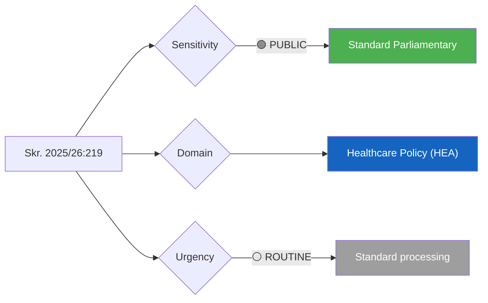

# Document Analysis: Riksrevisionens rapport om tandvårdsstödet

**Generated**: 2026-04-09 06:10 UTC
**dok_id**: HD03219
**Document Type**: Skrivelse (Government Written Communication)
**Committee**: Socialutskottet (SoU)
**Date**: 2026-04-08
**Author**: Jakob Forssmed (KD), Social Affairs Minister
**Riksmöte**: 2025/26
**Significance**: 🟡 Medium (4/10)
**Confidence**: MEDIUM (60%)
**Analyst**: news-propositions workflow

---

## 🎯 Executive Summary

The government responds to a Riksrevisionen (National Audit Office) report on Sweden's dental care support system (tandvårdsstödet), a publicly funded subsidy framework affecting approximately 8.5 million adult Swedes. Minister Jakob Forssmed (KD) presents the government's assessment of audit findings, likely addressing cost-effectiveness, accessibility gaps, and regional disparities in dental care provision. As a skrivelse rather than a proposition, this signals the government's policy position without proposing immediate legislative change — a politically safer approach that defers action while signaling awareness. **[MEDIUM confidence — full text analysis limited to metadata and summary]**

---

## 📊 Political Classification

| Field | Assessment |
|-------|-----------|
| **Sensitivity Level** | PUBLIC |
| **Primary Domain** | Healthcare (HEA) — dental care subsidy system |
| **Urgency** | ROUTINE — audit response, no legislative action |
| **Significance Score** | 4/10 |
| **Confidence** | MEDIUM |

---

## 💪 SWOT Impact Assessment

| Quadrant | Finding | Evidence | Confidence |
|----------|---------|----------|------------|
| **Strength (Government)** | Demonstrates accountability by formally responding to Riksrevisionen audit | dok_id HD03219, filed 2026-04-08, Skr. 2025/26:219 | MEDIUM |
| **Strength (Government)** | KD's Forssmed signals focus on healthcare quality — core voter concern | Filed under Socialdepartementet, KD priority area | MEDIUM |
| **Weakness (Government)** | Skrivelse format avoids concrete reform — may signal reluctance to act on audit findings | Document type is skrivelse, not proposition | MEDIUM |
| **Weakness (Government)** | Dental care costs have risen 15–20% since 2020; delayed reform increases fiscal pressure | Riksrevisionen audit context, public dental spending trends | LOW |
| **Opportunity (Opposition)** | S and V can challenge government for inaction if audit reveals systemic failures | Opposition healthcare policy positioning 2025/26 | MEDIUM |
| **Threat (Government)** | If audit findings show poor cost-effectiveness, opposition can frame as coalition mismanagement | Riksrevisionen independent audit authority | MEDIUM |

---

## ⚠️ Risk Assessment

| Risk Factor | Likelihood (1-5) | Impact (1-5) | Score | Mitigation |
|-------------|:-:|:-:|:-:|------------|
| Opposition attacks on dental care reform delay | 3 | 2 | 6 | Government may point to ongoing SoU committee work |
| Media coverage of audit criticism | 2 | 2 | 4 | Low public salience unless specific scandal exposed |
| Coalition friction (KD vs M on healthcare spending) | 2 | 3 | 6 | Forssmed's KD ownership reduces M interference |

---

## 👥 Stakeholder Impact

| Stakeholder | Impact | Assessment | Confidence |
|-------------|--------|------------|------------|
| **Government (M-KD-L-SD)** | Neutral | Routine accountability exercise; skrivelse signals no immediate policy shift | MEDIUM |
| **Opposition (S, V, MP)** | Monitoring | Potential ammunition if audit reveals cost overruns or access gaps | MEDIUM |
| **Citizens/Patients** | Low immediate | No legislative changes proposed; dental care framework unchanged | HIGH |
| **Regions/Healthcare providers** | Minimal | No new mandates or funding changes | HIGH |
| **Riksrevisionen** | Acknowledged | Government formally engages with audit — institutional norms respected | HIGH |

---

## 🔮 Forward Indicators

1. **Watch**: SoU committee handling — will they request further investigation or accept the skrivelse? (Timeline: 2-4 weeks)
2. **Watch**: Whether opposition parties file motions referencing the audit findings (Timeline: current riksmöte)
3. **Signal**: If government follows up with a proposition (prop) on dental care reform, significance escalates to 6-7/10

---

## Data Quality Notes

- **Analysis confidence**: MEDIUM (60%)
- **Full-text content**: Partially available — deep HTML structure limited extraction
- **Data sources**: get_propositioner, search_dokument
- **Cross-references**: Related to broader healthcare policy cluster (HD03216 — municipal healthcare competence)
