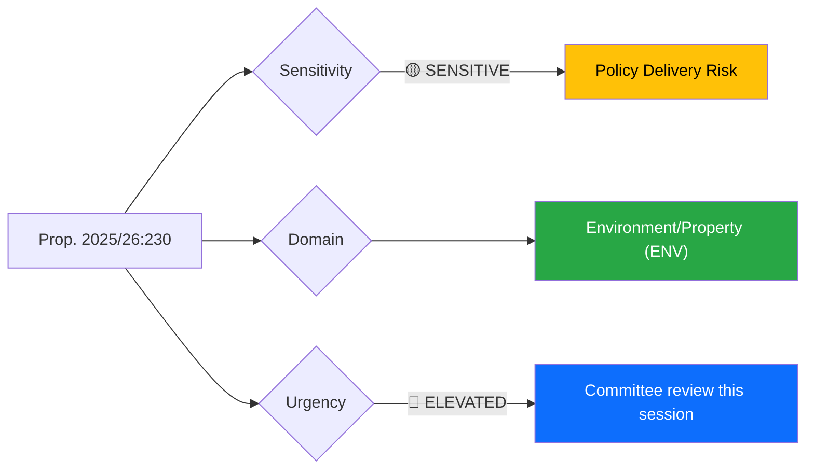
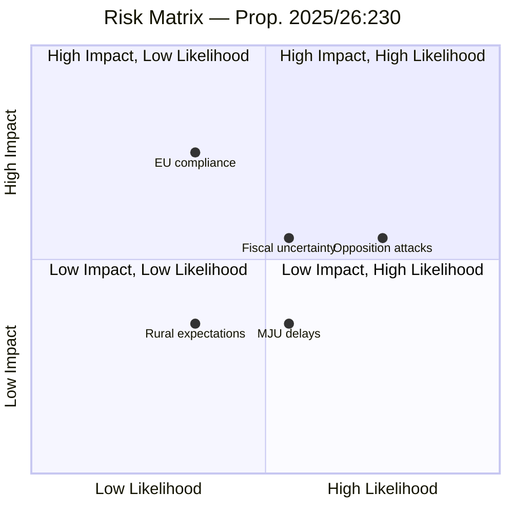

# Document Analysis: Ersättning vid rådighetsinskränkningar till följd av artskyddet

**Generated**: 2026-04-09 06:10 UTC
**dok_id**: HD03230
**Document Type**: Proposition
**Committee**: Miljö- och jordbruksutskottet (MJU)
**Date**: 2026-04-08
**Author**: Johan Britz, Climate & Business Minister
**Riksmöte**: 2025/26
**Significance**: 🟡 Medium-High (6/10)
**Confidence**: HIGH (80%)
**Analyst**: news-propositions workflow

---

## 🎯 Executive Summary

The government proposes amending the Environmental Code (miljöbalken) to guarantee compensation for property owners whose land use is restricted by species protection regulations (artskyddsförordningen). This is a politically significant proposition that directly responds to the Supreme Court ruling in the "Tjäderspelet i Malsättra" case, establishing a statutory right to compensation when protected species decisions prevent ongoing land use. The proposal balances property rights against environmental protection — a core tension in Swedish politics pitting rural/property interests (M, SD, C) against environmental advocates (MP, V). The law changes take effect on a date to be determined by the government. **[HIGH confidence — detailed table of contents and substantive summary available]**

---

## 📊 Political Classification

| Field | Assessment |
|-------|-----------|
| **Sensitivity Level** | SENSITIVE — property rights vs. environmental protection |
| **Primary Domain** | Environment/Property Rights (ENV) |
| **Secondary Domain** | Rural Affairs, Constitutional Law (property rights) |
| **Urgency** | ELEVATED — responds to Supreme Court ruling, active legislative process |
| **Significance Score** | 6/10 |
| **Confidence** | HIGH |

---

## 💪 SWOT Impact Assessment

| Quadrant | Finding | Evidence | Confidence |
|----------|---------|----------|------------|
| **Strength (Government)** | Resolves legal uncertainty created by Supreme Court "Tjäderspelet i Malsättra" ruling | Prop. 2025/26:230, Section 4.3 | HIGH |
| **Strength (Government)** | Property rights alignment appeals to M, SD, and rural C voters — core coalition base | Filed by Klimat- och näringslivsdepartementet under M-led government | HIGH |
| **Strength (Government)** | Includes recovery provision — state can reclaim compensation if restrictions lift | Section 5.3 of proposition | HIGH |
| **Weakness (Government)** | Open-ended fiscal exposure — no cap on state compensation costs stated | Section 7.3.2 Konsekvenser för staten | MEDIUM |
| **Weakness (Government)** | Entry-into-force left to government discretion — signals implementation uncertainty | "den dag som regeringen bestämmer" | HIGH |
| **Opportunity (Government)** | Strengthens property rights narrative ahead of 2026 election season | Cross-references to HD03212 (municipal rent guarantees) and HD03224 (enforcement rules) | MEDIUM |
| **Threat (Opposition)** | MP and V will argue this weakens species protection — "paying to destroy nature" framing | Environmental policy opposition platform | HIGH |
| **Threat (Government)** | EU Habitats Directive compliance risk if compensation incentivizes development in protected areas | EU environmental law framework | MEDIUM |

---

## ⚠️ Risk Assessment

| Risk Factor | Likelihood (1-5) | Impact (1-5) | Score | Mitigation |
|-------------|:-:|:-:|:-:|------------|
| Opposition attacks framing as "anti-environment" | 4 | 3 | 12 | Government cites Supreme Court ruling as legal necessity |
| Fiscal uncertainty — uncapped state liability | 3 | 3 | 9 | Recovery provision limits long-term exposure |
| EU compliance challenge under Habitats Directive | 2 | 4 | 8 | Proposition maintains species protection; adds compensation layer |
| MJU committee delays or minority reservations | 3 | 2 | 6 | Coalition majority likely sufficient for passage |
| Rural constituency expectations exceed legal framework | 2 | 2 | 4 | Clear legal criteria limit eligibility |

---

## 👥 Stakeholder Impact

| Stakeholder | Impact | Assessment | Confidence |
|-------------|--------|------------|------------|
| **Government (M-KD-L)** | Positive | Delivers on property rights agenda; strengthens rural support | HIGH |
| **SD (Support party)** | Positive | Aligns with rural/property rights stance; likely to support | HIGH |
| **Opposition (S)** | Cautious | May support in principle but critique fiscal exposure | MEDIUM |
| **Opposition (MP, V)** | Strongly negative | Will argue weakened environmental protection framework | HIGH |
| **Property owners/farmers** | Strongly positive | Statutory right to compensation for species protection restrictions | HIGH |
| **Environmental NGOs** | Negative | Concerned about precedent — compensation may reduce political will for species protection | MEDIUM |
| **Municipalities** | Neutral to positive | Reduced legal uncertainty in planning decisions | MEDIUM |
| **Courts** | Positive | Clear legislative framework reduces case-by-case judicial burden | HIGH |

---

## 🔮 Forward Indicators

1. **Watch**: MJU committee report — expect minority reservations from MP and V (Timeline: 4-8 weeks)
2. **Watch**: Environmental NGO public statements and potential media campaigns (Timeline: 1-2 weeks)
3. **Signal**: If EU Commission raises compliance concerns with Habitats Directive, significance escalates to 8/10
4. **Trigger**: Government announcement of entry-into-force date signals implementation commitment
5. **Cross-reference**: Monitor HD03206 (food chain fraud controls) and HD03205 (food chain emergency stocks) for coordinated rural/agricultural policy cluster

---

## 📋 Legislative Pipeline

| Stage | Status | Expected |
|-------|--------|----------|
| Government proposal | ✅ Filed 2026-04-08 | — |
| Committee referral (MJU) | 🔄 Pending | April 2026 |
| Committee report | ⏳ Expected | May-June 2026 |
| Chamber vote | ⏳ Expected | June 2026 |
| Entry into force | ❓ Date TBD by government | Late 2026 or 2027 |

---

## Data Quality Notes

- **Analysis confidence**: HIGH (80%)
- **Full-text content**: Table of contents and main proposal extracted successfully
- **Data sources**: get_propositioner, get_dokument_innehall
- **Key sections identified**: Sections 4.3 (Supreme Court case), 5.1-5.4 (compensation rules), 7 (consequences)
- **Cross-references**: HD03206, HD03205 (food/rural cluster); HD03212 (housing guarantees)
