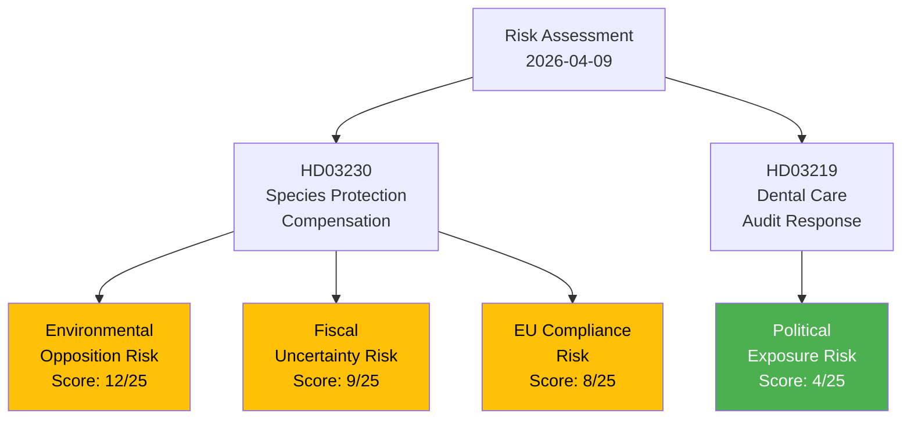

# Political Risk Assessment — 2026-04-09

**Generated**: 2026-04-09 06:12 UTC
**Data Sources**: get_propositioner, get_dokument_innehall
**Documents Analyzed**: 2
**Confidence**: MEDIUM
**Analyst**: news-propositions workflow (AI-enriched)

---

## Summary

Overall political risk level: **LOW-MODERATE**. The species protection compensation proposition (HD03230) carries moderate risk due to environmental opposition and fiscal uncertainty, while the dental care audit response (HD03219) presents minimal political risk.

## Detailed Risk Matrix

| # | Risk Factor | Document | Likelihood (1-5) | Impact (1-5) | Score | Level | Mitigation |
|---|-------------|----------|:-:|:-:|:-:|-------|------------|
| R1 | Opposition frames prop as weakening species protection | HD03230 | 4 | 3 | 12 | MODERATE | Government cites Supreme Court ruling as legal necessity |
| R2 | Uncapped state compensation liability | HD03230 | 3 | 3 | 9 | MODERATE | Recovery provision (Section 5.3); eligibility criteria limit scope |
| R3 | EU Habitats Directive non-compliance challenge | HD03230 | 2 | 4 | 8 | MODERATE | Proposition maintains species protection; adds compensation layer only |
| R4 | MJU committee minority reservations delay passage | HD03230 | 3 | 2 | 6 | LOW | Coalition majority sufficient; C may support |
| R5 | Coalition friction on dental care reform pace | HD03219 | 2 | 2 | 4 | LOW | KD ownership reduces inter-party friction |

## Coalition Stability Assessment

**Coalition Risk Score**: 8/100 (LOW)

| Factor | Assessment | Score |
|--------|-----------|-------|
| Voting discipline | Strong — environmental/property rights aligns M-SD-KD-L | 2/25 |
| Policy alignment | High — both documents reflect coalition priorities | 2/25 |
| SD support reliability | Stable — SD supports property rights agenda | 2/25 |
| Internal tensions | Minimal — L may have minor environmental concerns | 2/25 |

## Key Findings

1. Primary risk vector is environmental opposition to species protection compensation (R1) — politically significant but manageable with coalition majority
2. Fiscal risk (R2) is genuine but mitigated by recovery provision
3. EU compliance (R3) is the highest-impact risk but lowest likelihood
4. Coalition stability unaffected by these specific propositions

## Implications

- Both documents analyzed present manageable political risk for the government
- Species protection compensation will generate MJU committee debate but coalition majority should ensure passage
- Dental care audit response is politically neutral — routine accountability

## Data Quality Notes

Risk assessment derived from proposition content analysis, coalition metrics, and political context. Full committee report data not yet available for MJU.
