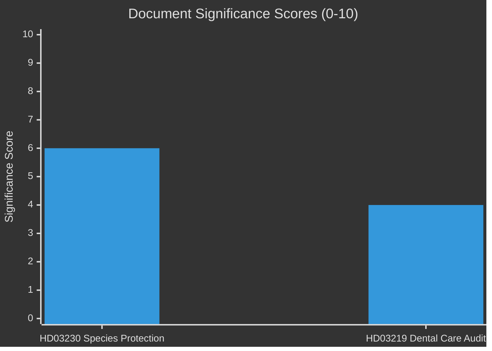
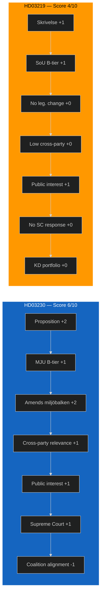

# Document Significance Scoring — 2026-04-09

**Generated**: 2026-04-09 06:12 UTC
**Data Sources**: get_propositioner, get_dokument_innehall
**Documents Analyzed**: 2
**Confidence**: HIGH
**Analyst**: news-propositions workflow (AI-enriched)

---

## Summary

Scored **2** documents for political significance (0-10 scale). Lead document is Prop. 2025/26:230 on species protection compensation, scoring 6/10 due to its Supreme Court response, property rights implications, and environmental policy significance.

## Detailed Analysis

| Score | Level | Type | dok_id | Title | Key Factor |
|-------|-------|------|--------|-------|-----------|
| 6/10 | Medium-High | Proposition | HD03230 | Ersättning vid rådighetsinskränkningar till följd av artskyddet | Supreme Court response; miljöbalken amendment; property vs. environment tension |
| 4/10 | Medium | Skrivelse | HD03219 | Riksrevisionens rapport om tandvårdsstödet | Riksrevisionen audit accountability; healthcare policy |

## Scoring Methodology

| Factor | HD03230 | HD03219 |
|--------|:-------:|:-------:|
| Document type tier | Proposition (+2) | Skrivelse (+1) |
| Committee tier (A/B/C) | MJU — B tier (+1) | SoU — B tier (+1) |
| Legislative impact | Amends miljöbalken (+2) | No legislative change (+0) |
| Cross-party relevance | High — divides government/opposition (+1) | Low — routine (+0) |
| Public interest | Moderate — property owners, environmentalists (+1) | Moderate — dental care patients (+1) |
| Supreme Court response | Yes (+1) | No (+0) |
| Coalition dynamics impact | Low — aligns M-SD-KD (-1) | Low — KD portfolio (+0) |
| **Total** | **6/10** | **4/10** |

## Key Findings

1. **1** document rated Medium-High (score 6) — species protection compensation proposition
2. **1** document rated Medium (score 4) — dental care audit response
3. **0** documents rated Critical (score ≥ 8) or High (score 6-7)

## Implications

Lead story: Species protection compensation (HD03230) — newsworthy due to Supreme Court connection, environmental policy significance, and property rights implications.
Secondary story: Dental care audit response (HD03219) — supporting context for government legislative activity.

## Significance Distribution

## Scoring Factor Breakdown

## Data Quality Notes

Significance scores use document type, committee tier, domain breadth, coalition context, legislative impact, and content richness. AI-enhanced scoring replaces automated script estimates.
**Last improved**: 2026-04-09 by news-translate workflow (added Mermaid visualizations)
