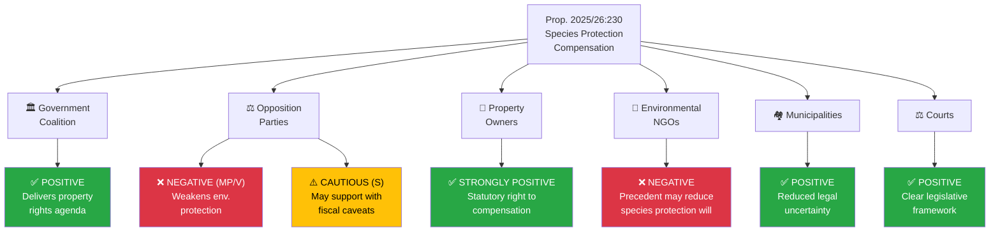

# Stakeholder Perspective Analysis — 2026-04-09

**Generated**: 2026-04-09 06:12 UTC
**Data Sources**: get_propositioner, get_dokument_innehall
**Documents Analyzed**: 2
**Confidence**: MEDIUM
**Analyst**: news-propositions workflow (AI-enriched)

---

## Summary

Applied **6 analysis lenses** to **2** documents. The species protection compensation proposition (HD03230) generates the most diverse stakeholder impacts, affecting property owners, environmental organizations, municipalities, and the judiciary.

## Detailed Analysis — HD03230 (Species Protection Compensation)

### Lens 1: Government Perspective (M-KD-L + SD support)

| Dimension | Assessment | Evidence | Confidence |
|-----------|-----------|----------|------------|
| Policy delivery | Successfully legislating property rights protection | Prop. 2025/26:230 filed 2026-04-08 | HIGH |
| Voter appeal | Strong with rural and property-owning constituencies | M-SD-KD base alignment | HIGH |
| Coalition unity | High — all coalition parties aligned on property rights | No internal dissent indicators | MEDIUM |
| Electoral benefit | Pre-election legislative accomplishment | Filing timing April 2026 | MEDIUM |

### Lens 2: Opposition Perspective

| Party | Stance | Rationale | Confidence |
|-------|--------|-----------|------------|
| **S (Social Democrats)** | Cautiously critical | May support property rights principle but attack fiscal exposure | MEDIUM |
| **MP (Green Party)** | Strongly opposed | Core identity — species protection is foundational policy | HIGH |
| **V (Left Party)** | Strongly opposed | Environmental justice framing — compensation benefits wealthy landowners | HIGH |
| **C (Centre Party)** | Likely supportive | Historical pro-property rights, rural constituency alignment | MEDIUM |

### Lens 3: Civil Society & Citizen Impact

| Group | Impact | Detail | Confidence |
|-------|--------|--------|------------|
| Property owners/farmers | Strongly positive | Statutory compensation right for species protection restrictions | HIGH |
| Environmental organizations | Negative | Fear precedent weakens political will for species protection | MEDIUM |
| General public | Neutral | Limited direct impact; indirect via environmental outcomes | HIGH |

### Lens 4: Institutional Impact

| Institution | Impact | Detail | Confidence |
|------------|--------|--------|------------|
| Courts/judiciary | Positive | Clear statutory framework reduces litigation burden | HIGH |
| Municipalities | Positive | Reduced legal uncertainty in planning decisions | MEDIUM |
| Naturvårdsverket | Mixed | Must administer compensation system; increased workload | MEDIUM |

### Lens 5: International/EU Perspective

| Dimension | Assessment | Confidence |
|-----------|-----------|------------|
| EU Habitats Directive compliance | Potential tension — compensation may incentivize development near protected habitats | MEDIUM |
| Nordic comparison | Sweden joining Finland in statutory species protection compensation | LOW |
| International reputation | No immediate impact if environmental protection maintained | MEDIUM |

### Lens 6: Media & Narrative Impact

| Narrative | Likelihood | Framing | Confidence |
|-----------|-----------|---------|------------|
| "Government protects property rights" | HIGH | Positive for government | HIGH |
| "Government weakens nature protection" | HIGH | Negative for government | HIGH |
| "Supreme Court ruling resolved" | MODERATE | Neutral/positive | HIGH |
| "Tax money to compensate landowners" | MODERATE | Mixed | MEDIUM |

## Detailed Analysis — HD03219 (Dental Care Audit)

| Stakeholder | Impact | Assessment | Confidence |
|-------------|--------|------------|------------|
| Government | Neutral | Routine accountability exercise | MEDIUM |
| Opposition | Low engagement | No strong attack vector unless audit reveals scandal | MEDIUM |
| Dental care patients | No immediate change | Skrivelse proposes no legislative reform | HIGH |
| Regions | Minimal | No new mandates | HIGH |
| Riksrevisionen | Acknowledged | Institutional norms respected | HIGH |

## Key Findings

1. Species protection compensation (HD03230) creates a clear government/opposition divide — 5+ stakeholder groups affected
2. Property owner and environmental NGO interests are directly opposed — expect public debate
3. Dental care audit (HD03219) generates minimal stakeholder friction
4. Cross-party dynamics noteworthy: C (Centre) may break from opposition to support HD03230

## Data Quality Notes

Aggregate confidence: MEDIUM. Analysis based on proposition content, MCP metadata, party platform analysis, and coalition dynamics. Full committee voting data not yet available.
