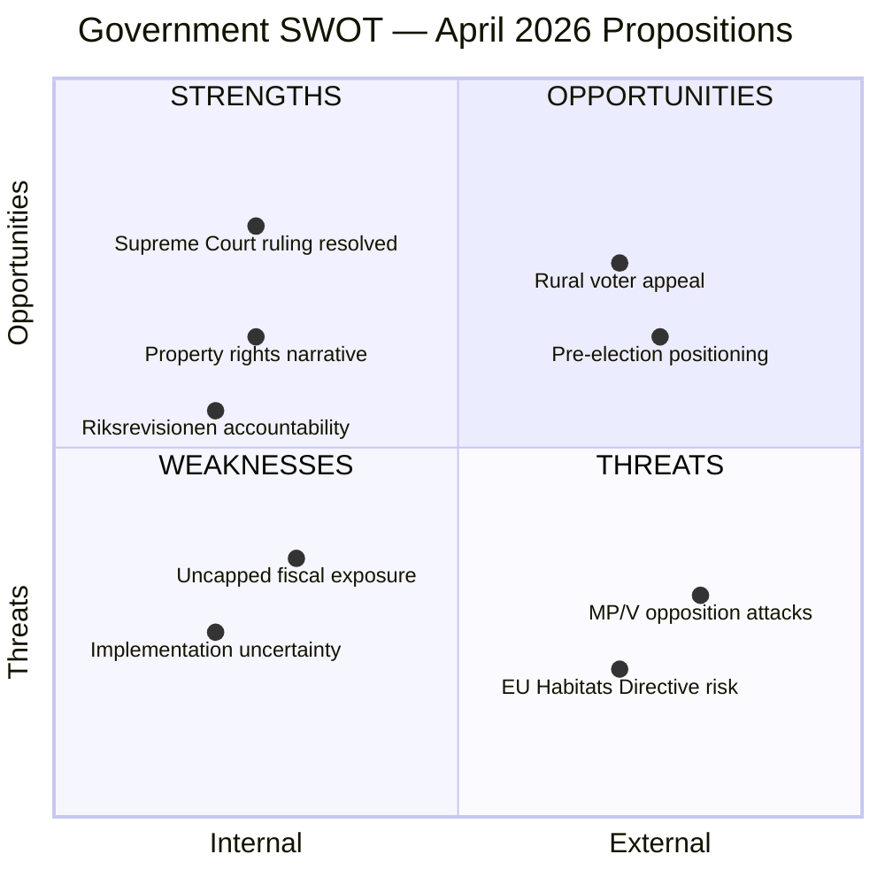

# Political SWOT Analysis — 2026-04-09

**Generated**: 2026-04-09 06:12 UTC
**Data Sources**: get_propositioner, get_dokument_innehall
**Documents Analyzed**: 2
**Confidence**: MEDIUM
**Analyst**: news-propositions workflow (AI-enriched)

---

## Summary

SWOT analysis across two government documents reveals a government managing dual policy tracks: environmental property rights reform (Prop. 2025/26:230) and healthcare accountability (Skr. 2025/26:219). The species protection compensation proposition is the primary SWOT focus due to its higher political significance.

## Detailed Analysis

### Strengths (Government)

| # | Strength | Evidence (dok_id) | Confidence |
|---|----------|-------------------|------------|
| S1 | Resolves Supreme Court legal uncertainty — "Tjäderspelet i Malsättra" case addressed legislatively | HD03230, Prop. 2025/26:230 Section 4.3 | HIGH |
| S2 | Property rights alignment strengthens M-SD-KD coalition base among rural and property-owning voters | HD03230, Klimat- och näringslivsdepartementet filing | HIGH |
| S3 | Recovery provision limits fiscal exposure — state can reclaim compensation if restrictions lift | HD03230, Section 5.3 | HIGH |
| S4 | Demonstrates parliamentary accountability by responding to Riksrevisionen audit | HD03219, Skr. 2025/26:219 | MEDIUM |
| S5 | Forssmed (KD) ownership of healthcare response aligns with KD voter priorities | HD03219, Socialdepartementet | MEDIUM |

### Weaknesses (Government)

| # | Weakness | Evidence (dok_id) | Confidence |
|---|----------|-------------------|------------|
| W1 | Open-ended fiscal liability — no explicit cap on state compensation for species protection restrictions | HD03230, Section 7.3.2 (consequences for state) | MEDIUM |
| W2 | Entry-into-force date left to government discretion — signals implementation hesitancy | HD03230, "den dag som regeringen bestämmer" | HIGH |
| W3 | Skrivelse format for dental care audit avoids concrete reform — could be framed as inaction | HD03219, document type: skrivelse (not proposition) | MEDIUM |

### Opportunities (External)

| # | Opportunity | Evidence (dok_id) | Confidence |
|---|------------|-------------------|------------|
| O1 | Pre-election positioning — property rights legislation appeals to rural swing voters | HD03230, filing timing April 2026 | MEDIUM |
| O2 | Cross-party support possible — C (Centre Party) historically pro-property rights in rural areas | HD03230, MJU committee dynamics | MEDIUM |
| O3 | Potential to reduce litigation burden — clear statutory framework replaces case-by-case court decisions | HD03230, Section 5.2 | HIGH |

### Threats (External)

| # | Threat | Evidence (dok_id) | Confidence |
|---|--------|-------------------|------------|
| T1 | MP and V will attack as weakening environmental protection — "paying to destroy nature" framing | HD03230, environmental opposition platform | HIGH |
| T2 | EU Habitats Directive compliance risk if compensation incentivizes development in protected habitats | HD03230, EU environmental law framework | MEDIUM |
| T3 | Environmental NGO campaigns may generate negative media coverage | HD03230, stakeholder analysis | MEDIUM |
| T4 | Opposition may exploit dental care audit findings to attack coalition healthcare record | HD03219, Riksrevisionen independence | LOW |

## Key Findings

1. Government's property rights proposition (HD03230) is the primary political battleground — expect MJU committee debate
2. Coalition unity on species protection compensation is strong (M, SD, KD aligned)
3. Dental care skrivelse (HD03219) is low-risk, routine accountability
4. Environmental policy remains the sharpest cleavage between government and green/left opposition

## Data Quality Notes

SWOT confidence: MEDIUM. Analysis based on proposition content, MCP metadata, and political context. Full committee report data not yet available.
