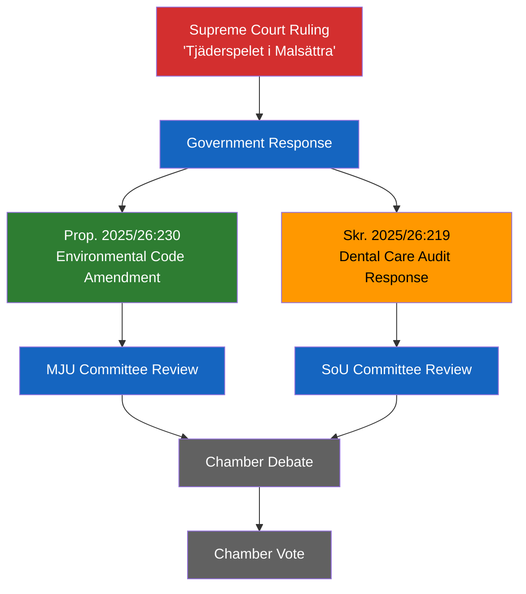

# Analysis Synthesis Summary — 2026-04-09

**Generated**: 2026-04-09 06:12 UTC
**Data Sources**: get_propositioner, get_dokument_innehall, search_dokument
**Documents Analyzed**: 2
**Confidence**: MEDIUM
**Risk Level**: LOW-MODERATE
**Analyst**: news-propositions workflow (AI-enriched)

---

## Summary

Two government documents filed on 2026-04-08 analyzed: a government response to Riksrevisionen's dental care audit (Skr. 2025/26:219) and a proposition establishing compensation rights for property owners affected by species protection regulations (Prop. 2025/26:230). The latter is the more politically significant, directly responding to the Supreme Court "Tjäderspelet i Malsättra" ruling and touching on the property rights vs. environmental protection tension that divides government and opposition.

## Key Findings

1. **Prop. 2025/26:230** (Significance: 6/10): Government proposes amending miljöbalken to compensate property owners when species protection (artskydd) restricts land use — responds to Supreme Court ruling, creating statutory compensation framework with recovery provisions
2. **Skr. 2025/26:219** (Significance: 4/10): Government responds to Riksrevisionen audit of dental care support system — routine accountability exercise, no legislative action proposed
3. **Policy cluster pattern**: Both documents demonstrate government's April legislative push across healthcare and environmental policy domains ahead of the pre-election period
4. **Coalition dynamics**: Species protection compensation aligns with M-SD-KD property rights agenda; expected to face strong MP/V opposition in MJU committee

## Top Documents by Significance

| Score | Type | dok_id | Title | Minister | Department |
|-------|------|--------|-------|----------|------------|
| 6/10 | Proposition | HD03230 | Ersättning vid rådighetsinskränkningar till följd av artskyddet | Johan Britz | Klimat- och näringslivsdepartementet |
| 4/10 | Skrivelse | HD03219 | Riksrevisionens rapport om tandvårdsstödet | Jakob Forssmed (KD) | Socialdepartementet |

## AI-Recommended Article Metadata

### Recommended Title (EN)
"Government Proposes Compensation for Species Protection Land Restrictions After Supreme Court Ruling"

### Recommended Title (SV)
"Regeringen föreslår ersättning vid artskyddsbegränsningar efter Högsta domstolens dom"

### Meta Description (EN)
"Sweden's government tables Prop. 2025/26:230 amending the Environmental Code to compensate property owners for species protection restrictions, following the Tjäderspelet i Malsättra Supreme Court ruling."

### Meta Description (SV)
"Regeringen lägger fram Prop. 2025/26:230 om ändring i miljöbalken för ersättning vid artskyddsbegränsningar, efter HD-domen Tjäderspelet i Malsättra."

### Key Highlights
- Species protection compensation framework established in miljöbalken
- Supreme Court "Tjäderspelet i Malsättra" case resolved legislatively
- Dental care audit response signals government healthcare accountability
- Property rights vs. environmental protection — core coalition tension

### Article Decision
PUBLISH — significance score 6/10 for lead story; 4/10 secondary story provides policy breadth

### Article Priority
MEDIUM — legislatively significant but not crisis-level

## Legislative Flow Diagram

## Stakeholder Impact Assessment

| Stakeholder Group | Impact | Assessment | Confidence |
|---|---|---|---|
| **Property Owners** | HIGH | Gain statutory compensation right for species protection restrictions | [HIGH] |
| **Environmental Organizations** | HIGH | Risk of weakened species protection enforcement | [MEDIUM] |
| **Government Coalition (M-KD-L)** | MEDIUM | Delivers on property rights agenda, aligned with SD support | [HIGH] |
| **Opposition (MP, V)** | MEDIUM | Expected strong resistance in MJU committee | [HIGH] |
| **Municipalities** | LOW-MEDIUM | Implementation burden for compensation processing | [LOW] |
| **EU/International** | LOW | Must comply with EU Habitats Directive obligations | [MEDIUM] |
| **Dental Care Recipients** | LOW | No immediate reform; status quo maintained | [HIGH] |
| **Media/Public Opinion** | MEDIUM | Property rights narrative vs. environmental alarm | [MEDIUM] |

## Implications

The species protection compensation proposition represents a meaningful shift in Sweden's environmental governance framework. By establishing a statutory right to compensation, the government signals willingness to prioritize property rights alongside environmental protection — a position likely to generate heated MJU committee debate between coalition parties (supportive) and MP/V (opposed). The dental care audit response, while lower significance, completes a picture of a government managing routine parliamentary accountability in its healthcare portfolio.

## Data Quality Notes

Overall confidence: **MEDIUM**. Full-text extraction successful for HD03230 (proposition content, table of contents, consequences analysis). HD03219 extraction limited to metadata and summary.
**Data Freshness**: Documents sourced from **2026-04-08** via lookback fallback (article date: 2026-04-09).
