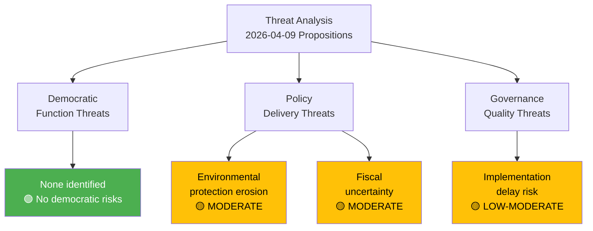

# Political Threat Analysis — 2026-04-09

**Generated**: 2026-04-09 06:12 UTC
**Data Sources**: get_propositioner, get_dokument_innehall
**Documents Analyzed**: 2
**Confidence**: MEDIUM
**Analyst**: news-propositions workflow (AI-enriched)

---

## Summary

Threat analysis identifies **no critical democratic threats** from today's propositions. The species protection compensation proposition (HD03230) intersects with environmental governance norms but does not threaten democratic functions. Primary threat vectors are policy-level: fiscal uncertainty and potential environmental protection erosion.

## Political Threat Taxonomy

## Detailed Threat Assessment

### HD03230 — Species Protection Compensation

| Threat Category | Severity | Likelihood | Assessment | Confidence |
|----------------|:--------:|:----------:|-----------|------------|
| Democratic function | 🟢 None | N/A | Proposition follows normal legislative process | HIGH |
| Environmental governance | 🟡 Moderate | 3/5 | Compensation framework may reduce political will for species protection decisions | MEDIUM |
| Fiscal governance | 🟡 Moderate | 3/5 | Uncapped liability creates budgetary uncertainty for future governments | MEDIUM |
| EU compliance | 🟡 Moderate | 2/5 | Potential tension with EU Habitats Directive requirements | MEDIUM |
| Implementation | 🟡 Low-Moderate | 3/5 | Open-ended entry-into-force date signals possible delay | HIGH |

### HD03219 — Dental Care Audit Response

| Threat Category | Severity | Likelihood | Assessment | Confidence |
|----------------|:--------:|:----------:|-----------|------------|
| Democratic function | 🟢 None | N/A | Skrivelse is standard audit response mechanism | HIGH |
| Healthcare governance | 🟢 Low | 2/5 | No legislative action proposed; status quo maintained | HIGH |
| Accountability | 🟢 Low | 1/5 | Government responds to Riksrevisionen as expected | HIGH |

## Key Findings

1. No democratic function threats identified in today's propositions
2. Environmental governance threat from HD03230 is policy-level, not institutional
3. Fiscal threat manageable with existing recovery provisions
4. Overall democratic health: GOOD — normal legislative process functioning

## Data Quality Notes

Threat analysis based on proposition content and democratic governance framework. No active threats to democratic institutions detected.
