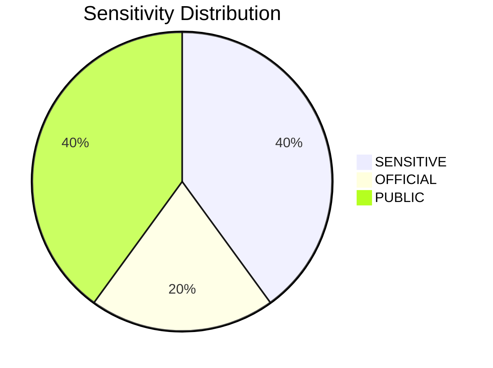
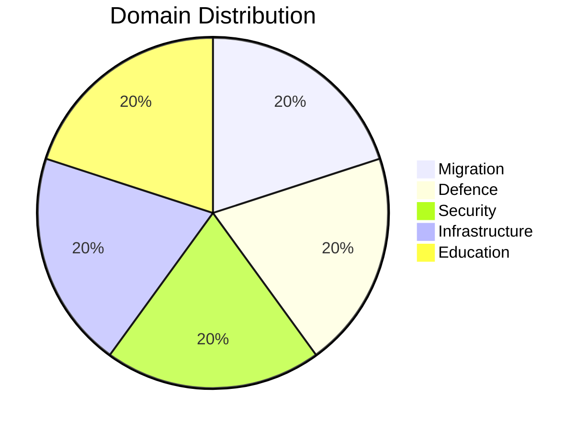

# Classification Results - 2026-04-09 Realtime Monitor 1029

## Document Classification Summary

| dok_id | Title | Sensitivity | Domain | Urgency | Significance |
|--------|-------|:-----------:|:------:|:-------:|:------------:|
| HD01SfU16 | Migrationsfragor | SENSITIVE | Migration (MIG) | ELEVATED | 5.5 |
| HD01FoU8 | Personalfragor | SENSITIVE | Defence (DEF) | ELEVATED | 4.5 |
| HD11695 | NPT oversynskonferens | OFFICIAL | Security (SEC) | ROUTINE | 4.0 |
| HD01TU15 | Jarnvags- och kollektivtrafikfragor | PUBLIC | Infrastructure (INF) | ROUTINE | 3.0 |
| HD01UbU31 | Undantag fran etikgodkannande | PUBLIC | Education (EDU) | ROUTINE | 2.5 |

---

## Classification Distribution

---

## Classification Criteria Applied

### Sensitivity Levels
- **SENSITIVE:** Documents with high political salience, potential for controversy, or affecting vulnerable populations (SfU16 migration, FoU8 defense)
- **OFFICIAL:** Documents with institutional significance but limited controversy (HD11695 NPT question)
- **PUBLIC:** Routine parliamentary business with low political sensitivity (TU15 transport, UbU31 research ethics)

### Domain Taxonomy
Documents classified into primary policy domains based on committee jurisdiction and subject matter. All 5 documents span 5 different domains, indicating a diverse daily parliamentary agenda without thematic clustering.
