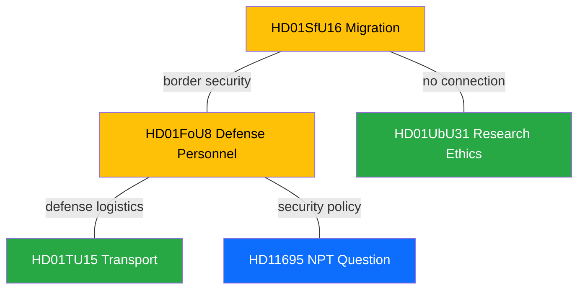

# Cross-Reference Map - 2026-04-09 Realtime Monitor 1029

## Document Relationship Network

---

## Cross-Reference Matrix

| Document | HD01SfU16 | HD01FoU8 | HD01TU15 | HD01UbU31 | HD11695 |
|----------|:-:|:-:|:-:|:-:|:-:|
| HD01SfU16 | - | WEAK | NONE | NONE | WEAK |
| HD01FoU8 | WEAK | - | WEAK | NONE | MEDIUM |
| HD01TU15 | NONE | WEAK | - | NONE | NONE |
| HD01UbU31 | NONE | NONE | NONE | - | NONE |
| HD11695 | WEAK | MEDIUM | NONE | NONE | - |

---

## Key Cross-References

### HD01SfU16 <-> HD01FoU8 (WEAK)
- **Connection:** Migration policy intersects with border security which connects to defense personnel
- **Nature:** Both involve government security apparatus capacity

### HD01FoU8 <-> HD11695 (MEDIUM)
- **Connection:** Defense personnel report and NPT question both touch on Sweden security posture
- **Nature:** Military readiness and nuclear nonproliferation are complementary security dimensions for NATO member Sweden

### HD01FoU8 <-> HD01TU15 (WEAK)
- **Connection:** Transport infrastructure is relevant for military logistics and personnel deployment
- **Nature:** Infrastructure supports defense mobility

---

## External Document Cross-References

| Today Document | Related External | Relationship | dok_id |
|---------------|-----------------|-------------|--------|
| HD01SfU16 | Skarpta regler om utvisning | Same migration reform cluster | HD03235 |
| HD01SfU16 | En ny mottagandelag | Migration reception reform | HD03229 |
| HD01SfU16 | Tidsbegransat boende for nyanlanda | Housing time limits for immigrants | HD03215 |
| HD01FoU8 | Cyberskerhetscenter | Defense capability cluster | HD03214 |
| HD01FoU8 | Strategisk exportkontroll | Defense industry context | HD03114 |
| HD11695 | NPT Review Conference | International security framework | External |
