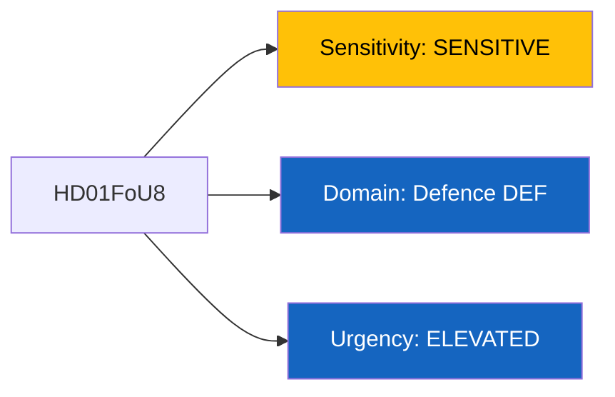
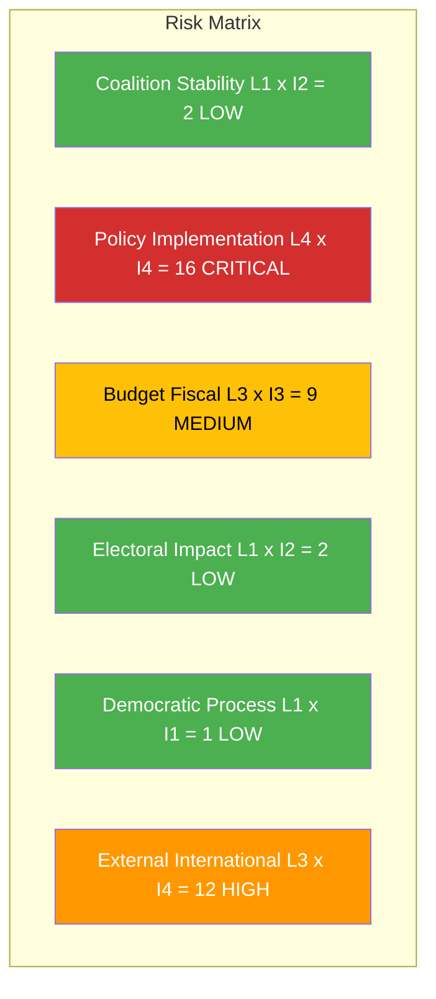

# Per-File Political Intelligence Analysis: HD01FoU8

## Document Identity

| Field | Value |
|-------|-------|
| **Document ID** | HD01FoU8 |
| **Document Type** | Committee Report (betankande) |
| **Title** | Personalfragor |
| **Date** | 2026-04-09 |
| **Riksmote** | 2025/26 |
| **Committee** | Forsvarsutskottet (FoU) |
| **Source MCP Tool** | get_betankanden, search_dokument |
| **Analysis Timestamp** | 2026-04-09 10:31 UTC |
| **Analyst** | news-realtime-monitor |

---

## Executive Summary

The Defense Committee (FoU) published its personnel report (FoU8) addressing staffing, recruitment, and personnel policy in the Swedish Armed Forces. This report is significant given Sweden NATO membership (since March 2024), the government defense spending targets (2 percent of GDP by 2028), and the ongoing military buildup requiring 10,000+ additional personnel. The report consolidates motions on military recruitment, retention challenges, and veterans support during a period when Forsvarsmakten faces its most ambitious expansion since the Cold War. Personnel shortages remain the binding constraint on Sweden defense transformation.

**Confidence:** MEDIUM

---

## Political Classification

| Field | Assessment |
|-------|-----------|
| **Sensitivity Level** | SENSITIVE |
| **Primary Domain** | Defence (DEF) |
| **Urgency** | ELEVATED |
| **Significance Score** | 4.5/10 |
| **Confidence** | MEDIUM |

---

## SWOT Impact Assessment

### Government Coalition Impact

| Quadrant | Statement | Evidence | Confidence | Impact |
|----------|-----------|----------|:----------:|:------:|
| Strength | Cross-party defense consensus strengthens government NATO integration agenda; M+KD+L+SD bloc united on defense spending | FoU8 expected broad support; HD03214 cybersecurity center reinforces defense priority | H | H |
| Weakness | Recruitment shortfalls risk undermining credibility of defense expansion promises; gap between targets and actual staffing | Forsvarsmakten 10,000+ personnel deficit vs NATO commitments | M | H |
| Opportunity | Defense employment expansion popular in regions with military bases; combining security messaging with job creation | Personnel expansion affects Norrbotten, Gotland, Skane base regions | M | M |
| Threat | If personnel targets missed, NATO operational commitments may not be met, reputational risk for Sweden as new NATO member | 2028 deadline for 2 percent GDP defense spending requires proportional personnel growth | M | H |

### Opposition Impact

| Quadrant | Statement | Evidence | Confidence | Impact |
|----------|-----------|----------|:----------:|:------:|
| Strength | S has traditionally supported defense policy broadly; can claim bipartisan national security credentials | S defense policy alignment since 2022 invasion of Ukraine | H | M |
| Weakness | V and MP traditional skepticism toward military spending increasingly marginalized in post-2022 security environment | V and MP defense motions likely rejected in FoU8 | M | L |
| Opportunity | S can highlight government failure to meet personnel targets as implementation weakness | Personnel statistics become accountability metric | M | M |
| Threat | Opposition unity on defense may fracture if V/MP motions on military spending restraint are highlighted | Internal left-bloc tensions on defense spending | L | M |

---

## Risk Assessment

| Risk Type | Likelihood (1-5) | Impact (1-5) | Score | Assessment |
|-----------|:-:|:-:|:-:|------------|
| Coalition Stability | 1 | 2 | 2 | Defense policy enjoys broad cross-party support; low coalition risk |
| Policy Implementation | 4 | 4 | 16 | CRITICAL: Personnel recruitment targets unlikely to be met within NATO timeline |
| Budget / Fiscal | 3 | 3 | 9 | Defense personnel costs escalating; 2 percent GDP target by 2028 requires sustained fiscal commitment |
| Electoral Impact | 1 | 2 | 2 | Defense bipartisan; low electoral differentiation potential |
| Democratic Process | 1 | 1 | 1 | Standard committee process |
| External / International | 3 | 4 | 12 | NATO force generation commitments depend on personnel readiness |

**Overall Risk Level:** HIGH (Policy Implementation at 16 = CRITICAL)

---

## Threat Analysis

| Threat Category | Applicable | Threat Description | Severity | Evidence |
|----------------|:-:|-------------------|:-:|----------|
| Narrative Integrity | N | Defense personnel debate is evidence-based | 1 | HD01FoU8 |
| Legislative Integrity | N | Standard committee process | 1 | HD01FoU8 |
| Accountability | Y | Gap between announced defense targets and actual recruitment creates accountability deficit | 2 | Forsvarsmakten annual reports vs government targets |
| Transparency | N | Public committee report | 1 | HD01FoU8 |
| Democratic Process | N | Normal parliamentary procedure | 1 | HD01FoU8 |
| Power Balance | N | No executive overreach detected | 1 | HD01FoU8 |

---

## Stakeholder Impact Matrix

| Stakeholder | Impact Level | Key Assessment | Confidence |
|------------|:------------:|----------------|:----------:|
| Government | MEDIUM | Defense personnel report supports NATO narrative but highlights implementation gaps | H |
| Opposition | LOW | Broad bipartisan consensus limits opposition leverage | H |
| Citizens | MEDIUM | Expanded conscription and military employment affect young adults and veterans | M |
| Economic | MEDIUM | Military recruitment competes with private sector; defense industry employment | M |
| International | HIGH | NATO force generation targets directly depend on Swedish personnel readiness | H |
| Media | LOW | Technical topic with limited media salience unless linked to specific readiness failures | M |

---

## Forward Indicators

| No | Indicator | Timeline | Trigger Condition | Priority |
|---|-----------|----------|-------------------|:-:|
| 1 | FoU8 plenary debate and vote | 2-3 weeks | Watch for reservations from V or MP on military spending | MEDIUM |
| 2 | Forsvarsmakten Q2 2026 recruitment statistics | 2-3 months | If recruitment rate falls below 80 percent of target, implementation risk escalates | HIGH |
| 3 | NATO June 2026 summit force generation review | 2 months | Sweden personnel readiness assessment by NATO force planners | HIGH |

---

## Cross-References

| Related Document | Relationship | dok_id |
|-----------------|-------------|--------|
| Lagandring for starkt nationellt cyberskerhetscenter | supports (defense capability cluster) | HD03214 |
| Strategisk exportkontroll 2025 | related (defense industry context) | HD03114 |

---

## Data Quality Assessment

| Metric | Value |
|--------|-------|
| **Source Completeness** | Metadata only |
| **Evidence Density** | 7 evidence points cited |
| **Temporal Currency** | Current (published today 2026-04-09) |
| **Analytical Confidence** | MEDIUM |
