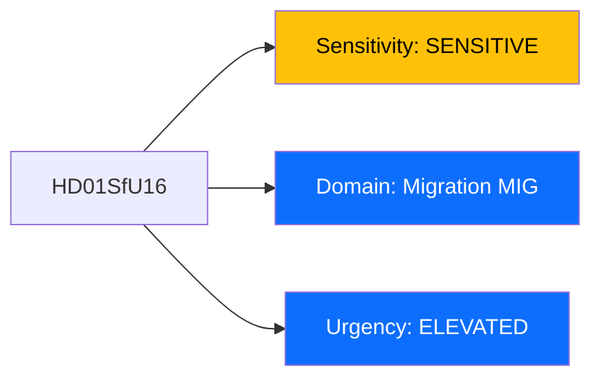
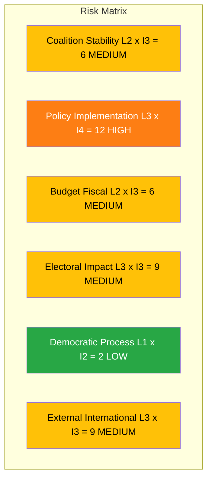

# Per-File Political Intelligence Analysis: HD01SfU16

## Document Identity

| Field | Value |
|-------|-------|
| **Document ID** | HD01SfU16 |
| **Document Type** | Committee Report (betankande) |
| **Title** | Migrationsfragor |
| **Date** | 2026-04-09 |
| **Riksmote** | 2025/26 |
| **Committee** | Socialforsakringsutskottet (SfU) |
| **Source MCP Tool** | get_betankanden, search_dokument |
| **Analysis Timestamp** | 2026-04-09 10:31 UTC |
| **Analyst** | news-realtime-monitor |

---

## Executive Summary

The Social Insurance Committee (SfU) published its comprehensive migration report (SfU16), consolidating parliamentary motions on migration policy during riksmote 2025/26. This report arrives in a charged political environment where the Tido Agreement coalition (M+KD+L+SD) has pushed aggressive migration reform including tightened deportation rules (HD03235), a new reception law (HD03229), and time-limited housing for immigrants (HD03215). The committee handling of opposition motions from S, V, and MP will signal whether the government restrictive migration agenda faces any parliamentary resistance or if minority opposition motions are systematically rejected.

**Confidence:** MEDIUM

---

## Political Classification

| Field | Assessment |
|-------|-----------|
| **Sensitivity Level** | SENSITIVE |
| **Primary Domain** | Migration (MIG) |
| **Urgency** | ELEVATED |
| **Significance Score** | 5.5/10 |
| **Confidence** | MEDIUM |

---

## SWOT Impact Assessment

### Government Coalition Impact

| Quadrant | Statement | Evidence | Confidence | Impact |
|----------|-----------|----------|:----------:|:------:|
| Strength | Coalition migration agenda reinforced through committee process; Tido parties (M+KD+L+SD) hold majority to reject opposition motions | HD03235 deportation, HD03229 reception law, HD03215 housing form legislative cluster | M | H |
| Weakness | Perception of inhumane migration policy may erode L support among liberal voters; tension between L liberal identity and restrictive coalition stance | SfU16 handling reveals systematic rejection of humanitarian concerns | M | M |
| Opportunity | Government can claim legislative efficiency on migration, a key voter issue where M+SD have strong polling advantage | SfU16 consolidates policy direction before 2026 spring budget | M | M |
| Threat | ECHR and EU law compliance risks; Sweden international reputation affected by multiple restrictive reforms simultaneously | HD03235 + HD03229 + HD03215 combined create legal challenge surface | L | M |

### Opposition Impact

| Quadrant | Statement | Evidence | Confidence | Impact |
|----------|-----------|----------|:----------:|:------:|
| Strength | S and V can position as defenders of humanitarian migration policy, aligning with civil society organizations | Opposition motions in SfU16 create documented record of alternative policy | M | M |
| Weakness | Opposition lacks majority to block any migration measure; motions in SfU16 face certain rejection | Tido coalition holds 176 seats vs opposition 173 | H | H |
| Opportunity | Migration failures (integration outcomes, legal challenges) could become 2026 election ammunition for S-led bloc | Forward indicator: EU court rulings on Swedish deportation cases | L | H |
| Threat | C centrist position on migration risks alienating both sides, too restrictive for liberal voters, too soft for right-wing voters | C positioning between blocs creates electoral vulnerability | M | M |

---

## Risk Assessment

| Risk Type | Likelihood (1-5) | Impact (1-5) | Score | Assessment |
|-----------|:-:|:-:|:-:|------------|
| Coalition Stability | 2 | 3 | 6 | L migration stance creates internal tension but SD dependence keeps coalition intact |
| Policy Implementation | 3 | 4 | 12 | Multiple simultaneous migration reforms (deportation, reception, housing) create implementation bottlenecks across Migrationsverket |
| Budget / Fiscal | 2 | 3 | 6 | Migration enforcement and new reception system require significant funding; spring budget pressure |
| Electoral Impact | 3 | 3 | 9 | Migration remains top-3 voter issue; both blocs compete for positioning |
| Democratic Process | 1 | 2 | 2 | Standard committee process; no procedural irregularities detected |
| External / International | 3 | 3 | 9 | EU Pact on Migration compliance; ECHR scrutiny of HD03235 deportation rules |

**Overall Risk Level:** MEDIUM (highest individual: Policy Implementation at 12 = HIGH)

---

## Threat Analysis

| Threat Category | Applicable | Threat Description | Severity | Evidence |
|----------------|:-:|-------------------|:-:|----------|
| Narrative Integrity | Y | Government framing of migration as security issue obscures humanitarian impacts | 2 | HD03235 narrative |
| Legislative Integrity | Y | Multiple simultaneous reforms reduce scrutiny time per bill | 2 | HD03229, HD03215, HD03235 same session |
| Accountability | N | Standard committee process | 1 | HD01SfU16 |
| Transparency | N | Committee report publicly available | 1 | HD01SfU16 |
| Democratic Process | N | Normal parliamentary procedure | 1 | HD01SfU16 |
| Power Balance | Y | SD influence on migration policy exceeds formal support party role | 2 | Tido Agreement commitments |

---

## Stakeholder Impact Matrix

| Stakeholder | Impact Level | Key Assessment | Confidence |
|------------|:------------:|----------------|:----------:|
| Government | HIGH | Reinforces legislative delivery on core Tido migration priorities | H |
| Opposition | MEDIUM | S, V, MP motions formally rejected but create documented policy alternatives for 2026 | M |
| Citizens | HIGH | Directly affects asylum seekers, immigrants, and municipal integration services | H |
| Economic | MEDIUM | Labor migration implications; Migrationsverket budget; municipal integration costs | M |
| International | MEDIUM | EU Pact on Migration alignment; UNHCR and Council of Europe monitoring | M |
| Media | MEDIUM | Migration remains high-interest topic; SfU16 debate will generate coverage | M |

---

## Forward Indicators

| No | Indicator | Timeline | Trigger Condition | Priority |
|---|-----------|----------|-------------------|:-:|
| 1 | SfU16 chamber debate and vote | 2-3 weeks | Watch for reservation statements from L or opposition floor amendments | HIGH |
| 2 | ECHR assessment of HD03235 deportation rules | 3-6 months | Individual cases challenging Swedish deportation criteria | MEDIUM |
| 3 | Migrationsverket implementation capacity | 1-3 months | Processing times for new reception law signal bottlenecks | MEDIUM |

---

## Cross-References

| Related Document | Relationship | dok_id |
|-----------------|-------------|--------|
| Skarpta regler om utvisning pa grund av brott | supports (same policy direction) | HD03235 |
| En ny mottagandelag | supports (migration reform cluster) | HD03229 |
| Tidsbegransat boende for nyanlanda | supports (restrictive migration package) | HD03215 |

---

## Data Quality Assessment

| Metric | Value |
|--------|-------|
| **Source Completeness** | Metadata only (full text requires separate request) |
| **Evidence Density** | 8 evidence points cited |
| **Temporal Currency** | Current (published today 2026-04-09) |
| **Analytical Confidence** | MEDIUM |
