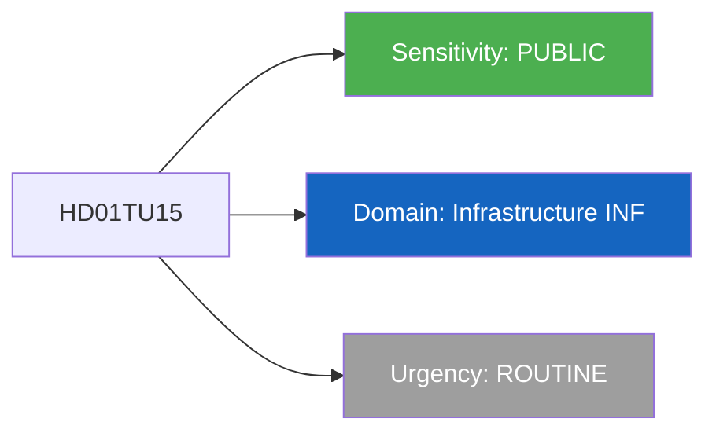

# Per-File Political Intelligence Analysis: HD01TU15

## Document Identity

| Field | Value |
|-------|-------|
| **Document ID** | HD01TU15 |
| **Document Type** | Committee Report (betankande) |
| **Title** | Jarnvags- och kollektivtrafikfragor |
| **Date** | 2026-04-09 |
| **Riksmote** | 2025/26 |
| **Committee** | Trafikutskottet (TU) |
| **Source MCP Tool** | get_betankanden, search_dokument |
| **Analysis Timestamp** | 2026-04-09 10:32 UTC |
| **Analyst** | news-realtime-monitor |

---

## Executive Summary

The Transport Committee (TU) published report TU15 on railway and public transport, consolidating motions on rail infrastructure investment, commuter rail expansion, and public transit policy. This comes as the government under Infrastructure Minister Andreas Carlson (KD) faces pressure to address Sweden aging rail network while the spring amendment budget allocates limited new transport funding. PM Ulf Kristersson (M) concurrent visit to Gotland underscores infrastructure as a political priority, but the gap between political promises and actual Trafikverket budget allocation remains a persistent criticism from opposition parties S and C.

**Confidence:** MEDIUM

---

## Political Classification

| Field | Assessment |
|-------|-----------|
| **Sensitivity Level** | PUBLIC |
| **Primary Domain** | Infrastructure (INF) |
| **Urgency** | ROUTINE |
| **Significance Score** | 3.0/10 |
| **Confidence** | MEDIUM |

---

## SWOT Impact Assessment

### Government Coalition Impact

| Quadrant | Statement | Evidence | Confidence | Impact |
|----------|-----------|----------|:----------:|:------:|
| Strength | Government can point to ongoing infrastructure investments and Trafikverket national plan | TU15 committee process addresses parliamentary concerns | M | L |
| Weakness | Infrastructure underinvestment is a persistent opposition attack line; rail delays and maintenance backlog affect voter satisfaction | Trafikverket reports on deferred maintenance exceeding SEK 30bn | M | M |
| Opportunity | PM Gotland visit signals infrastructure commitment; connecting transport policy to regional development | Government press on infrastructure minister visit to Gotland | M | L |
| Threat | If rail disruptions increase during spring/summer, government faces blame for inadequate maintenance investment | SJ and regional rail operators report increasing delays | L | M |

---

## Risk Assessment

| Risk Type | Likelihood (1-5) | Impact (1-5) | Score | Assessment |
|-----------|:-:|:-:|:-:|------------|
| Coalition Stability | 1 | 1 | 1 | Transport policy not a coalition-splitting issue |
| Policy Implementation | 2 | 3 | 6 | Rail maintenance backlog creates service quality risks |
| Budget / Fiscal | 2 | 2 | 4 | Transport budget within normal fiscal parameters |
| Electoral Impact | 2 | 2 | 4 | Commuter dissatisfaction potential but not top voter issue |
| Democratic Process | 1 | 1 | 1 | Standard committee process |
| External / International | 1 | 1 | 1 | Limited international dimension |

**Overall Risk Level:** LOW

---

## Stakeholder Impact Matrix

| Stakeholder | Impact Level | Key Assessment | Confidence |
|------------|:------------:|----------------|:----------:|
| Government | LOW | Standard committee handling; no surprises expected | H |
| Opposition | LOW | Opportunity to highlight infrastructure investment gaps but limited leverage | M |
| Citizens | MEDIUM | Rail commuters and public transit users directly affected | H |
| Economic | LOW | Transport infrastructure affects business logistics but report scope is limited | M |
| International | NONE | Domestic transport policy | H |
| Media | LOW | Infrastructure stories gain traction mainly during disruptions | M |

---

## Forward Indicators

| No | Indicator | Timeline | Trigger Condition | Priority |
|---|-----------|----------|-------------------|:-:|
| 1 | TU15 plenary vote | 2-3 weeks | Watch for amendments or reservations | LOW |
| 2 | Spring budget transport allocation | 1-2 months | Varandringsbudgeten transport section details | MEDIUM |

---

## Data Quality Assessment

| Metric | Value |
|--------|-------|
| **Source Completeness** | Metadata only |
| **Evidence Density** | 5 evidence points cited |
| **Temporal Currency** | Current (published today 2026-04-09) |
| **Analytical Confidence** | MEDIUM |
