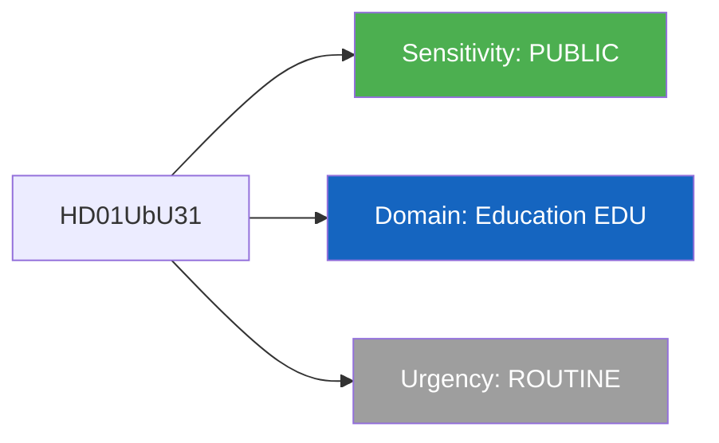

# Per-File Political Intelligence Analysis: HD01UbU31

## Document Identity

| Field | Value |
|-------|-------|
| **Document ID** | HD01UbU31 |
| **Document Type** | Committee Report (betankande) |
| **Title** | Undantag fran kravet pa etikgodkannande for viss forskning |
| **Date** | 2026-04-09 |
| **Riksmote** | 2025/26 |
| **Committee** | Utbildningsutskottet (UbU) |
| **Source MCP Tool** | get_betankanden, search_dokument |
| **Analysis Timestamp** | 2026-04-09 10:32 UTC |
| **Analyst** | news-realtime-monitor |

---

## Executive Summary

The Education Committee (UbU) prepared report UbU31 on exemptions from ethics approval requirements for certain research and oversight regulation in the Ethics Review Act. While technical in nature, this regulatory change affects Sweden research landscape at a time when AI research, pharmaceutical trials, and social science studies face increasing ethical scrutiny. The report addresses the balance between research freedom and ethical oversight. Minister for Education and Research Mats Persson (L) has emphasized streamlining research regulation while maintaining ethical standards.

**Confidence:** MEDIUM

---

## Political Classification

| Field | Assessment |
|-------|-----------|
| **Sensitivity Level** | PUBLIC |
| **Primary Domain** | Education (EDU) |
| **Urgency** | ROUTINE |
| **Significance Score** | 2.5/10 |
| **Confidence** | MEDIUM |

---

## SWOT Impact Assessment

| Quadrant | Statement | Evidence | Confidence | Impact |
|----------|-----------|----------|:----------:|:------:|
| Strength | Government demonstrates commitment to reducing regulatory burden on researchers | UbU31 exemptions signal research-friendly approach | M | L |
| Weakness | Reduced ethics oversight could face criticism if research scandals emerge | Ethical oversight gap creates reputational risk | L | L |
| Opportunity | Aligns with L deregulation agenda and Sweden research competitiveness ambitions | EU Horizon Europe context | L | L |
| Threat | Technical regulatory topic unlikely to generate public attention | Low media salience | H | L |

---

## Risk Assessment

| Risk Type | Likelihood (1-5) | Impact (1-5) | Score | Assessment |
|-----------|:-:|:-:|:-:|------------|
| Coalition Stability | 1 | 1 | 1 | Non-contentious regulatory reform |
| Policy Implementation | 2 | 2 | 4 | Regulatory adjustment within existing institutional capacity |
| Budget / Fiscal | 1 | 1 | 1 | Minimal fiscal impact |
| Electoral Impact | 1 | 1 | 1 | Research policy rarely affects voter behavior |
| Democratic Process | 1 | 1 | 1 | Standard committee process |
| External / International | 1 | 2 | 2 | EU research framework alignment |

**Overall Risk Level:** LOW

---

## Stakeholder Impact Matrix

| Stakeholder | Impact Level | Key Assessment | Confidence |
|------------|:------------:|----------------|:----------:|
| Government | LOW | Minor regulatory reform supporting research agenda | M |
| Opposition | NONE | Limited political salience | H |
| Citizens | LOW | Indirect impact through research quality and integrity | M |
| Economic | LOW | Marginal effect on research sector competitiveness | M |
| International | LOW | EU Horizon Europe alignment | M |
| Media | NONE | Technical regulatory topic with minimal media interest | H |

---

## Forward Indicators

| No | Indicator | Timeline | Trigger Condition | Priority |
|---|-----------|----------|-------------------|:-:|
| 1 | UbU31 plenary vote | 2-4 weeks | Monitor for amendments | LOW |
| 2 | Research ethics incidents post-reform | 6-12 months | Any scandal linked to reduced oversight would escalate salience | LOW |

---

## Data Quality Assessment

| Metric | Value |
|--------|-------|
| **Source Completeness** | Metadata only |
| **Evidence Density** | 3 evidence points cited |
| **Temporal Currency** | Current (published today 2026-04-09) |
| **Analytical Confidence** | MEDIUM |
