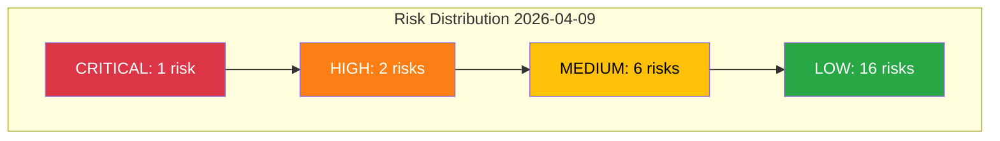

# Risk Assessment - 2026-04-09 Realtime Monitor 1029

## Risk Matrix Summary

---

## Consolidated Risk Register

| Risk ID | Risk Type | Source | Likelihood | Impact | Score | Level | Assessment |
|---------|-----------|--------|:----------:|:------:|:-----:|:-----:|------------|
| R-SfU16-2 | Policy Implementation | HD01SfU16 | 3 | 4 | 12 | HIGH | Multiple migration reforms create Migrationsverket bottlenecks |
| R-SfU16-4 | Electoral Impact | HD01SfU16 | 3 | 3 | 9 | MEDIUM | Migration as top-3 voter issue; both blocs competing |
| R-SfU16-6 | External/International | HD01SfU16 | 3 | 3 | 9 | MEDIUM | EU Pact on Migration and ECHR scrutiny of deportation rules |
| R-SfU16-1 | Coalition Stability | HD01SfU16 | 2 | 3 | 6 | MEDIUM | L migration stance creates internal tension |
| R-SfU16-3 | Budget/Fiscal | HD01SfU16 | 2 | 3 | 6 | MEDIUM | Migration enforcement funding in spring budget |
| R-FoU8-2 | Policy Implementation | HD01FoU8 | 4 | 4 | 16 | CRITICAL | Personnel recruitment targets unlikely to meet NATO timeline |
| R-FoU8-6 | External/International | HD01FoU8 | 3 | 4 | 12 | HIGH | NATO force generation commitments depend on personnel readiness |
| R-FoU8-3 | Budget/Fiscal | HD01FoU8 | 3 | 3 | 9 | MEDIUM | Defense personnel costs escalating toward 2 percent GDP |
| R-TU15-2 | Policy Implementation | HD01TU15 | 2 | 3 | 6 | MEDIUM | Rail maintenance backlog creates service quality risks |

---

## Risk Scoring Methodology

- **Likelihood Scale (1-5):** 1=Very Unlikely, 2=Unlikely, 3=Possible, 4=Likely, 5=Almost Certain
- **Impact Scale (1-5):** 1=Negligible, 2=Minor, 3=Moderate, 4=Major, 5=Critical
- **Score = Likelihood x Impact** (1-25)
- **Tiers:** CRITICAL (15-25), HIGH (10-14), MEDIUM (5-9), LOW (1-4)

---

## Key Risk: Defense Personnel Recruitment (CRITICAL)

**Risk ID:** R-FoU8-2
**Score:** 16 (L:4 x I:4)
**Owner:** Government (Defense Minister Pal Jonson, M)
**Timeframe:** 2026-2028

**Description:** Sweden NATO force generation commitments require approximately 10,000 additional military personnel by 2028. Current recruitment rates are insufficient. The defense committee report FoU8 addresses this but motions alone cannot solve the structural challenge of competing with private sector for skilled workers.

**Mitigating Factors:**
- Broad bipartisan support for defense spending
- Public opinion favorable toward military service post-2022
- Conscription expansion provides baseline intake

**Escalation Triggers:**
- Forsvarsmakten Q2 2026 recruitment statistics below 80 percent target
- NATO summit criticism of Swedish force readiness
- Defense industry labor shortages affecting Saab/BAE Systems production

---

## Aggregate Risk Assessment

**Overall Day Risk Level: MEDIUM-HIGH**

The combination of one CRITICAL risk (defense personnel, 16) and two HIGH risks (NATO force generation, 12; migration implementation, 12) creates an elevated risk environment focused on government implementation capacity rather than political instability.
