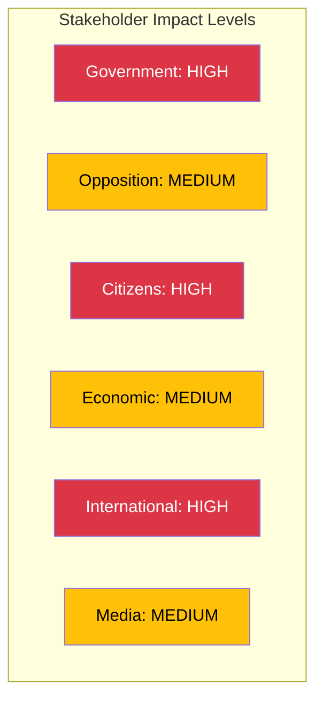

# Stakeholder Perspectives - 2026-04-09 Realtime Monitor 1029

## Stakeholder Impact Overview

---

## Detailed Stakeholder Analysis

### Government (Impact: HIGH)

| Document | Impact | Assessment |
|----------|:------:|-----------|
| HD01SfU16 | HIGH | Reinforces Tido Agreement migration legislative delivery; demonstrates policy momentum |
| HD01FoU8 | MEDIUM | Supports NATO integration narrative but highlights implementation gaps in personnel recruitment |
| HD01TU15 | LOW | Standard infrastructure committee handling |
| HD01UbU31 | LOW | Minor regulatory reform supporting research agenda |
| HD11695 | LOW | Routine written question; government can demonstrate NPT engagement |

**Key Government Stakeholders:**
- PM Ulf Kristersson (M) - overall coalition management; Gotland visit
- Maria Malmer Stenergard (M) - Migration Minister; SfU16 policy direction
- Pal Jonson (M) - Defense Minister; FoU8 personnel challenges
- Andreas Carlson (KD) - Infrastructure Minister; TU15 transport policy
- Mats Persson (L) - Education Minister; UbU31 research ethics

### Opposition (Impact: MEDIUM)

| Party | Key Interest | Leverage |
|-------|-------------|:--------:|
| S (Socialdemokraterna) | Migration alternative; defense bipartisan support; HD11695 NPT question | MEDIUM |
| V (Vansterpartiet) | Humanitarian migration concerns; defense spending skepticism | LOW |
| MP (Miljopartiet) | Migration humanitarian stance; limited defense engagement | LOW |
| C (Centerpartiet) | Infrastructure investment; centrist migration positioning | MEDIUM |

### Citizens (Impact: HIGH)

| Group | Primary Document | Impact Assessment |
|-------|-----------------|------------------|
| Asylum seekers and immigrants | HD01SfU16 | HIGH - direct policy impact on reception, housing, deportation rules |
| Military personnel and conscripts | HD01FoU8 | MEDIUM - recruitment conditions, veterans support, career prospects |
| Rail commuters | HD01TU15 | MEDIUM - service quality, infrastructure investment decisions |
| Research community | HD01UbU31 | LOW - ethics approval exemptions affect research process |

### International (Impact: HIGH)

| Actor | Primary Concern | Engagement Level |
|-------|----------------|:----------------:|
| NATO | Swedish force generation and personnel readiness | HIGH |
| EU | Migration policy and Pact on Migration compliance | MEDIUM |
| ECHR | Human rights assessment of deportation rules | MEDIUM |
| UNHCR | Swedish asylum policy direction | MEDIUM |
| Nordic Council | Shared security and migration challenges | LOW |
