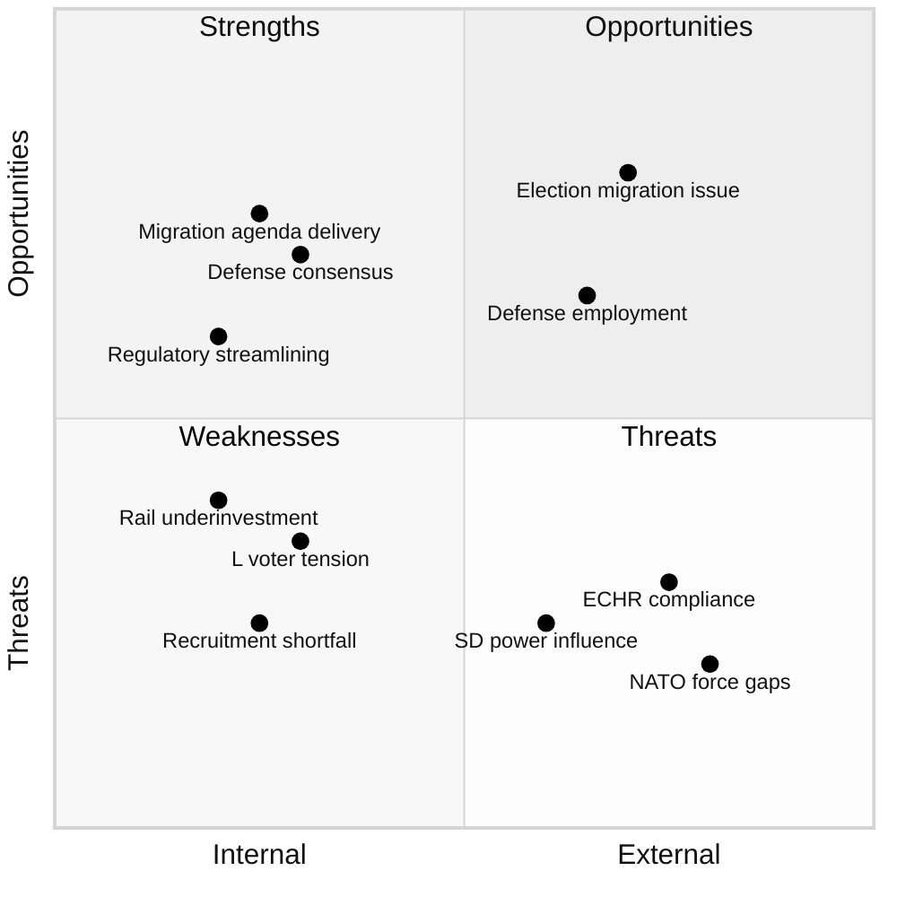

# SWOT Analysis - 2026-04-09 Realtime Monitor 1029

## Analysis Scope
- **Date:** 2026-04-09
- **Documents Analyzed:** 5 (4 committee reports + 1 written question)
- **Focus:** Government coalition position and opposition dynamics

---

## Aggregated SWOT Matrix

---

## Strengths (Internal Positive)

| ID | Statement | Source | Evidence | Confidence | Impact |
|----|-----------|--------|----------|:----------:|:------:|
| S1 | Coalition migration agenda reinforced through committee process | HD01SfU16 | Tido parties hold majority; HD03235, HD03229, HD03215 form legislative cluster | M | H |
| S2 | Cross-party defense consensus strengthens NATO integration | HD01FoU8 | FoU8 expected broad support; bipartisan defense spending commitment | H | H |
| S3 | Regulatory streamlining supports research competitiveness | HD01UbU31 | UbU31 exemptions align with L deregulation agenda | M | L |
| S4 | Government demonstrates legislative productivity | All | 4 committee reports in single day shows active parliamentary process | H | M |

## Weaknesses (Internal Negative)

| ID | Statement | Source | Evidence | Confidence | Impact |
|----|-----------|--------|----------|:----------:|:------:|
| W1 | Defense recruitment shortfalls undermine NATO expansion credibility | HD01FoU8 | 10,000+ personnel deficit vs NATO commitments; CRITICAL risk score 16 | M | H |
| W2 | L internal tension between liberal identity and restrictive migration stance | HD01SfU16 | SfU16 systematic rejection of humanitarian concerns | M | M |
| W3 | Infrastructure underinvestment and rail maintenance backlog | HD01TU15 | Trafikverket deferred maintenance exceeding SEK 30bn | M | M |
| W4 | Implementation bottlenecks across multiple policy areas simultaneously | HD01SfU16, HD01FoU8 | Migration reforms + defense expansion + transport = resource competition | M | H |

## Opportunities (External Positive)

| ID | Statement | Source | Evidence | Confidence | Impact |
|----|-----------|--------|----------|:----------:|:------:|
| O1 | Migration policy efficiency is key voter issue where M+SD lead in polling | HD01SfU16 | SfU16 consolidates policy direction before 2026 spring budget | M | M |
| O2 | Defense employment expansion popular in military base regions | HD01FoU8 | Norrbotten, Gotland, Skane personnel expansion | M | M |
| O3 | Opposition can build 2026 campaign on implementation gap narrative | HD01SfU16, HD01FoU8 | Documented targets vs outcomes across defense and migration | M | H |

## Threats (External Negative)

| ID | Statement | Source | Evidence | Confidence | Impact |
|----|-----------|--------|----------|:----------:|:------:|
| T1 | ECHR and EU compliance risks from restrictive migration reforms | HD01SfU16 | HD03235 + HD03229 + HD03215 combined legal challenge surface | L | M |
| T2 | NATO force generation failures if personnel targets missed | HD01FoU8 | 2028 deadline; allied planning assumptions affected | M | H |
| T3 | SD influence on migration exceeds formal support party role | HD01SfU16 | Tido Agreement commitments give SD effective veto on migration | M | M |
| T4 | Rail service disruptions eroding government credibility | HD01TU15 | Increasing delays during spring/summer | L | M |

---

## SWOT Interactions

| Interaction | Description | Risk Level |
|------------|-------------|:----------:|
| S1 + T1 | Migration legislative efficiency creates ECHR vulnerability | MEDIUM |
| S2 + W1 | Defense consensus undermined by recruitment reality gap | HIGH |
| W4 + T2 | Multi-area implementation strain increases NATO compliance risk | HIGH |
| O1 + T3 | SD migration leverage creates electoral dependency risk for M | MEDIUM |
