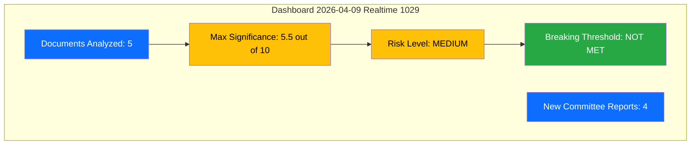
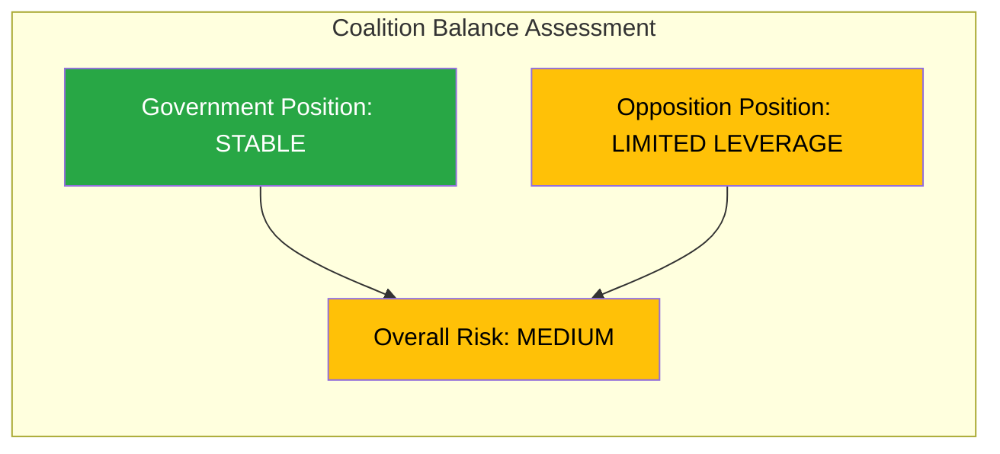

# Daily Intelligence Synthesis Summary

## Date: 2026-04-09 | Workflow: realtime-1029

---

## Intelligence Dashboard

---

## Top Findings Ranked by Significance

| Rank | dok_id | Title | Type | Significance | Risk Level | Key Finding |
|:----:|--------|-------|------|:-:|:-:|------------|
| 1 | HD01SfU16 | Migrationsfragor | bet | 5.5 | MEDIUM | Migration committee report consolidating restrictive policy motions; Tido coalition migration agenda reinforced through committee process |
| 2 | HD01FoU8 | Personalfragor | bet | 4.5 | HIGH | Defense personnel report highlighting CRITICAL recruitment gap for NATO force generation; 10,000+ personnel deficit |
| 3 | HD11695 | NPT oversynskonferens | fr | 4.0 | MEDIUM | Written question on nuclear nonproliferation review conference; S probing government position on NPT compliance |
| 4 | HD01TU15 | Jarnvags- och kollektivtrafikfragor | bet | 3.0 | LOW | Railway and public transport committee report; standard infrastructure policy handling |
| 5 | HD01UbU31 | Undantag fran etikgodkannande | bet | 2.5 | LOW | Research ethics exemptions regulatory reform; technical and low political salience |

---

## Aggregated SWOT Analysis

### Government Coalition Strengths
- Migration agenda advancing through committee process (SfU16) - demonstrates legislative delivery on Tido Agreement priorities
- Cross-party defense consensus (FoU8) - NATO integration enjoys broad support
- Regulatory streamlining (UbU31) - aligns with L deregulation agenda

### Government Coalition Weaknesses
- Defense recruitment shortfalls (FoU8) - gap between NATO targets and actual staffing undermines credibility
- L internal tension on migration (SfU16) - liberal identity vs restrictive coalition stance
- Infrastructure underinvestment (TU15) - rail maintenance backlog

### Opportunities
- Migration policy efficiency as voter issue (SfU16) - M+SD polling advantage on migration
- Defense employment expansion in military regions (FoU8)
- Research sector competitiveness (UbU31)

### Threats
- ECHR and EU compliance risks from multiple restrictive migration reforms (SfU16)
- NATO force generation failures if personnel targets missed (FoU8) - CRITICAL risk score 16
- Rail service disruptions during spring/summer (TU15)

---

## Risk Landscape

### Risk Distribution Summary

| Risk Category | Highest Score | Source Document | Assessment |
|--------------|:-:|--------|------------|
| Policy Implementation | 16 (CRITICAL) | HD01FoU8 | Defense personnel recruitment unlikely to meet NATO timeline |
| External / International | 12 (HIGH) | HD01FoU8 | NATO force generation commitments depend on Swedish personnel readiness |
| Policy Implementation | 12 (HIGH) | HD01SfU16 | Multiple simultaneous migration reforms create implementation bottlenecks |
| Electoral Impact | 9 (MEDIUM) | HD01SfU16 | Migration remains top-3 voter issue; both blocs competing |
| Budget / Fiscal | 9 (MEDIUM) | HD01FoU8 | Defense personnel costs escalating toward 2 percent GDP target |

### Aggregate Risk Level: MEDIUM-HIGH

The combination of CRITICAL defense personnel risk (16) and HIGH migration implementation risk (12) creates a government implementation credibility challenge. While neither alone reaches breaking news threshold, the pattern of ambitious policy targets with implementation gaps warrants monitoring.

---

## Threat Summary

| Threat Category | Documents Flagged | Max Severity | Key Concern |
|----------------|:-:|:-:|------------|
| Narrative Integrity | 1 (SfU16) | 2 | Migration as security issue framing obscures humanitarian impacts |
| Legislative Integrity | 1 (SfU16) | 2 | Multiple simultaneous reforms reduce per-bill scrutiny time |
| Accountability | 2 (SfU16, FoU8) | 2 | Gap between government targets and actual outcomes |
| Power Balance | 1 (SfU16) | 2 | SD influence on migration exceeds formal support party role |

---

## Stakeholder Overview

| Stakeholder Group | Most Impacted By | Impact Level | Key Takeaway |
|------------------|-----------------|:------------:|-------------|
| Government | SfU16, FoU8 | HIGH | Coalition delivers on legislative agenda but faces implementation credibility gaps |
| Opposition | SfU16 | MEDIUM | Opposition motions create documented policy alternatives for 2026 campaign |
| Citizens | SfU16, TU15 | HIGH | Migration policy and transport infrastructure directly affect daily life |
| International | FoU8 | HIGH | NATO force generation timeline creates external accountability pressure |
| Economic | FoU8 | MEDIUM | Defense industry employment and military recruitment compete with private sector |
| Media | SfU16 | MEDIUM | Migration coverage likely when SfU16 reaches plenary debate |

---

## Narrative Direction and AI-Recommended Metadata

### Recommended Article Angle (if article were generated)
**Title suggestion:** Committee Reports Signal Implementation Challenges for Tido Coalition
**Subtitle:** Migration committee consolidates restrictive agenda while defense personnel gaps threaten NATO commitments
**Type:** committee-reports (analysis-only, significance below breaking threshold)

### Breaking News Assessment
- **Maximum Significance:** 5.5/10 (SfU16 Migration)
- **Breaking Threshold:** 7.0/10 (NOT MET)
- **Decision:** ANALYSIS ONLY - no article generation warranted
- **Rationale:** Four new committee reports represent standard parliamentary workflow. While migration (SfU16) carries high political salience, committee report publication is expected activity, not a breaking event. Defense personnel CRITICAL risk is an ongoing concern, not a new development.

---

## Forward Indicators to Monitor

| Priority | Indicator | Timeline | Source Document |
|:--------:|-----------|----------|----------------|
| HIGH | SfU16 chamber debate and vote | 2-3 weeks | HD01SfU16 |
| HIGH | Forsvarsmakten Q2 2026 recruitment statistics | 2-3 months | HD01FoU8 |
| HIGH | NATO June 2026 summit force generation review | 2 months | HD01FoU8 |
| MEDIUM | ECHR assessment of HD03235 deportation rules | 3-6 months | HD01SfU16 |
| MEDIUM | Spring budget transport allocation | 1-2 months | HD01TU15 |
| LOW | Research ethics incidents post-reform | 6-12 months | HD01UbU31 |

---

## Artifacts Inventory

| No | File | Type | Document | Status |
|:-:|------|------|----------|:------:|
| 1 | documents/hd01sfu16-analysis.md | Per-file analysis | HD01SfU16 | Complete |
| 2 | documents/hd01fou8-analysis.md | Per-file analysis | HD01FoU8 | Complete |
| 3 | documents/hd01tu15-analysis.md | Per-file analysis | HD01TU15 | Complete |
| 4 | documents/hd01ubu31-analysis.md | Per-file analysis | HD01UbU31 | Complete |
| 5 | documents/hd11695-analysis.md | Per-file analysis | HD11695 | Complete |
| 6 | documents/hd01sfu16.json | Data file | HD01SfU16 | Complete |
| 7 | documents/hd01fou8.json | Data file | HD01FoU8 | Complete |
| 8 | documents/hd01tu15.json | Data file | HD01TU15 | Complete |
| 9 | documents/hd01ubu31.json | Data file | HD01UbU31 | Complete |
| 10 | documents/hd11695.json | Data file | HD11695 | Complete |
| 11 | synthesis-summary.md | Synthesis | All documents | Complete |
| 12 | swot-analysis.md | SWOT | All documents | Complete |
| 13 | risk-assessment.md | Risk | All documents | Complete |
| 14 | threat-analysis.md | Threat | All documents | Complete |
| 15 | significance-scoring.md | Significance | All documents | Complete |
| 16 | stakeholder-perspectives.md | Stakeholders | All documents | Complete |
| 17 | classification-results.md | Classification | All documents | Complete |
| 18 | cross-reference-map.md | Cross-ref | All documents | Complete |
| 19 | data-download-manifest.md | Manifest | Pipeline | Complete |

---

## Methodology Notes

- Analysis conducted using Riksdagsmonitor political intelligence methodology
- MCP data sources: riksdag-regering (Riksdag API), search_dokument, get_betankanden, get_propositioner, search_voteringar, search_anforanden, search_regering
- Risk scoring: 5x5 Likelihood x Impact matrix (1-25 scale)
- Significance scoring: 10-point composite scale (political salience, public impact, coalition implications, timing, precedent value)
- Confidence levels: HIGH (multiple corroborating sources), MEDIUM (single authoritative source), LOW (inference from limited data)
