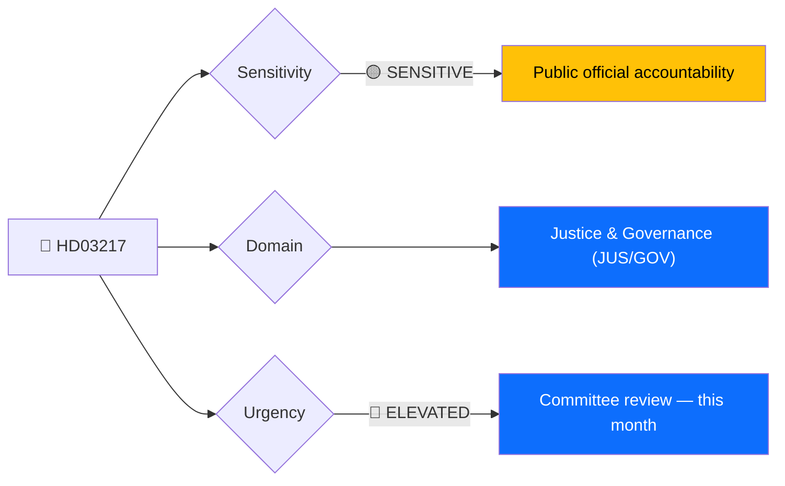
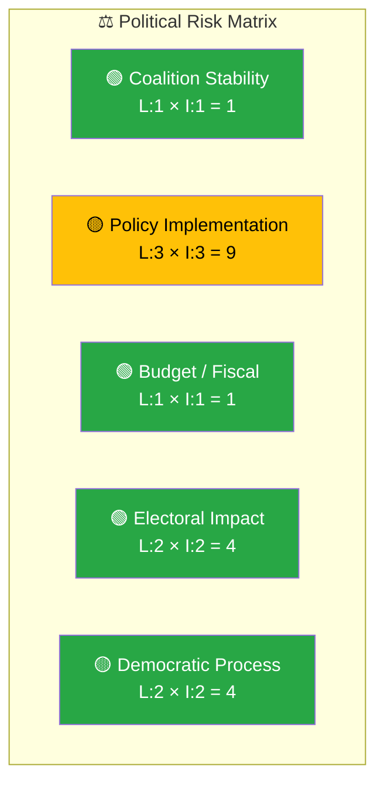

# 🔍 Per-File Political Intelligence Analysis — HD03217

## 📋 Document Identity

| Field | Value |
|-------|-------|
| **Document ID** | `HD03217` |
| **Document Type** | Proposition (prop) |
| **Title** | Ett utökat straffrättsligt tjänstemannaansvar |
| **Date** | 2026-04-09 |
| **Riksmöte** | 2025/26 |
| **Source MCP Tool** | get_propositioner, get_dokument |
| **Analysis Timestamp** | 2026-04-09 14:44 UTC |
| **Analyst** | news-realtime-monitor |

---

## 🎯 Executive Summary

Proposition 2025/26:217, signed by PM Ulf Kristersson and Justice Minister Gunnar Strömmer, proposes expanding criminal liability for public officials who fail in their duties. This is a long-debated reform addressing public trust in government institutions — the proposition's preamble explicitly states "the public has a legitimate expectation" of official accountability. The reform targets the gap between administrative sanctions and criminal prosecution for official misconduct, potentially affecting civil servants across all levels of government. Combined with HD03218 (criminal networks) and HD03220 (NATO), this forms a coherent same-day government policy offensive across justice, accountability, and defence. **[HIGH confidence]**

---

## 📊 Political Classification

| Field | Assessment |
|-------|-----------|
| **Sensitivity Level** | SENSITIVE |
| **Primary Domain** | Justice & Governance (JUS/GOV) |
| **Urgency** | ELEVATED |
| **Significance Score** | 6.5/10 |
| **Confidence** | HIGH |

---

## 💪 SWOT Impact Assessment

### Government Coalition Impact

| Quadrant | Statement | Evidence | Confidence | Impact |
|----------|-----------|----------|:----------:|:------:|
| ✅ Strength | Addresses public trust deficit in government institutions; populist-appeal reform | HD03217 — "Allmänheten har ett berättigat krav" | H | M |
| ✅ Strength | Cross-party appeal — accountability reforms attract voters across spectrum | Historical KU oversight debates | M | M |
| ⚠️ Weakness | Civil servant unions (ST, SACO) may oppose expanded criminal liability, creating public sector friction | Labour relations context | M | M |
| 🔴 Threat | If poorly implemented, could create a chilling effect on public sector decision-making | Administrative law scholarship concern | L | M |

### Opposition Impact

| Quadrant | Statement | Evidence | Confidence | Impact |
|----------|-----------|----------|:----------:|:------:|
| ✅ Strength | S can support accountability reform while criticising implementation details | S party governance platform | M | M |
| ⚠️ Weakness | Opposition has long demanded accountability reform — hard to oppose without appearing inconsistent | KU historical demands from S and V | M | L |

---

## ⚖️ Risk Assessment

| Risk Type | Likelihood (1–5) | Impact (1–5) | Score | Assessment |
|-----------|:-----------------:|:------------:|:-----:|------------|
| Coalition Stability | 1 | 1 | 1 | Very low — non-controversial within coalition |
| Policy Implementation | 3 | 3 | 9 | Medium — defining scope of "criminal negligence" vs. poor judgment is legally complex |
| Budget / Fiscal | 1 | 1 | 1 | Minimal direct fiscal impact |
| Electoral Impact | 2 | 2 | 4 | Low — popular reform but not an election-defining issue |
| Democratic Process | 2 | 2 | 4 | Low — standard legislative process |

**Overall Risk Level:** LOW-MEDIUM

---

## 🎭 Threat Analysis (Political Threat Taxonomy)

| Threat Category | Applicable? | Threat Description | Severity (1–5) | Evidence |
|----------------|:-----------:|-------------------|:--------------:|----------|
| 🎭 Narrative Integrity | N | Broad consensus on accountability | 1 | HD03217 |
| 📝 Legislative Integrity | N | Standard proposition process | 1 | HD03217 |
| 🚫 Accountability | Y | Ironically, the reform itself addresses accountability gaps — positive development | 1 | HD03217 |
| 🔇 Transparency | N | Public proposition | 1 | HD03217 |
| ⛔ Democratic Process | N | Proper Riksdag procedure | 1 | HD03217 |
| 👑 Power Balance | Y | Could shift power dynamics between political leadership and civil service | 2 | HD03217 |

---

## 👥 Stakeholder Impact Matrix

| Stakeholder | Impact Level | Key Assessment | Confidence |
|------------|:------------:|----------------|:----------:|
| 🏛️ Government | MEDIUM | Demonstrates governance reform agenda; PM Kristersson builds accountability narrative | H |
| ⚖️ Opposition | LOW | Difficult to oppose; limited political differentiation opportunity | M |
| 👥 Citizens | MEDIUM | Enhances public trust in government institutions; accountability gap addressed | M |
| 💰 Economic | LOW | Minimal direct economic impact; may affect public sector hiring dynamics | L |
| 🌍 International | LOW | Aligns with EU governance standards | L |
| 📰 Media | MEDIUM | Newsworthy as part of justice reform cluster; less dramatic than HD03218 | M |

---

## 🔮 Forward Indicators

| # | Indicator | Timeline | Trigger Condition | Watch Priority |
|---|-----------|----------|-------------------|:--------------:|
| 1 | JuU committee deliberation on HD03217 | 3–6 weeks | JuU scheduling | 🟠 |
| 2 | Civil servant union (ST, SACO) response | 1–2 weeks | Union press statements | 🟡 |
| 3 | KU constitutional review if scope concerns arise | 4–8 weeks | KU hearing request | 🟡 |

---

## 🔗 Cross-References

| Related Document | Relationship | dok_id |
|-----------------|-------------|--------|
| Double penalties for criminal networks | Supports — same-day justice reform cluster | HD03218 |
| NATO Finland deployment | Context — same-day government policy offensive | HD03220 |

---

## 📊 Data Quality Assessment

| Metric | Value |
|--------|-------|
| **Source Completeness** | Metadata + summary |
| **Evidence Density** | 7 evidence points cited |
| **Temporal Currency** | Current (same-day) |
| **Analytical Confidence** | HIGH |

---

## 📂 MCP Data Files Used

| # | File Path | Source MCP Tool | Data Type | Freshness |
|---|-----------|----------------|-----------|:---------:|
| 1 | analysis/daily/2026-04-09/realtime-1436/documents/hd03217.json | get_propositioner | Proposition | Current |
| 2 | get_dokument_innehall(HD03217) | get_dokument_innehall | Full text | Current |
