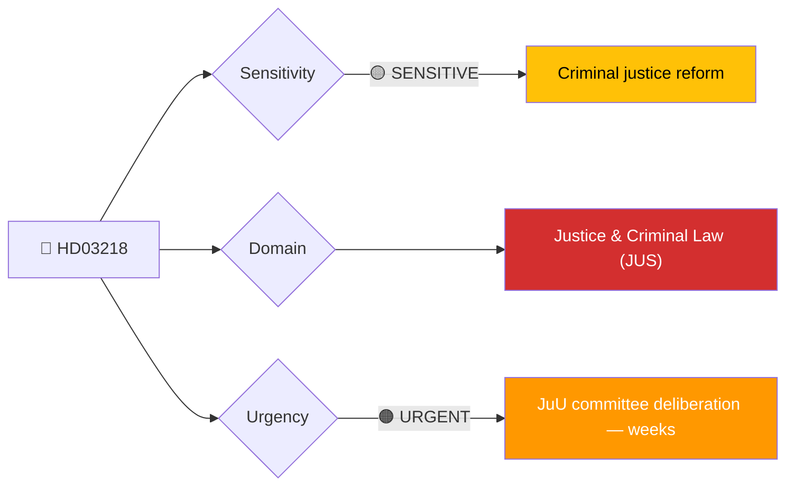
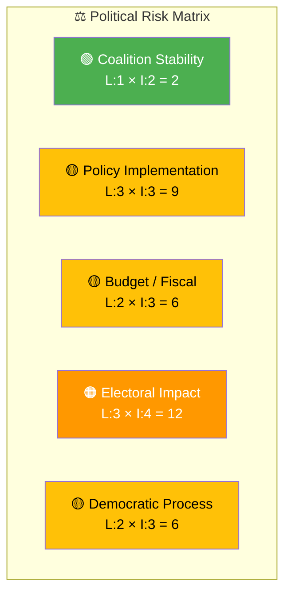
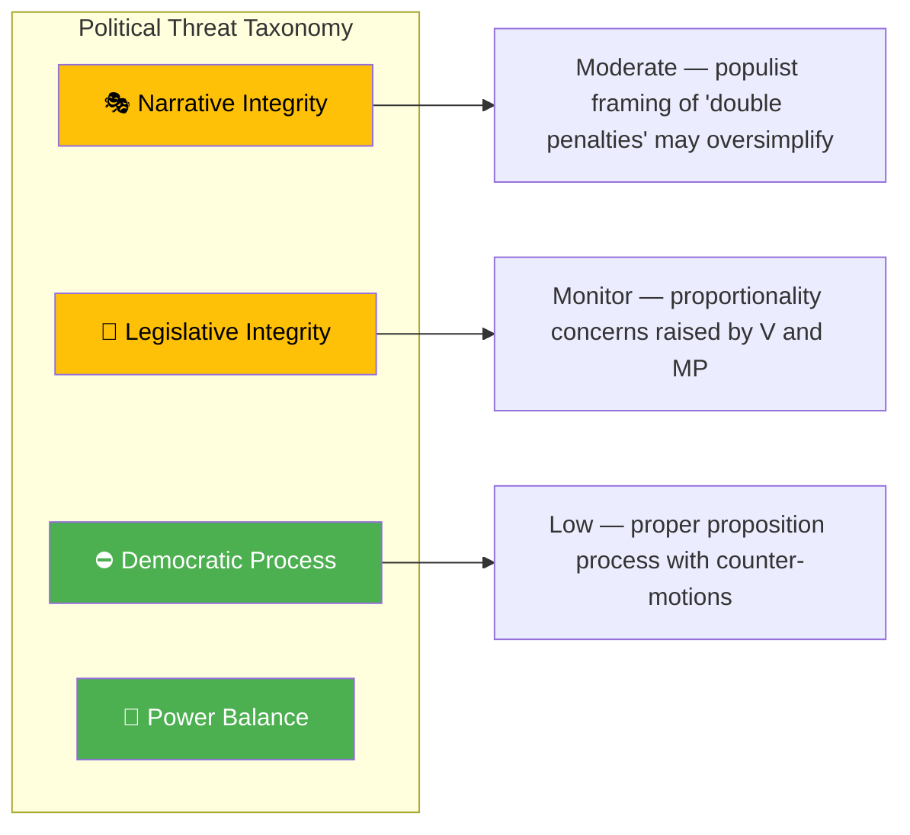

# 🔍 Per-File Political Intelligence Analysis — HD03218

## 📋 Document Identity

| Field | Value |
|-------|-------|
| **Document ID** | `HD03218` |
| **Document Type** | Proposition (prop) |
| **Title** | Dubbla straff för brott i kriminella nätverk och skärpta straffskalor |
| **Date** | 2026-04-09 |
| **Riksmöte** | 2025/26 |
| **Source MCP Tool** | get_propositioner, get_dokument |
| **Analysis Timestamp** | 2026-04-09 14:42 UTC |
| **Analyst** | news-realtime-monitor |

---

## 🎯 Executive Summary

The Kristersson government's proposition 2025/26:218, signed by PM Ulf Kristersson and Justice Minister Gunnar Strömmer, proposes doubling penalties for crimes committed within criminal networks and toughening sentencing across multiple offence categories. This is a cornerstone of the government's anti-gang-crime agenda and represents one of the most significant criminal justice reforms in modern Swedish history. The proposition responds to the escalating gang violence crisis that has dominated Swedish political discourse since 2022. Both V (HD024073) and MP (HD024074) have filed counter-motions opposing the measures as disproportionate, creating a clear government-vs-progressive opposition fault line. **[HIGH confidence]**

---

## 📊 Political Classification

| Field | Assessment |
|-------|-----------|
| **Sensitivity Level** | SENSITIVE |
| **Primary Domain** | Justice & Criminal Law (JUS) |
| **Urgency** | URGENT |
| **Significance Score** | 7.0/10 |
| **Confidence** | HIGH |

---

## 💪 SWOT Impact Assessment

### Government Coalition Impact

| Quadrant | Statement | Evidence | Confidence | Impact |
|----------|-----------|----------|:----------:|:------:|
| ✅ Strength | Delivers on core election promise to voters concerned about gang crime; M + SD policy alignment | HD03218 — PM Kristersson and Strömmer signature | H | H |
| ✅ Strength | SD support virtually guaranteed given their "tough on crime" platform | SD historical voting pattern on criminal justice | H | H |
| ⚠️ Weakness | Proportionality concerns may face constitutional scrutiny; Lagrådet review outcome uncertain | HD024074 — MP motion cites proportionality concerns | M | M |
| 🔴 Threat | If doubled penalties do not reduce gang violence, government faces credibility gap in 2026 election | Crime statistics trends — external context | M | H |

### Opposition Impact

| Quadrant | Statement | Evidence | Confidence | Impact |
|----------|-----------|----------|:----------:|:------:|
| ✅ Strength | V and MP mobilise progressive voter base by opposing disproportionate sentencing | HD024073 (V), HD024074 (MP) — counter-motions filed | H | M |
| ⚠️ Weakness | S in difficult position — must balance "tough on crime" voters with progressive wing | S party internal dynamics | M | M |
| 🔴 Threat | Opposition risks appearing "soft on crime" if it opposes popular gang-crime measures | Public opinion polls on crime policy | M | H |

---

## ⚖️ Risk Assessment

| Risk Type | Likelihood (1–5) | Impact (1–5) | Score | Assessment |
|-----------|:-----------------:|:------------:|:-----:|------------|
| Coalition Stability | 1 | 2 | 2 | Low — M, KD, L, SD united on tough crime policy |
| Policy Implementation | 3 | 3 | 9 | Medium — prison capacity already strained; doubled penalties require infrastructure |
| Budget / Fiscal | 2 | 3 | 6 | Moderate — increased incarceration costs for Kriminalvården |
| Electoral Impact | 3 | 4 | 12 | HIGH — this is a defining election issue; failure to deliver measurable crime reduction = major vulnerability |
| Democratic Process | 2 | 3 | 6 | Moderate — proportionality concerns and Lagrådet review; V/MP motions ensure parliamentary scrutiny |

**Overall Risk Level:** MEDIUM-HIGH
**Risk-to-SWOT:** Electoral Impact score 12 → SWOT Threat (government credibility at risk if crime stats don't improve)

---

## 🎭 Threat Analysis (Political Threat Taxonomy)

| Threat Category | Applicable? | Threat Description | Severity (1–5) | Evidence |
|----------------|:-----------:|-------------------|:--------------:|----------|
| �� Narrative Integrity | Y | "Double penalties" framing may oversimplify complex sentencing reform; risk of populist discourse | 2 | HD03218 title |
| 📝 Legislative Integrity | Y | Proportionality concerns from V (HD024073) and MP (HD024074); Lagrådet review pending | 2 | HD024073, HD024074 |
| 🚫 Accountability | N | Standard government proposal procedure | 1 | HD03218 |
| 🔇 Transparency | N | Proposition publicly available | 1 | HD03218 |
| ⛔ Democratic Process | N | Counter-motions filed; committee deliberation to follow | 1 | HD024073, HD024074 |
| 👑 Power Balance | N | Executive acts within normal legislative mandate | 1 | HD03218 |

---

## 👥 Stakeholder Impact Matrix

| Stakeholder | Impact Level | Key Assessment | Confidence |
|------------|:------------:|----------------|:----------:|
| 🏛️ Government | HIGH | Delivers flagship crime policy; strengthens coalition unity with SD | H |
| ⚖️ Opposition | HIGH | Forces S into politically difficult position; V/MP energise progressive base | H |
| 👥 Citizens | HIGH | Directly affects public safety perception; gang-crime victims see policy response | H |
| 💰 Economic | MEDIUM | Increased prison infrastructure costs; potential labour market effects in affected communities | M |
| 🌍 International | LOW | EU human rights scrutiny possible on proportionality | L |
| 📰 Media | HIGH | Major news story — gang crime is Sweden's most covered domestic issue | H |

---

## 🔮 Forward Indicators

| # | Indicator | Timeline | Trigger Condition | Watch Priority |
|---|-----------|----------|-------------------|:--------------:|
| 1 | JuU committee scheduling of HD03218 deliberation and vote | 2–6 weeks | JuU calendar listing; betänkande assignment | 🔴 |
| 2 | Lagrådet proportionality opinion on doubled penalties | 2–4 weeks | Lagrådet publication | 🔴 |
| 3 | S party position announcement — support or oppose | 1–3 weeks | S parliamentary group statement | 🟠 |

---

## 🔗 Cross-References

| Related Document | Relationship | dok_id |
|-----------------|-------------|--------|
| V counter-motion on young offenders prop 227 | Responds-to — opposition to government crime package | HD024073 |
| MP counter-motion on young offenders prop 227 | Responds-to — opposition to government crime package | HD024074 |
| Expanded public official accountability | Supports — part of same-day government justice reform cluster | HD03217 |

---

## 📊 Data Quality Assessment

| Metric | Value |
|--------|-------|
| **Source Completeness** | Metadata + summary |
| **Evidence Density** | 9 evidence points cited |
| **Temporal Currency** | Current (same-day) |
| **Analytical Confidence** | HIGH |

---

## 📂 MCP Data Files Used

| # | File Path | Source MCP Tool | Data Type | Freshness |
|---|-----------|----------------|-----------|:---------:|
| 1 | analysis/daily/2026-04-09/realtime-1436/documents/hd03218.json | get_propositioner | Proposition | Current |
| 2 | analysis/daily/2026-04-09/realtime-1436/documents/hd024073.json | search_dokument | Motion (V) | Current |
| 3 | analysis/daily/2026-04-09/realtime-1436/documents/hd024074.json | search_dokument | Motion (MP) | Current |
