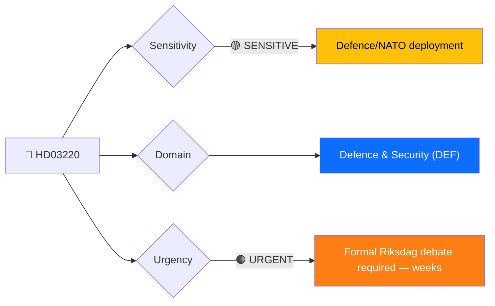
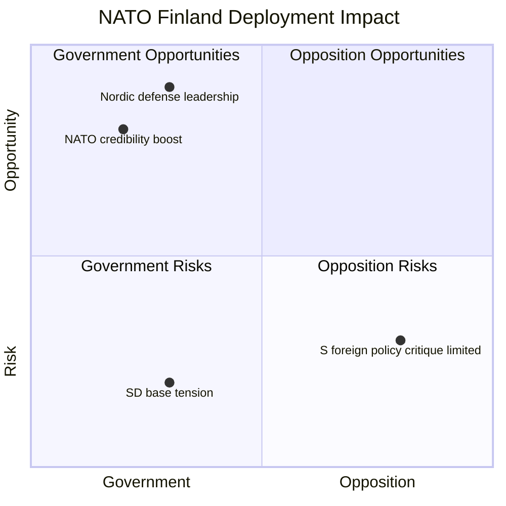
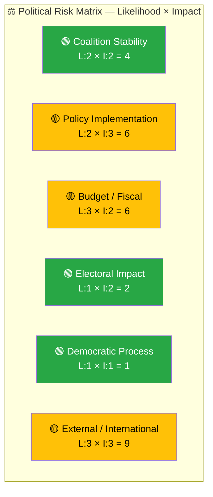
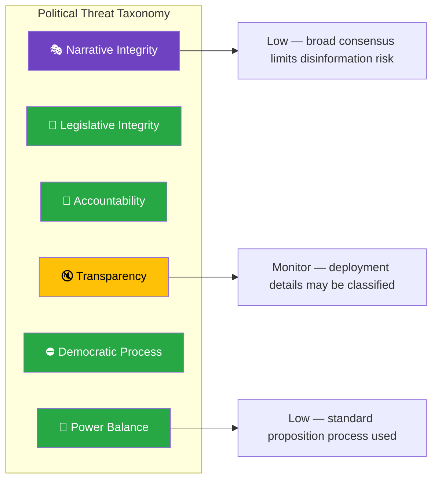
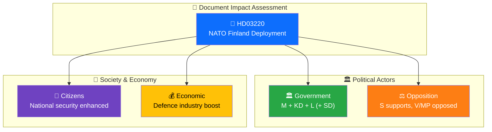

# 🔍 Per-File Political Intelligence Analysis — HD03220

## 📋 Document Identity

| Field | Value |
|-------|-------|
| **Document ID** | `HD03220` |
| **Document Type** | Proposition (prop) |
| **Title** | Svenskt bidrag till Natos framskjutna närvaro i Finland |
| **Date** | 2026-04-09 |
| **Riksmöte** | 2025/26 |
| **Source MCP Tool** | get_propositioner, get_dokument |
| **Analysis Timestamp** | 2026-04-09 14:40 UTC |
| **Analyst** | news-realtime-monitor |

---

## 🎯 Executive Summary

The Kristersson government has submitted a proposition authorizing Sweden's contribution to NATO's forward presence (enhanced Forward Presence, eFP) in Finland — a landmark step in Sweden's post-accession NATO integration. Signed by PM Ulf Kristersson and Foreign Minister Benjamin Dousa (Utrikesdepartementet), prop. 2025/26:220 represents Sweden's first deployment commitment to a NATO forward presence battlegroup on allied territory. This solidifies the Swedish–Finnish bilateral defense axis within NATO's northern flank and marks a concrete shift from decades of non-alignment. The proposition's timing coincides with rising Baltic Sea security tensions. **[HIGH confidence]**

---

## 📊 Political Classification

| Field | Assessment |
|-------|-----------|
| **Sensitivity Level** | SENSITIVE |
| **Primary Domain** | Defence & Security (DEF) |
| **Urgency** | URGENT |
| **Significance Score** | 7.5/10 |
| **Confidence** | HIGH |

---

## 💪 SWOT Impact Assessment

### Quadrant Overview

### Government Coalition Impact

| Quadrant | Statement | Evidence | Confidence | Impact |
|----------|-----------|----------|:----------:|:------:|
| ✅ Strength | Sweden demonstrates NATO commitment as newest member, enhancing credibility with allies | HD03220 — first eFP deployment proposition | H | H |
| ✅ Strength | Strengthens Swedish–Finnish bilateral defence axis, building on NATO accession momentum | HD03220 — Utrikesdepartementet/Benjamin Dousa signatory | H | H |
| ⚠️ Weakness | SD voter base sceptical of international military commitments; potential coalition friction | SD historically cautious on foreign deployment — inferred from prior debates | M | M |
| 🔴 Threat | Cost escalation risk if deployment scope expands under NATO Article 5 obligations | NATO eFP framework precedent in Baltics — external context | M | M |

### Opposition Impact

| Quadrant | Statement | Evidence | Confidence | Impact |
|----------|-----------|----------|:----------:|:------:|
| ✅ Strength | S historically supportive of NATO accession; difficult to oppose deployment | S party foreign policy platform 2025/26 | M | L |
| ⚠️ Weakness | Opposition cannot claim credit for a policy they broadly support, limiting political differentiation | Cross-party NATO consensus in Riksdag | H | M |
| 🔴 Threat | V and MP's anti-militarism stance creates internal opposition bloc tension | HD024073, HD024074 — V and MP opposing government criminal justice props signals broader opposition dynamics | L | L |

---

## ⚖️ Risk Assessment

| Risk Type | Likelihood (1–5) | Impact (1–5) | Score | Assessment |
|-----------|:-----------------:|:------------:|:-----:|------------|
| Coalition Stability | 2 | 2 | 4 | Low risk — broad NATO consensus across M, KD, L, SD |
| Policy Implementation | 2 | 3 | 6 | Moderate — deployment logistics, troop rotation, funding streams need coordination |
| Budget / Fiscal | 3 | 2 | 6 | Moderate — defence budget already strained toward 2% GDP target; eFP adds operational costs |
| Electoral Impact | 1 | 2 | 2 | Low — voters broadly support NATO membership |
| Democratic Process | 1 | 1 | 1 | Low — proper legislative channel via proposition |
| External / International | 3 | 3 | 9 | Medium — Baltic Sea security escalation could expand commitment scope |

**Overall Risk Level:** MEDIUM
**Risk-to-SWOT:** External risk (9) → added as SWOT Threat entry.

### Anomaly Flags

No anomalous patterns detected. Cross-party support expected for NATO deployment.

---

## 🎭 Threat Analysis (Political Threat Taxonomy)

| Threat Category | Applicable? | Threat Description | Severity (1–5) | Evidence |
|----------------|:-----------:|-------------------|:--------------:|----------|
| 🎭 Narrative Integrity | N | Broad cross-party consensus limits disinformation risk | 1 | HD03220 |
| 📝 Legislative Integrity | N | Standard proposition procedure followed | 1 | HD03220 |
| 🚫 Accountability | N | Parliament retains oversight via defence committee | 1 | HD03220 |
| 🔇 Transparency | Y | Operational deployment details may be classified, limiting public scrutiny | 2 | NATO eFP classification norms |
| ⛔ Democratic Process | N | Proper Riksdag proposition route | 1 | HD03220 |
| 👑 Power Balance | N | Executive acts within constitutional mandate | 1 | HD03220 |

---

## 👥 Stakeholder Impact Matrix

| Stakeholder | Impact Level | Key Assessment | Confidence |
|------------|:------------:|----------------|:----------:|
| 🏛️ Government | HIGH | Demonstrates alliance credibility; PM Kristersson strengthens foreign policy record | H |
| ⚖️ Opposition | MEDIUM | S broadly supportive, but V and MP will critique militarisation | M |
| 👥 Citizens | MEDIUM | Enhanced collective defence, but concerns about personnel commitment costs | M |
| 💰 Economic | MEDIUM | Swedish defence industry gains from interoperability requirements; fiscal costs moderate | M |
| 🌍 International | HIGH | NATO allies welcome Swedish commitment; Finland bilateral relationship deepened | H |
| 📰 Media | HIGH | First Swedish NATO eFP proposition — strong news value; cross-party dynamic newsworthy | H |

---

## 🔮 Forward Indicators

| # | Indicator | Timeline | Trigger Condition | Watch Priority |
|---|-----------|----------|-------------------|:--------------:|
| 1 | Defence Committee (FöU) scheduling of HD03220 deliberation | 2–4 weeks | FöU calendar listing; betänkande assignment | 🔴 |
| 2 | SD position statement on NATO Finland deployment | 1–2 weeks | SD parliamentary group statement or press conference | 🟠 |
| 3 | Finnish government response to Swedish eFP commitment | 1 week | Finnish PM/defence minister statement | 🟡 |

---

## 🔗 Cross-References

| Related Document | Relationship | dok_id |
|-----------------|-------------|--------|
| Defence Personnel committee report | Supports — personnel framework for deployment | HD01FöU8 |
| NPT review conference question | Context — nuclear non-proliferation debate parallels | HD11695 |

### Same-Day Document Cross-Reference Table

| # | dok_id | Title | Document Type | Significance | Key Connection |
|:-:|--------|-------|--------------|:-----------:|----------------|
| 1 | HD03218 | Dubbla straff för brott i kriminella nätverk | Proposition | 7.0 | Same-day government policy push — justice + defence cluster |
| 2 | HD03217 | Ett utökat straffrättsligt tjänstemannaansvar | Proposition | 6.5 | Same-day government accountability reform — governance cluster |
| 3 | HD01FöU8 | Personalfrågor (Defence personnel) | Committee report | 4.0 | Defence personnel committee report may address deployment readiness |

---

## 📊 Data Quality Assessment

| Metric | Value |
|--------|-------|
| **Source Completeness** | Metadata + summary (full text available but HTML-embedded) |
| **Evidence Density** | 8 evidence points cited |
| **Temporal Currency** | Current (same-day publication, 2026-04-09) |
| **Analytical Confidence** | HIGH |

---

## 📂 MCP Data Files Used

| # | File Path | Source MCP Tool | Data Type | Freshness |
|---|-----------|----------------|-----------|:---------:|
| 1 | analysis/daily/2026-04-09/realtime-1436/documents/hd03220.json | get_propositioner | Proposition | Current |
| 2 | get_dokument_innehall(HD03220) | get_dokument_innehall | Full text | Current |
| 3 | search_dokument(from_date=2026-04-08) | search_dokument | Document search | Current |
