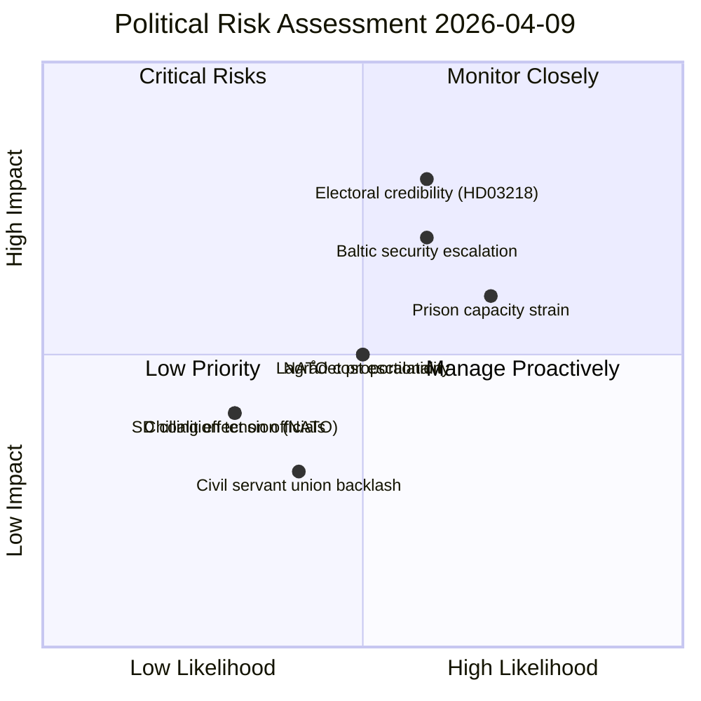
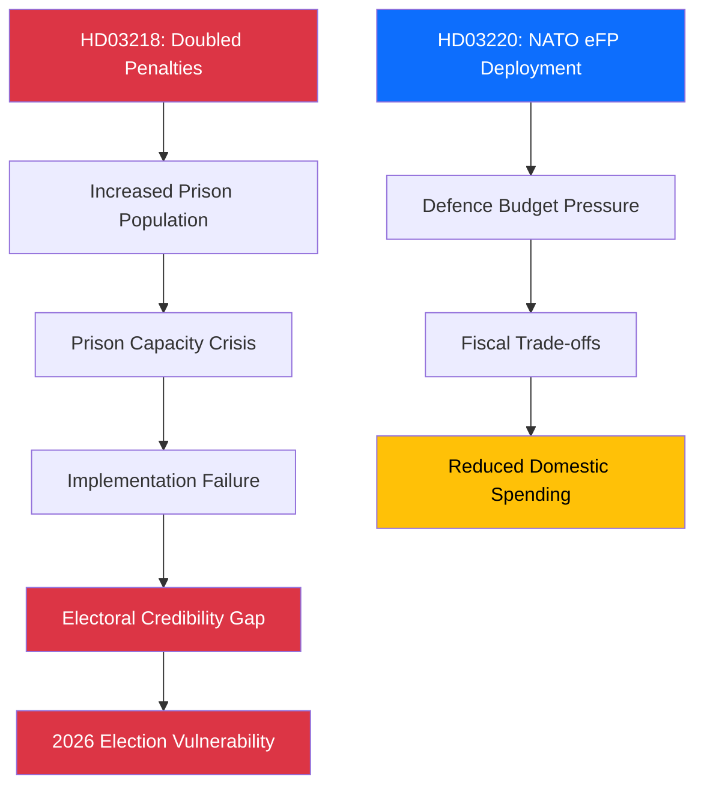

# ⚖️ Risk Assessment — 2026-04-09 (realtime-1436)

**Date:** 2026-04-09
**Run ID:** realtime-1436
**Documents Analysed:** 11

---

## 📊 Risk Heat Map

---

## 🎯 Five-Dimension Risk Scoring

### Risk 1: Electoral Credibility on Crime Policy

| Dimension | Score (1–5) | Evidence |
|-----------|:-----------:|---------|
| **Likelihood** | 3 | Crime statistics have been mixed despite previous reforms |
| **Impact** | 4 | Crime policy is THE defining 2026 election issue |
| **Velocity** | 2 | Electoral effects manifest over 6–12 months |
| **Persistence** | 4 | If crime rates don't drop, narrative is permanent through election |
| **Interconnection** | 3 | Links to prison capacity, police resources, judicial capacity |
| **Composite Score** | **16/25** | **MEDIUM-HIGH** |

### Risk 2: NATO Deployment Cost Escalation

| Dimension | Score (1–5) | Evidence |
|-----------|:-----------:|---------|
| **Likelihood** | 3 | Baltic Sea tensions ongoing; Russian escalation pattern |
| **Impact** | 3 | Defence budget already strained toward 2% GDP target |
| **Velocity** | 3 | Escalation can occur rapidly; commitment scope may expand |
| **Persistence** | 4 | NATO commitments are long-term; withdrawal politically costly |
| **Interconnection** | 2 | Limited domestic policy spillover |
| **Composite Score** | **15/25** | **MEDIUM** |

### Risk 3: Prison Capacity Crisis

| Dimension | Score (1–5) | Evidence |
|-----------|:-----------:|---------|
| **Likelihood** | 4 | Swedish prisons already at capacity; doubled sentences = more inmates |
| **Impact** | 3 | Implementation failure undermines reform credibility |
| **Velocity** | 2 | Gradual build-up as sentences take effect |
| **Persistence** | 4 | Infrastructure deficit takes years to address |
| **Interconnection** | 3 | Links to crime policy credibility, budget, recidivism |
| **Composite Score** | **16/25** | **MEDIUM-HIGH** |

### Risk 4: SD Coalition Reliability on NATO

| Dimension | Score (1–5) | Evidence |
|-----------|:-----------:|---------|
| **Likelihood** | 2 | SD leadership supports NATO; voter base mixed |
| **Impact** | 2 | SD unlikely to break on foreign policy |
| **Velocity** | 1 | Slow-developing tension |
| **Persistence** | 2 | SD's tactical pragmatism likely prevails |
| **Interconnection** | 1 | Isolated from other policy areas |
| **Composite Score** | **8/25** | **LOW** |

---

## 🔗 Cascading Risk Chains

---

## 📊 Risk Interconnection Matrix

| Risk | Electoral | NATO Cost | Prison | SD Tension | Lagrådet |
|------|:---------:|:---------:|:------:|:----------:|:--------:|
| **Electoral** | — | Low | HIGH | Low | MEDIUM |
| **NATO Cost** | Low | — | Low | MEDIUM | Low |
| **Prison** | HIGH | Low | — | Low | MEDIUM |
| **SD Tension** | Low | MEDIUM | Low | — | Low |
| **Lagrådet** | MEDIUM | Low | MEDIUM | Low | — |

---

## 📈 Overall Risk Summary

| Metric | Value |
|--------|-------|
| **Mean Composite Risk Score** | 13.8/25 |
| **Overall Risk Level** | MEDIUM |
| **Highest Individual Risk** | Electoral Credibility (16/25) and Prison Capacity (16/25) |
| **Risk Trend** | ⬆️ Increasing (3 major propositions add implementation risk) |
| **Confidence** | HIGH |
