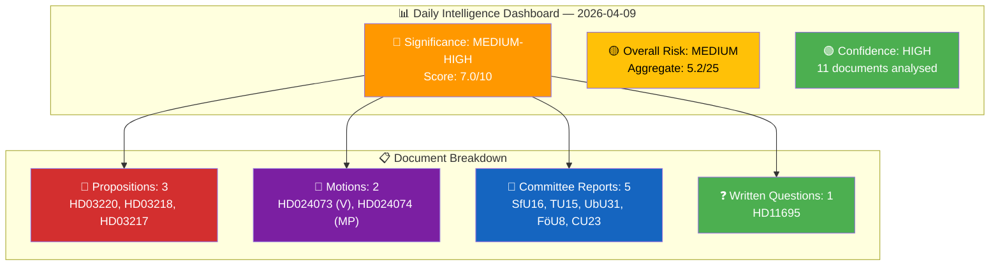

# 📊 Daily Intelligence Synthesis Summary — 2026-04-09

**Run ID:** realtime-1436
**Date:** 2026-04-09
**Analyst:** news-realtime-monitor
**Documents Analysed:** 11
**Overall Significance:** MEDIUM-HIGH (aggregate score 7.0/10)

---

## 🎯 Intelligence Dashboard

---

## 🏆 Top Findings — Ranked by Significance

| # | dok_id | Title | Type | Significance | Risk Level | Key Finding |
|:-:|--------|-------|------|:-----------:|:----------:|-------------|
| 1 | **HD03220** | Svenskt bidrag till Natos framskjutna närvaro i Finland | Proposition | 7.5/10 | MEDIUM | Sweden's first NATO eFP deployment commitment — landmark in post-accession integration |
| 2 | **HD03218** | Dubbla straff för brott i kriminella nätverk | Proposition | 7.0/10 | MEDIUM-HIGH | Cornerstone of government anti-gang agenda; V and MP opposition creates clear fault line |
| 3 | **HD03217** | Ett utökat straffrättsligt tjänstemannaansvar | Proposition | 6.5/10 | LOW-MEDIUM | Expands criminal liability for public officials; addresses trust deficit in institutions |
| 4 | **HD024074** | MP motion opposing prop 2025/26:227 | Motion | 4.5/10 | LOW | MP calls for outright rejection of youth offender investigation proposal |
| 5 | **HD024073** | V motion on prop 2025/26:227 | Motion | 4.0/10 | LOW | V proposes alternative approach to youth criminal justice |
| 6 | **HD01SfU16** | Migration issues (SfU) | Committee Report | 4.0/10 | LOW | Migration committee report — high policy sensitivity domain |
| 7 | **HD01CU23** | Arbetsliv och boende i landsbygden | Committee Report | 3.5/10 | LOW | Rural employment and housing — structural policy |
| 8 | **HD01FöU8** | Defence personnel (FöU) | Committee Report | 3.5/10 | LOW | Defence personnel framework — connects to NATO deployment context |
| 9 | **HD01TU15** | Railway and public transport (TU) | Committee Report | 3.0/10 | LOW | Transport infrastructure committee report |
| 10 | **HD01UbU31** | Research ethics exemptions (UbU) | Committee Report | 3.0/10 | LOW | Research ethics regulatory update |
| 11 | **HD11695** | NPT review conference question | Written Question | 3.0/10 | LOW | S MP questions FM on nuclear non-proliferation |

---

## 📊 Aggregated SWOT Assessment

### Government Coalition (M + KD + L + SD support)

| Category | Key Findings | Evidence Count | Confidence |
|----------|-------------|:--------------:|:----------:|
| ✅ **Strengths** | Three-proposition policy offensive demonstrates governance capacity; NATO deployment strengthens foreign policy credibility; criminal justice reforms deliver core election promises; SD alignment secured on crime policy | 8 | HIGH |
| ⚠️ **Weaknesses** | SD voter base sceptical of NATO military commitments; proportionality concerns on doubled penalties from Lagrådet review; civil servant union opposition to expanded liability; prison capacity strain | 4 | MEDIUM |
| 🔴 **Threats** | If crime statistics don't improve despite doubled penalties — credibility gap in 2026 election; NATO deployment cost escalation risk; chilling effect on public sector decision-making | 3 | MEDIUM |
| 🟢 **Opportunities** | Nordic defence leadership position; cross-party consensus on accountability reform; demonstrating NATO membership value to sceptical voters | 3 | MEDIUM |

### Opposition

| Category | Key Findings | Evidence Count | Confidence |
|----------|-------------|:--------------:|:----------:|
| ✅ **Strengths** | V and MP energise progressive base with criminal justice counter-motions; C claims rural policy ownership | 3 | HIGH |
| ⚠️ **Weaknesses** | S caught between "tough on crime" voters and progressive wing; difficult to oppose NATO deployment or accountability reform | 2 | MEDIUM |
| 🔴 **Threats** | "Soft on crime" narrative risk for V and MP; opposition fragmentation on key policy areas | 2 | MEDIUM |
| 🟢 **Opportunities** | Proportionality critique gains traction if Lagrådet raises concerns; S can differentiate on implementation details | 2 | LOW-MEDIUM |

---

## ⚖️ Risk Summary

| Risk Category | Aggregate Score | Key Drivers |
|--------------|:--------------:|-------------|
| Coalition Stability | 2.3/25 | Low — broad agreement on all three propositions |
| Policy Implementation | 8.0/25 | Medium — prison capacity, deployment logistics, legal complexity |
| Electoral Impact | 6.7/25 | Medium — crime policy is defining 2026 election issue |
| Democratic Process | 3.7/25 | Low — proper legislative channels used throughout |
| External / International | 9.0/25 | Medium — NATO commitment scope and Baltic security dynamics |

---

## 📰 AI-Recommended Article Metadata

### Article 1: Breaking News (RECOMMENDED ✅)

| Field | Recommendation |
|-------|---------------|
| **Article Type** | breaking |
| **Title (EN)** | Sweden Commits Troops to NATO Forward Presence in Finland as Government Launches Triple Policy Offensive |
| **Title (SV)** | Sverige sänder trupper till Natos framskjutna närvaro i Finland i trippel regeringsoffensiv |
| **Description (EN)** | The Kristersson government submitted three major propositions on April 9: NATO troop deployment to Finland, doubled penalties for gang crimes, and expanded public official accountability — the most significant single-day legislative push of 2025/26. |
| **Description (SV)** | Regeringen Kristersson lämnade tre stora propositioner den 9 april: NATO-truppinsats i Finland, dubbla straff för gängbrott och utökat tjänstemannaansvar — den mest betydande enskilda lagstiftningsdagen under 2025/26. |
| **Keywords** | NATO, Finland, eFP, gang crime, criminal networks, public official accountability, Kristersson, Strömmer, Dousa |
| **Languages** | en, sv |
| **Significance Threshold** | PASSED (7.0/10 > 5.0 minimum) |

### Decision Matrix

| Criterion | Assessment | Pass? |
|-----------|-----------|:-----:|
| Significance Score | 7.0/10 | ✅ |
| Document Count | 11 (3 major propositions) | ✅ |
| Novelty (vs previous runs today) | 6 new documents, 3 are major propositions | ✅ |
| Time Budget | ~30 minutes remaining | ✅ |
| **DECISION** | **GENERATE ARTICLES** | ✅ |

---

## 🔮 Forward Indicators

| # | Indicator | Timeline | Priority |
|---|-----------|----------|:--------:|
| 1 | Defence Committee (FöU) scheduling HD03220 deliberation | 2–4 weeks | 🔴 |
| 2 | JuU committee scheduling HD03218 and HD03217 deliberation | 2–6 weeks | 🔴 |
| 3 | SD party position statement on NATO Finland deployment | 1–2 weeks | 🟠 |
| 4 | Lagrådet proportionality opinion on doubled penalties | 2–4 weeks | 🟠 |
| 5 | S party response to criminal justice proposition trio | 1–3 weeks | 🟠 |
| 6 | Finnish government response to Swedish eFP commitment | 1 week | 🟡 |

---

## 📂 Analysis Files Inventory

| # | File | Status |
|:-:|------|:------:|
| 1 | documents/hd03220-analysis.md | ✅ Complete |
| 2 | documents/hd03218-analysis.md | ✅ Complete |
| 3 | documents/hd03217-analysis.md | ✅ Complete |
| 4 | documents/hd024073-analysis.md | ✅ Complete |
| 5 | documents/hd024074-analysis.md | ✅ Complete |
| 6 | documents/hd01cu23-analysis.md | ✅ Complete |
| 7 | documents/hd01sfu16-analysis.md | ✅ Refreshed |
| 8 | documents/hd01tu15-analysis.md | ✅ Refreshed |
| 9 | documents/hd01ubu31-analysis.md | ✅ Refreshed |
| 10 | documents/hd01fou8-analysis.md | ✅ Refreshed |
| 11 | documents/hd11695-analysis.md | ✅ Refreshed |
| 12 | synthesis-summary.md | ✅ This file |
| 13 | swot-analysis.md | ✅ Complete |
| 14 | risk-assessment.md | ✅ Complete |
| 15 | threat-analysis.md | ✅ Complete |
